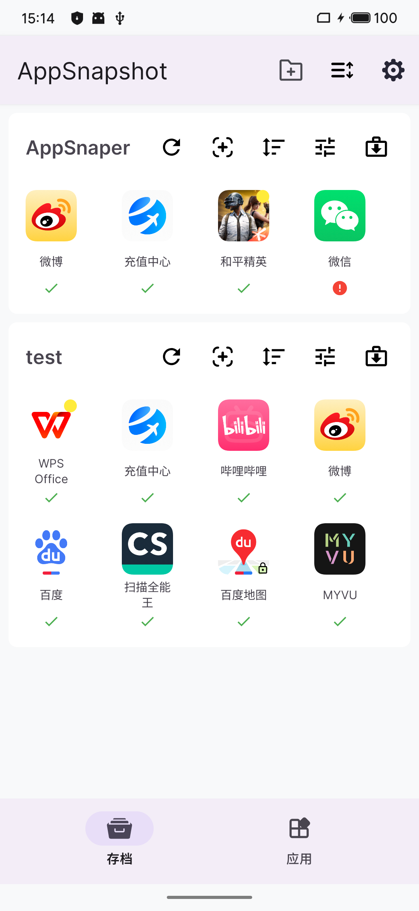
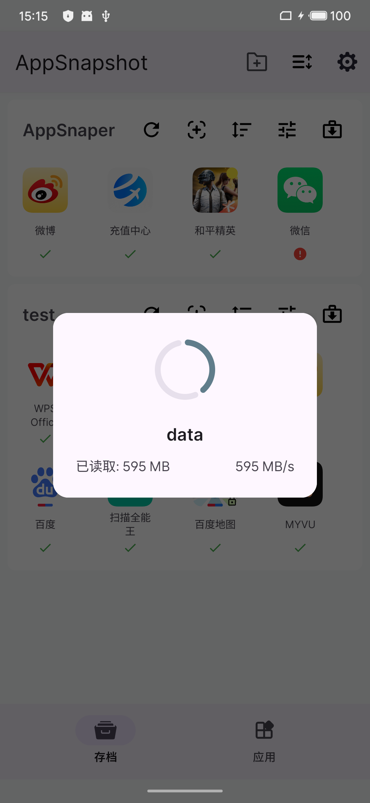
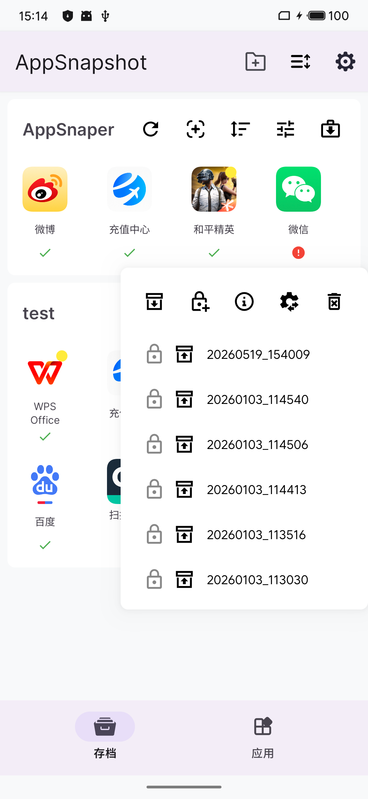
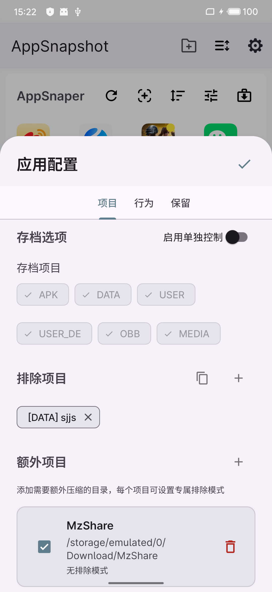
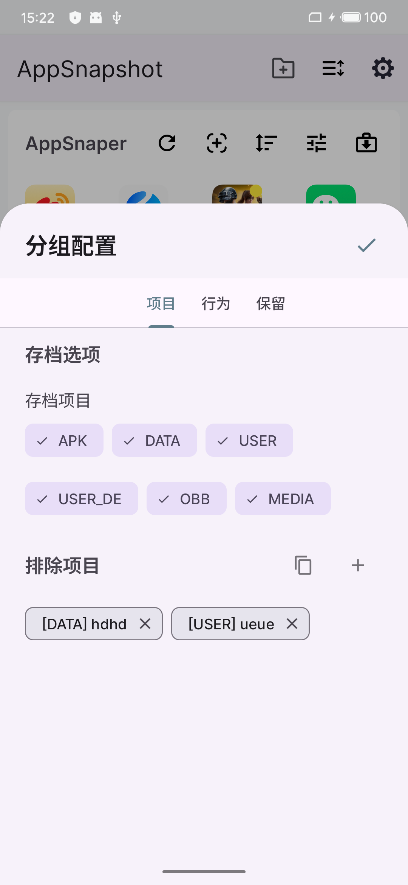

# AppSnapshoter

[中文](README.md) | English

A root-required Android app snapshot tool that quickly packages an app's APK, data directories, OBB, media files, etc. into **compressed snapshots** for backup and restore, with Syncthing sync support.

## Star History

<a href="https://www.star-history.com/?repos=TIIEHenry%2FAppSnapshoter&type=date&legend=top-left">

 <picture>
   <source media="(prefers-color-scheme: dark)" srcset="https://api.star-history.com/chart?repos=TIIEHenry/AppSnapshoter&type=date&theme=dark&legend=top-left" />
   <source media="(prefers-color-scheme: light)" srcset="https://api.star-history.com/chart?repos=TIIEHenry/AppSnapshoter&type=date&legend=top-left" />
   
 </picture>
</a>

## Features

- **One-tap Archive / One-tap Restore**: Long-press an app to quickly create a snapshot, select an archive to restore in one tap — minimal and intuitive
- **Blazing Fast Snapshots**: Native JNI-based TAR packaging + ZSTD compression, far exceeding pure Java solutions
- **Smart APK Deduplication**: APKs shared across apps are not compressed repeatedly, saving storage and time
- **Multiple Archive Management**: Keep multiple historical archives per app, roll back to any version at any time
- **Custom Compression Items**: Beyond default directories, freely add extra directories for compression to meet different needs
- **Streaming Pipeline**: FIFO pipes and `ParcelFileDescriptor`-based streaming compression — no intermediate files, saving storage
- **Root Service Architecture**: AIDL + libsu root service IPC — UI layer never touches root kernel logic directly, safe and reliable
- **Group Management**: Group apps and perform batch snapshot/restore operations by group
- **Pure Native UI**: Built with ViewBinding + DataBinding, no Compose dependency, lightweight

## Screenshots

| Home | Snapshotting | Archive List |
|:---:|:---:|:---:|
|  |  |  |

| App Config | Group Settings |
|:---:|:---:|
|  |  |

## Usage Guide

### Prerequisites

- Rooted Android device
- Minimum Android 9 (API 28)

### Basic Workflow

1. **Grant Permissions**: The app will request Root permission on first launch — please allow it
2. **Create Groups**: Go to Group Settings and create at least one group (used to organize apps and archives)
3. **Add Apps**: On the home screen, add apps to the corresponding groups
4. **Configure Snapshot** (optional): Tap an app to enter the config page, select directories to include (data, obb, media) and custom directories, and choose whether to include split APKs
5. **Create Snapshot**: Long-press an app to quickly create a snapshot — progress shows the current stage (preprocessing → packaging)
6. **View Archives**: Switch to the "Archives" tab to view completed snapshot files, including timestamps, filenames, and sizes. Each app can retain multiple archives
7. **One-tap Restore**: Long-press an app and select the target archive to restore app data in one tap

### Group Management

Tap the settings icon in the bottom-right corner to enter Group Settings. Create groups and categorize apps for convenient batch snapshot or restore operations.

### Syncthing Cross-device Sync

Pair with [Syncthing-Android](https://github.com/researchxxl/syncthing-android) to sync snapshot data and configuration across multiple devices.

**How it works**: All AppSnapshoter data is stored at:

| Content | Path |
|---------|------|
| Global config / App config / Snapshot archives (default) | `/storage/emulated/0/Android/snapshot/` |
| Per-group archive directory | Customizable `rootPath` in group settings |

**Steps**:

1. Install [Syncthing-Android](https://github.com/researchxxl/syncthing-android) on both devices
2. In Syncthing, add a shared folder with the path set to AppSnapshoter's global root directory `/storage/emulated/0/Android/snapshot/`
3. If certain groups use a custom `rootPath`, add the corresponding directory as a shared folder as well
4. Once sync is complete, the other device will have the same configuration and snapshot archives — just restore directly

**Note**: MMKV internal storage (`{filesDir}/mmkv/`) is in the app's private directory and is not within Syncthing's sync scope. Group lists and ordering are stored in MMKV — you'll need to manually recreate groups on a new device. Subsequent config changes will sync via JSON files.

## Credits

This project references the design of [Android-DataBackup](https://github.com/XayahSuSuSu/Android-DataBackup.git).

Special thanks to myself: this is my first project that incorporates a bit of VibeCoding, though most of it is still hand-written. It may not be the most elegant, but old-school coding has its own charm.

## License

This project is licensed under the [GNU General Public License v3.0](LICENSE).
