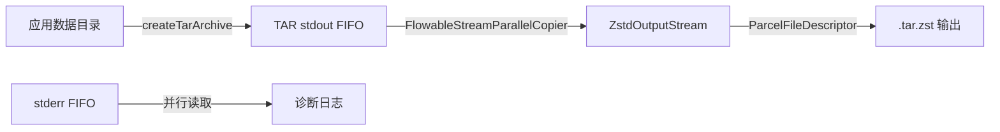

# 压缩管线架构

## 概述

压缩管线将应用数据打包压缩为 `.tar.zst` 格式。全链路 JNI 原生实现，通过 FIFO 管道流式处理，零中间文件。

## ZSTD 压缩流程（主路径）



### 三阶段管线（`ZstdCompressor`）

**文件**：`provider/.../filesystem/compressors/zstd/ZstdCompressor.kt`

```
协程 1: TAR 打包
  └─ FileSystemImpl.createTarArchive()
       └─ TarJNI.callCli() (fork 子进程)
            └─ GNU tar → stdout FIFO

协程 2: stderr 读取
  └─ 从 stderr FIFO 读取 tar 诊断输出

协程 3: ZSTD 压缩
  └─ FlowableStreamParallelCopier 从 stdout FIFO 读取
       └─ ZstdOutputStream 压缩（可配置级别 1-19）
            └─ 输出到 ParcelFileDescriptor
```

### ZSTD 解压流程（`ZstdDecompressor`）

```
阶段 1: ZstdInputStream 解压 → FlowableStreamParallelCopier → FIFO
阶段 2: FileSystemImpl.extractTar() 从 FIFO 读取 → 写入目标目录
```

### TAR 打包流程（`TarCompressor`）

```
1. 创建 stderr FIFO
2. 并发执行：
   - createTarArchive() → stdout（文件或 FIFO）
   - 读取 stderr FIFO
3. 报告完成（原始大小、压缩大小、MD5）
```

## 核心组件

### 文件遍历

**文件**：`io-nativefs/.../NativeFileSystem.kt` + `native-filesystem.cpp`

- POSIX `fts_open`/`fts_read`/`fts_close` 遍历目录
- `stat()` 查询 UID/GID
- 性能远超 Java 递归

### TAR 打包

**文件**：`io-tar/.../TarJNI.kt` + `jni.cpp`

- `fork()` 子进程执行 GNU tar
- `dup2()` 重定向 STDIN/STDOUT/STDERR
- 支持 FIFO 输入（管道接收数据流）
- `prctl(PR_SET_PDEATHSIG)` 防止孤儿进程

### ZSTD 压缩

**文件**：`io-zstd` 内嵌 zstd-jni

- `ZstdOutputStream` 流式压缩
- `ZstdInputStream` 流式解压
- 支持字典压缩（`ZstdDictCompress`）
- 压缩级别映射：用户级 1-9 → ZSTD 级 1-19（非线性）

### 高速流拷贝

**文件**：`provider/.../nota/io/StreamParallelCopier.java` + `FlowableStreamParallelCopier.kt`

- 读线程 + 写线程 + `ArrayBlockingQueue<DataItem>`
- 128KB 缓冲区
- 两线程均 `Thread.MAX_PRIORITY`
- `StateFlow<Progress>` 追踪字节数和速度（每秒更新）

## 压缩算法路由

**文件**：`provider/.../filesystem/FileCompressor.kt`

```
FileCompressor (IFileCompressor.Stub)
├─ compress() → 检测算法
│   ├─ .apk 文件 → TarCompressor（仅打包不压缩）
│   └─ 其他 → ZstdCompressor（TAR + ZSTD）
├─ compressMultiple() → 多源合并压缩
├─ decompress()
│   ├─ .zst → ZstdDecompressor
│   └─ .tar → TarDecompressor
└─ checkFileValid() → 大小 + MD5 校验
```

## FIFO 管道使用

```kotlin
// 创建 FIFO
Os.mkfifo(path, 438 /* 0666 */)

// TAR 写入 stdout FIFO → ZSTD 从 stdout FIFO 读取
// TAR 写入 stderr FIFO → 并行读取诊断信息
```

- **零中间文件**：TAR 输出直接流入 ZSTD 输入
- **内存效率**：流式处理，内存占用与文件大小无关
- **内核级传输**：管道传输，用户态零拷贝

## 性能设计

| 设计 | 收益 |
|------|------|
| JNI 原生 TAR/ZSTD | 避免 Java 字节操作开销 |
| FIFO 流式管线 | 零中间文件、低内存占用 |
| 并行流拷贝（双线程） | 充分利用 I/O 带宽 |
| 128KB 缓冲区 | 平衡内存和吞吐 |
| `Thread.MAX_PRIORITY` | 减少线程调度延迟 |
| FTS 遍历 | 比 Java 递归快数倍 |

## 相关模块

| 模块 | 职责 |
|------|------|
| [`io-tar`](../modules/io-tar/INDEX.md) | TAR 归档（内嵌 GNU tar） |
| [`io-zstd`](../modules/io-zstd/INDEX.md) | ZSTD 压缩（内嵌 zstd-jni） |
| [`io-nativefs`](../modules/io-nativefs/INDEX.md) | 文件遍历（FTS + stat） |
| [`provider`](../modules/provider/INDEX.md) | 管线编排、压缩器实现 |
| [`api`](../modules/api/INDEX.md) | `IFileCompressor`、`ICompressCallback` |
