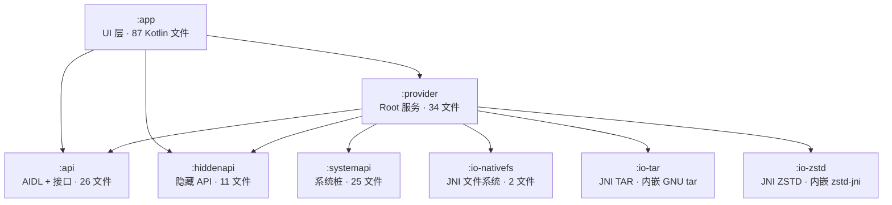

# 系统架构总览

## 模块依赖图



## 分层架构

```
┌─────────────────────────────────────────────────────────┐
│                      UI 层 (:app)                        │
│  MainActivity · LauncherFragment · TimelineFragment      │
│  SnapshotViewModel · AppsViewModel · TimelineViewModel   │
│  ViewBinding + DataBinding · Material3 · Navigation      │
│  Fluent 2 主题 · 紧凑顶栏 · 悬浮底栏 · 87 Kotlin 文件     │
├─────────────────────────────────────────────────────────┤
│                   契约层 (:api)                           │
│  ISnapShotRootService (AIDL, 30+ 方法)                   │
│  IPackageManager · IPermissionManager · IFileSystem      │
│  IFileCompressor · ICompressCallback · ITaskHandler      │
│  26 文件 (7 AIDL + 19 Java/Kotlin)                       │
├─────────────────────────────────────────────────────────┤
│              Root 服务层 (:provider)                      │
│  ┌─ SnapshotRootService (主 AIDL 服务)                   │
│  │   ├─ AppManagementHandler (PackageManagerDelegate     │
│  │   │    + ProcessManager + AppLauncher)                │
│  │   ├─ PermissionManagementHandler                      │
│  │   ├─ SsaidManagementHandler                           │
│  │   └─ FileSystemHandler                                │
│  ├─ FileSystemManagerRootService (libsu-nio)             │
│  ├─ FileSystemImpl (混合文件系统)                         │
│  └─ FileCompressor → Zstd/Tar Compressor/Decompressor    │
│  34 文件 · 12 包 · 双 Root 服务                           │
├─────────────────────────────────────────────────────────┤
│                   原生层 (:io-*)                          │
│  io-nativefs: FTS 遍历 + stat (C++, 76 行)              │
│  io-tar: fork + dup2 + GNU tar (C++, 141 行 + 64K 行)   │
│  io-zstd: zstd-jni 流式压缩/解压 (内嵌完整 zstd 源码)    │
├─────────────────────────────────────────────────────────┤
│                   辅助层                                  │
│  hiddenapi: @RefineAs 字节码精化 (11 文件)               │
│  systemapi: 内部类桩 — XML/Settings/SystemProperties (25) │
└─────────────────────────────────────────────────────────┘
```

## 核心架构模式

### 1. 双 Root 服务 IPC

```
App 进程                              Root 进程
─────────                            ─────────
ProvidersImpl ────── AIDL ─────────→ SnapshotRootService
  ├─ AppManagerImpl                    ├─ AppManagementHandler
  ├─ FileSystemImpl                    ├─ PermissionManagementHandler
  │    └─ FileCompressor              ├─ SsaidManagementHandler
  │         ├─ ZstdCompressor         └─ FileSystemHandler
  │         └─ TarCompressor
  └─ FileSystemProviderImpl ── AIDL ──→ FileSystemManagerRootService
       (libsu-nio FileSystemManager)       (高效文件 I/O)
```

- **SnapshotRootService**：30+ AIDL 方法，4 个领域 Handler
- **FileSystemManagerRootService**：libsu-nio `FileSystemManager` binder，高效文件读写
- App 层通过 `Providers` 接口访问，不直接引用实现类

### 2. 压缩管线

```
应用数据 → NativeFileSystem.calculateTreeSize() (预估大小)
         → createTarArchive() → stdout FIFO
         → FlowableStreamParallelCopier (128KB 双线程)
         → ZstdOutputStream (级别 1-19)
         → ParcelFileDescriptor → .tar.zst
```

### 3. MVVM 模式

| ViewModel | 实例化方式 | 职责 |
|-----------|-----------|------|
| `SnapshotViewModel` | `SnapshotApp.onCreate()` 直接实例化 | 全局分组和应用数据 |
| `LauncherViewModel` | ViewModelProvider | 恢复操作和分组导航 |
| `AppsViewModel` | ViewModelProvider | 多维过滤应用列表 |
| `TimelineViewModel` | ViewModelProvider | 时间范围查询和批量操作 |

### 4. 配置持久化

```
MMKV 默认实例 → GlobalConfig (分组排序、时间线预设)
MMKV 分组实例 → GroupConfig (每分组配置)
文件系统     → group.json + 快照文件
              + /storage/emulated/0/Android/snapshot/
```

## 统计

| 指标 | 数量 |
|------|------|
| Gradle 模块 | 8 |
| 总源文件（非 native 库） | ~165 |
| Kotlin 文件（app） | 87 |
| AIDL 接口 | 7 |
| Root 服务 | 2 |
| ViewModel | 4 |
| BottomSheet | 10 |
| JNI 模块 | 3（nativefs + tar + zstd） |

## 技术栈

| 类别 | 技术 |
|------|------|
| 语言 | Kotlin（app, provider）、Java（api）、C/C++（io-*） |
| UI | ViewBinding + DataBinding、Material3、Navigation Component |
| 异步 | Kotlin Coroutines、Flow、StateFlow |
| 存储 | MMKV（配置）、文件系统（快照） |
| 序列化 | FastJSON2（主）、Moshi、Gson（可用） |
| 图片 | Glide（kapt） |
| Root | libsu（Magisk/KernelSU/APatch） |
| 压缩 | ZSTD + TAR（JNI 原生） |
| 构建 | Gradle 9.2.1、AGP 9.0.0、Kotlin 2.3.0、Java 21 |
| Android | compileSdk 36、minSdk 28、NDK 25.2.9519653 |
