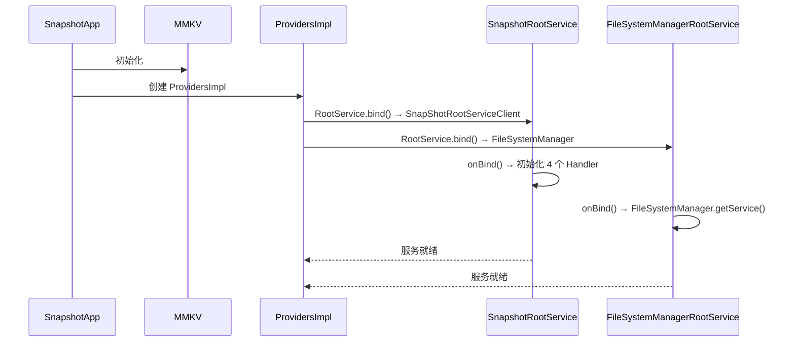

# Root 服务架构

## 概述

AppSnapshoter 采用**双 Root 服务架构**，将 Root 特权操作分为两个独立服务：

1. **SnapshotRootService** — 主 AIDL 服务，暴露 30+ RPC 方法
2. **FileSystemManagerRootService** — 文件 I/O 服务，暴露 libsu-nio `FileSystemManager` binder

## 启动流程



`SnapshotApp.onCreate()` 中：
1. MMKV 初始化
2. 创建 `ProvidersImpl` 实例
3. `bindRootService()` 同时绑定两个 Root 服务
4. Root 检查通过后服务可用

## 双 Root 服务设计

### SnapshotRootService（主服务）

**文件**：`provider/.../service/SnapshotRootService.kt`

继承 `RootService`，`onBind()` 创建 `Impl`（继承 `ISnapShotRootService.Stub`），初始化 4 个 Handler：

```
SnapshotRootService.Impl
├── AppManagementHandler      ← PackageManagerHidden, UserManagerHidden, ActivityManagerHidden
│   ├── PackageManagerDelegate  (包枚举、安装/卸载)
│   ├── ProcessManager          (force-stop、clear、suspend)
│   └── AppLauncher             (启动应用)
├── PermissionManagementHandler ← PackageManagerHidden, AppOpsManagerHidden
├── SsaidManagementHandler      (SSAID 读写，独立 HandlerThread)
└── FileSystemHandler           (文件操作、tar、chown、md5)
```

每个 Handler 运行在 Root 进程，使用 Android 隐藏 API（`PackageManagerHidden`、`UserManagerHidden`、`AppOpsManagerHidden`、`ActivityManagerHidden`）。

### FileSystemManagerRootService（文件 I/O 服务）

**文件**：`provider/.../filesystem/root/fsm/FileSystemManagerRootService.kt`

独立 Root 服务，暴露 libsu-nio 的 `FileSystemManager` binder。提供高效的 Root 级文件读写（无需每字节走 AIDL）。

## 客户端架构

```
App 进程（客户端）
─────────────────
ProvidersImpl                    ← 实现 Providers 接口，服务入口
  ├─ SnapShotRootServiceClient   ← 主服务客户端 Binder（单例 per 包）
  ├─ AppManagerImpl              ← 实现 IPackageManager + IPermissionManager
  │     所有方法通过 runBlocking 桥接协程，调用 rootServiceClient.client!!
  ├─ FileSystemProviderImpl      ← 绑定 FileSystemManagerRootService
  │     └─ FileSystemImpl        ← 实现 IFileSystem
  │           ├─ 普通操作 → libsu-nio FileSystemManager
  │           ├─ 特权操作 → SnapShotRootServiceClient (AIDL)
  │           └─ 压缩 → FileCompressor
  └─ FileCompressor              ← 实现 IFileCompressor.Stub
        ├─ ZstdCompressor / ZstdDecompressor
        └─ TarCompressor / TarDecompressor
```

## 接口设计

### AIDL 接口（跨进程，异步）

| 接口 | 方法数 | 域 |
|------|--------|-----|
| `ISnapShotRootService` | 30+ | 全部 Root 操作 |
| `IFileCompressor` | 4 | 压缩/解压（异步回调） |
| `ICompressCallback` | 3 | 进度回调 |
| `ITaskHandler` | 3 | 任务控制 |

### 纯 Java 接口（进程内，同步）

| 接口 | 实现类 | 域 |
|------|--------|-----|
| `IPackageManager` | `AppManagerImpl` | 包查询、安装、卸载 |
| `IPermissionManager` | `AppManagerImpl` | 权限、AppOps、SSAID |
| `IFileSystem` | `FileSystemImpl` | 文件操作、tar、压缩 |
| `Providers` | `ProvidersImpl` | 服务绑定和管理 |

### 混合设计决策

| 用 AIDL | 用纯接口 |
|---------|---------|
| 需要异步回调（压缩进度） | 同步调用（查询应用列表） |
| 需要可取消任务 | 性能敏感（避免 IPC 开销） |
| 跨进程安全 | 进程内执行即可 |

## 安全隔离

- Root 进程崩溃不影响 UI 进程
- AIDL 接口仅暴露必要操作，无任意命令执行
- `ParcelFileDescriptor` 传输文件数据，避免路径注入
- Handler 模式隔离各领域，互不影响

## 相关模块

| 模块 | 职责 |
|------|------|
| [`api`](../modules/api/INDEX.md) | 接口定义（AIDL + 纯 Java） |
| [`provider`](../modules/provider/INDEX.md) | 双 Root 服务实现 |
| [`hiddenapi`](../modules/hiddenapi/INDEX.md) | 隐藏 API 访问 |
| [`systemapi`](../modules/systemapi/INDEX.md) | 系统类桩（SSAID SettingsState 等） |
