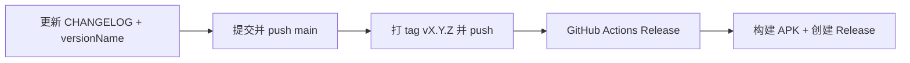

# 发布指南

本文说明如何为 AppSnapshoter 创建 GitHub Release、维护更新日志，以及如何用 AI 辅助完成发布。

Release 页：https://github.com/TIIEHenry/AppSnapshoter/releases

## 发布机制概览

向 GitHub 推送 `v*` 格式的 Git tag 后，[`.github/workflows/release.yml`](../../../.github/workflows/release.yml) 会自动：

1. 运行 `./gradlew assembleRelease` 构建 Release APK
2. 从 [`CHANGELOG.md`](../../../CHANGELOG.md) 提取对应版本段落作为 Release 说明
3. 创建 GitHub Release 并上传 APK（按 ABI 拆分：`arm64-v8a`、`x86_64`）



## 版本号约定

三处版本号必须一致：

| 位置 | 示例 | 说明 |
|------|------|------|
| Git tag | `v1.1.0` | 必须以 `v` 开头，触发 CI |
| `app/build.gradle.kts` → `versionName` | `"1.1.0"` | APK「关于」里显示的版本，**不含** `v` |
| `CHANGELOG.md` 标题 | `## [1.1.0] - 2026-06-18` | CI 用此段落作为 Release 正文 |

`versionCode` 为递增整数（每次发布 +1），仅用于 Android 安装/升级判断，与 tag 无固定换算关系。

当前版本定义见 [`app/build.gradle.kts`](../../../app/build.gradle.kts) 的 `defaultConfig`。

## CHANGELOG 维护

更新日志文件：仓库根目录 [`CHANGELOG.md`](../../../CHANGELOG.md)，格式参考 [Keep a Changelog](https://keepachangelog.com/zh-CN/)。

### 日常开发

在 `## [Unreleased]` 下累积面向用户的变更，按类型分组：

- `Added` — 新功能
- `Changed` — 既有行为变更
- `Fixed` — 缺陷修复
- `Removed` / `Deprecated` / `Security` — 按需使用

写作要求：中文、面向安装 APK 的用户；合并同类 commit；不写 hash；不编造未实现内容。

### 发布时

1. 将 `## [Unreleased]` 内容移到新版本段落，例如 `## [1.1.0] - 2026-06-18`
2. 在文件顶部保留空的 `## [Unreleased]` 供下次累积
3. 本地校验 Release 正文能否提取：

```bash
scripts/extract-changelog.sh 1.1.0
```

有输出即表示 CI 能正确生成 Release 说明；无输出则发布会失败。

## 手动发布

适合不使用 AI、逐步操作的场景。

### 1. 更新 CHANGELOG 与版本号

编辑 `CHANGELOG.md`（见上一节），并修改 `app/build.gradle.kts`：

```kotlin
versionCode = 2        // 比上一版 +1
versionName = "1.1.0"  // 与 tag / CHANGELOG 一致，无 v 前缀
```

### 2. 提交并推送

```bash
git add CHANGELOG.md app/build.gradle.kts
git commit -m "chore(release): prepare v1.1.0"
git push origin main
```

### 3. 打 tag 并推送

```bash
git tag -a v1.1.0 -m "Release v1.1.0"
git push origin v1.1.0
```

### 4. 等待 CI 并验证

- 打开 GitHub → **Actions** → **Release** workflow，确认构建成功
- 打开 [Releases](https://github.com/TIIEHenry/AppSnapshoter/releases) 页，检查说明正文与 APK 附件

### 本地仅构建 APK（不上传 Release）

```bash
./gradlew assembleRelease
# 输出：app/build/outputs/apk/release/
```

也可在 GitHub 网页手动创建 Release 并上传本地 APK，但通常推荐使用 tag 触发 CI。

## 使用 AI 辅助发布

仓库提供专用 prompt： [`.github/prompts/release.md`](../../../.github/prompts/release.md)

在 Cursor 中 `@` 引用该文件并说明意图即可。AI 会按 prompt 执行：分析 commit → 写 CHANGELOG → **修改 `versionName` / `versionCode`** → 提交 →（经你确认后）打 tag 并 push。

### 常用指令

**完整发布（指定版本）：**

```
@.github/prompts/release.md 请发布 v1.1.0
```

**只准备、不 push（便于人工检查）：**

```
@.github/prompts/release.md 根据 main 上自 v1.0 以来的变更建议版本号，写好 CHANGELOG，准备好发布但不要 push
```

**只写日志、不改应用版本号：**

```
@.github/prompts/release.md 写好 CHANGELOG，但不要修改 app/build.gradle.kts
```

### AI 会改哪些文件

| 文件 | 是否修改 |
|------|----------|
| `CHANGELOG.md` | 是 |
| `app/build.gradle.kts`（`versionCode` / `versionName`） | 默认是；可在指令中要求跳过 |
| Git commit / tag / push | 提交与 push 需你明确同意（prompt 已约束） |

### 发布前自检清单

- [ ] `versionName`、CHANGELOG `## [x.y.z]`、tag `vx.y.z` 三者一致
- [ ] `scripts/extract-changelog.sh x.y.z` 有非空输出
- [ ] `versionCode` 已递增
- [ ] 已 push 包含版本 bump 的 commit，再打 tag（避免 tag 指向旧代码）

## 故障排除

| 现象 | 原因 | 处理 |
|------|------|------|
| Release workflow 报错「未找到 CHANGELOG 段落」 | tag 版本与 `CHANGELOG.md` 中 `## [版本]` 不匹配 | 补写对应段落或修正 tag |
| Release 说明为空 | 版本段落存在但内容为空 | 在 CHANGELOG 中补充条目 |
| 推送 tag 后无 workflow | tag 不以 `v` 开头 | 使用 `v1.0.0` 格式 |
| APK 版本与 Release 标题不一致 | 打 tag 前未 bump `versionName` | 重新发版或修正后打新 tag |
| 多个 APK 不知选哪个 | 启用了 ABI split | 手机选 `arm64-v8a`，模拟器/x86 设备选 `x86_64` |

## 相关文件

| 文件 | 用途 |
|------|------|
| [`CHANGELOG.md`](../../../CHANGELOG.md) | 面向用户的更新日志 |
| [`scripts/extract-changelog.sh`](../../../scripts/extract-changelog.sh) | CI 提取指定版本段落 |
| [`.github/workflows/release.yml`](../../../.github/workflows/release.yml) | 自动构建与发布 |
| [`.github/prompts/release.md`](../../../.github/prompts/release.md) | AI 发布 prompt |
| [`app/build.gradle.kts`](../../../app/build.gradle.kts) | `versionCode` / `versionName` |
