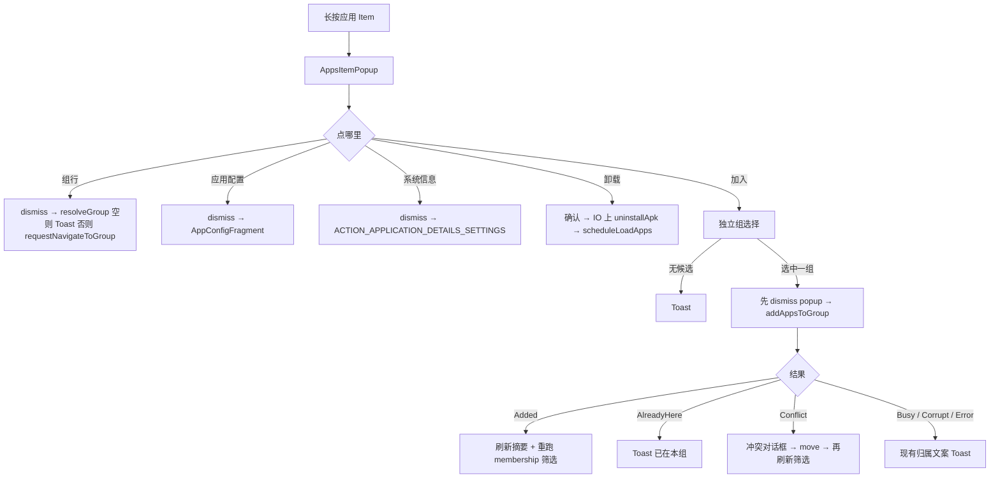

# 应用 Tab Item 长按 Popup

> 版本：v1.0 · 日期：2026-08-23 · 状态：draft  
> 关联：应用 Tab（`AppsFragment`）、存档 Item popup（`ArchiveItemPopupMenu`）、[分组应用归属](GROUP_MEMBERSHIP.md)、[分组集](GROUP_SET.md)

## 文档索引

| 章节 | 内容 |
|------|------|
| 1 | [背景与目标](#背景与目标) |
| 2 | [现状分析](#现状分析) |
| 3 | [已定决策](#已定决策) |
| 4 | [功能设计](#功能设计) |
| 5 | [核心业务逻辑](#核心业务逻辑) |
| 6 | [模块与文件结构](#模块与文件结构) |
| 7 | [边界与质量](#边界与质量) |
| 8 | [实施计划](#实施计划) |

## 快速摘要

应用 Tab 长按不再弹 `AppMembershipDialog`。改为与存档主页 Item **同一架构**的 `PopupWindow`：上排图标按钮，下半 `RecyclerView`。列表 item 是该应用**已经加入的组**（独占优先、再共享），点组跳到存档 Tab。入组入口是上排**一个「加入」按钮**，再选独立组。同排另有系统应用信息 / 应用配置 / 卸载。加入走现有 `addAppsToGroup` + 冲突移动，不新开归属模型。

---

## 背景与目标

### 需求背景

应用 Tab 长按目前只展示归属并跳转；未分组时只提示「未分组」，不能入组。入组仍只能从存档 Tab 点某个组的 `+` 再选应用，方向反了：用户在应用列表里看到目标应用，却要先记住组、切 Tab、再搜应用。

同时用户希望长按能做更多事（详情、卸载），并复用主页应用 Item 的 popup 样式，而不是再堆一套 AlertDialog。

### 目标

1. 应用 Tab 长按改为存档 Item 同构的 popup（上排动作 + 下半列表）。
2. 现有归属 dialog 里的组，变成 popup 列表 item；点组仍跳转存档对应组。
3. 可从应用 Tab 把该应用加入某个**独立组**（不在分组集内）。
4. 可打开系统应用信息页、应用配置（`AppConfigFragment`）、确认后卸载。
5. 加入 / 移动的不变量仍由 `AppDataRepository` 强制，UI 只消费结构化结果。

### 非目标（v1）

| 排除项 | 说明 |
|--------|------|
| 复用 `ArchiveItemPopupMenu` / `layout_popup_menu.xml` 整份 | 强绑 `ArchivedApp`、存档列表、快照/锁定/删存档；应用 Tab 没有所属组 |
| 快照、锁定、删存档、恢复 | 需要组上下文与存档树，仍只在存档 Tab popup |
| 加入分组集内的组 | v1 目标组 = 独立组；集内组仍从存档 Tab `+` 添加 |
| 长按当场新建独立组 | 建组仍走存档 Tab `AddGroupBottomSheet` |
| 复制存档到多组 | 与归属方案一致，不做 |
| 应用 Tab 多选批量入组 / 卸载 | 仍单 Item |
| 改单击行为 | 单击仍打开 `AppConfigFragment` |
| 改存档 Tab popup | 本方案不改主页 Item 菜单逻辑 |

---

## 现状分析

### 两条长按

| 表面 | 实现 | 内容 |
|------|------|------|
| 存档 Tab 组内应用 | `ArchiveItemPopupMenu` + `layout_popup_menu.xml` | 上排：快照 / 锁定 / 系统信息 / 配置 / 删除；下半：该应用在**该组**的存档列表 |
| 应用 Tab 已安装应用 | `AppMembershipDialog`（`AlertDialog`） | 已加入的独占/共享组；点组 `navigateToGroup`；未分组只提示文案 |

应用 Tab 单击已打开 `AppConfigFragment`。归属摘要在列表副标题（`AppListItemBinder` + `GroupMembershipResolver`）。

### 入组真源

| 能力 | 位置 | 约束 |
|------|------|------|
| 加入 | `AppDataRepository.addAppsToGroup` → `AddAppsResult` | 独占冲突不写盘；UI 不得另开写入口 |
| 移动 | `moveAppBetweenGroups` → `MoveAppResult` | 仅独占→独占 |
| 冲突对话框 | `GroupActionsController.handleAddAppsResult` | 仅存档 Tab `+` 在用；应用 Tab 新入口必须复用同一套 UI，禁止复制一份逻辑 |
| 独立组 | `ArchiveListItem.GroupCard.setId == null` | 与 [分组集](GROUP_SET.md) 投影一致；禁止用「不在 `group_sets` 里」另算 |

### 卸载

`IPackageManager.uninstallApk(packageName, userId)`（Root `pm uninstall --user`）。应用层尚无通用确认 UI。组内「锁定」只约束自动卸载 / 移动，**不**挡住用户在应用 Tab 主动卸载。

### 可复用

- 视觉 token：`popup_menu_background`、`popup_btn_size`、`showAsDropDown(anchor)`、elevation
- `GroupMembershipResolver.buildMembershipIndex` / `AppGroupMembership`
- `SnapshotViewModel.addAppsToGroup` / `moveAppBetweenGroups` / `requestNavigateToGroup`
- `AppConfigFragment.newInstance(packageName, userId)`
- `ArchiveItemPopupMenu.openAppSettings`（应抽出，避免 apps 依赖 launch.popup）
- 列表 loading 契约不变：`isAppsLoading` SSOT

### 不能复用的误区

- 把 `layout_popup_menu.xml` 的存档 `RecyclerView` + 五枚专用按钮 `GONE` 掉再塞新动作：布局语义仍是「某组的存档菜单」，后续必分叉。
- 把 `item_archive.xml`（锁、存档图标）拿来画组名行。
- 只在 UI 里拦独占冲突、绕过 repository。
- 用 `groupList` 减「名字像集」来当独立组。独立组只认 `archiveList` 上 `setId == null` 的 `GroupCard`。

---

## 已定决策

| # | 决策 | 理由 |
|---|------|------|
| D1 | 长按 = 新 popup，删除 `AppMembershipDialog` | 用户明确要主页 popup 架构；dialog 与 popup 并存会双入口 |
| D2 | 复用**架构与视觉**，不复用存档 popup 的 layout/class | 数据是 `AppInfo` + 归属，不是 `ArchivedApp` + 存档 |
| D3 | 下半列表 = 现归属 dialog 的组（独占行在前，共享在后） | 用户指定「dialog 里的组放到 popup item」 |
| D4 | 点列表组 = 关 popup → `navigateToGroup` → 切存档 Tab | 保持现网长按语义 |
| D5 | 未分组 = 空列表，不弹「未分组」对话框 | 上排「加入」已覆盖该场景 |
| D6 | 入组入口 = 上排**一个「加入」按钮**，再 Dialog 选独立组 | 用户选定。列表只表示「已在哪些组」，不和候选组混排；不要列表末行「加入…」、不要同一列表点未加入组即加入 |
| D7 | 上排共四键：「加入」/ 系统信息 / 应用配置 / 卸载 | 「加入」只负责入组；详情与卸载仍在同排，不塞进列表 item |
| D8 | 单击仍打开 `AppConfigFragment` | 长按增强，不改浏览路径 |
| D9 | 加入目标仅独立组，且 `group.userId == app.userId` | 用户原话「独立组」；跨 user 不入组 |
| D10 | 选择独立组后走 `addAppsToGroup`；Conflict 走抽出的结果 UI → move | D9 of 归属方案：不变量在 repository |
| D11 | 卸载：确认框 → `uninstallApk`；本应用自己禁用卸载 | 防误触；Root 卸载与现网包管理一致 |
| D12 | 不把快照/锁定放进应用 Tab popup | 无所属组则无锁定列表、无存档树 |
| D13 | 组行跳转只走 `requestNavigateToGroup` | 归属列表含集内组；现网会展开折叠集。禁止自写 scroll |
| D14 | `addAppsToGroup` 回调前先 dismiss popup | Conflict→move 后旧归属行会过期 |
| D15 | `groupList` 变化必须重跑 `applyFilter()` | 现网只刷新副标题，未分组筛选不会自己更新 |
| D16 | 卸载在 repository `scope` + `packageOpGuard`；成功只 `loadApps` | `scheduleLoadApps` / VM `loadApps()` **已存在**；禁止点击线程 `uninstallApk`（ANR） |

### 考虑过的替代方案（拒绝或推迟）

| 方案 | 结论 |
|------|------|
| 列表同时列出未加入的独立组，点了即加入 | 推迟。与「dialog 里的组」语义冲突；v1 用上排加入 |
| 列表末尾固定「加入独立组…」行 | 推迟。上排按钮更符合「动作在上、对象在下」 |
| 本版只搬家归属、不做加入 | 拒绝。最初需求就是从应用 Tab 入组 |
| 长按进多选 | 拒绝。与 popup 互斥，且应用 Tab 现无多选 |
| 卸载走系统 `ACTION_DELETE` Intent | 拒绝作主路径。本应用已有 Root `uninstallApk`；系统面板作失败时的弱提示即可，不双路径默认 |

---

## 功能设计

### 信息架构

```text
AppsItemPopup（PopupWindow，锚在被长按的 item）
├── 上排 ImageButton
│   ├── btn_add            加入（选独立组）
│   ├── btn_info          系统应用信息
│   ├── btn_settings      AppConfigFragment
│   └── btn_uninstall     卸载（确认）
└── RecyclerView          已加入的组
    ├── MembershipRow(exclusive, group)
    └── MembershipRow(shared, group)
```

视觉对齐存档 popup：同一 `popup_menu_background`、同一 `popup_btn_size`、同一 `showAsDropDown`。新建 `layout_apps_popup_menu.xml` / `item_apps_popup_group.xml`，**不要**改 `layout_popup_menu.xml`。

组行：主文字 = 组名；前缀或副文案区分独占/共享（复用 `app_membership_exclusive_item` / `app_membership_shared_item`）。不要用存档锁图标。

### 交互



**独立组选择（v1）**：`AlertDialog.setItems`，条目 = 候选独立组名，顺序与存档顶层独立 `GroupCard` 一致。候选定义见 [查询](#查询)。组很多时仍用 Dialog（与现冲突框一致）；不在 v1 做搜索。

**卸载确认**：标题用应用名；正文说明将卸载该用户下的应用，**不**删除任何分组里的存档目录。

### 与单击、筛选的关系

| 手势 | 行为 |
|------|------|
| 单击 Item | 不变：`AppConfigFragment` |
| 长按 Item | 本 popup（取代归属 dialog） |
| 未分组 / 已分组筛选 | **现网缺口**：`groupList` 只 `refreshMembership()` 改副标题，**不** `applyFilter()`。本方案必须在 `groupList` 变化时重跑 membership 筛选，否则「未分组加入后筛选消失」验收不过 |

---

## 核心业务逻辑

### 数据

不新增持久化字段。Popup 输入：

```text
AppInfo + AppGroupMembership + 当前 archiveList / groupList 快照
```

组行模型（仅 UI）：

```kotlin
data class AppsPopupGroupRow(
    val group: SnapGroup,
    val exclusive: Boolean,
)
```

### 查询

**已加入行**（与现 dialog 相同）：

```text
rows = membership.exclusiveGroups.map { exclusive=true }
     + membership.sharedGroups.map { exclusive=false }
```

**独立组候选**（加入按钮）：

```text
independent = archiveList
  .filterIsInstance<GroupCard>()
  .filter { it.setId == null }
  .map { it.group }
  .filter { it.userId == app.userId }
  .filter { !containsPackage(it, app.packageName) }
```

- `archiveList` 为空或尚未投影：候选为空，Toast「没有可加入的独立组」。禁止 fallback 把集内组算进去。
- 已在该独立组（独占或共享）的组不进候选（避免 AlreadyHere 往返）。若该应用已在另一独占组，候选里的其它独占独立组仍列出；选中后 repository 返回 `Conflict`，再走移动。

纯函数建议放 `GroupMembershipResolver`（或并列 `AppsPopupTargets`），单测覆盖：集内组排除、userId、已是成员排除。

### 加入

与存档 Tab `+` 同一管道，单应用列表：

```text
addAppsToGroup(targetId, listOf(appInfo))
```

UI 用抽出的 `AddAppsResultUi`：**必须同时迁走** `handleAddAppsResult` **和** `moveApps`（顺序 move 循环）。Controller 只提供 `context` + `onMovedOrAdded`。禁止只抽对话框、把 `moveApps` 留在依赖 `ItemGroupBinding` 的 Controller 里。

任何 `addAppsToGroup` 回调到达前先 **dismiss popup**（含 Conflict）。否则移动成功后列表仍显示旧独占组。

加入/移动成功后：`refreshMembership()` **且** `AppsViewModel` 重跑 `applyFilter()`（或等价）。现网只改副标题，筛选不会自己更新。不必为加入再 `loadApps`。

跳转组行：**只许** `SnapshotViewModel.requestNavigateToGroup`。列表含集内组；该方法会展开折叠集再 pending 滚动。禁止自写「只 scroll」。`resolveGroup == null` 时 Toast，**不要**调用 navigate（现网会留下卡住的 pending）。

### 卸载

```text
确认 → repository.scope / IO 上 IPackageManager.uninstallApk(packageName, userId)
  成功 → scheduleLoadApps 刷新 catalog（isAppsLoading SSOT）
  失败 → Toast
  禁止成功后调 loadData：那会连带 loadGroups 全量扫盘
  禁止在点击线程直接 uninstallApk：实现是 runBlocking + 最长 60s shell，会 ANR
```

- `packageName == 本应用`：按钮 disabled。
- 占用门闸读 `packageOpGuard.isBusy()` / `isGlobalBatchRunning()`（GROUP_MEMBERSHIP D11），不要只看 `isBatchRunning` LiveData。
- 卸载**不**调用 `deleteAppCompletely`，存档树保留。

### 系统信息

从 `ArchiveItemPopupMenu.openAppSettings` 抽到 `utils`（如 `AppDetailsLauncher`）。存档 popup 与应用 popup 共用。失败回退 `ACTION_MANAGE_APPLICATIONS_SETTINGS`，再失败 Toast（现网文案）。

---

## 模块与文件结构

| 文件 | 操作 | 说明 |
|------|------|------|
| `res/layout/layout_apps_popup_menu.xml` | 新增 | 上排四键 + `RecyclerView`；token 对齐存档 popup；列表复制 `maxHeight`（存档为 200dp） |
| `res/layout/item_apps_popup_group.xml` | 新增 | 组名 + 独占/共享标签 |
| `main/apps/AppsItemPopupMenu.kt` | 新增 | 显示 popup、绑按钮；**不**实现 add/move 守卫；`showAsDropDown(itemView)` |
| `main/apps/AppsPopupGroupAdapter.kt` | 新增 | 组行 ListAdapter |
| `group/AddAppsResultUi.kt`（建议名） | 新增 | 迁走 `handleAddAppsResult` **与** `moveApps`；Controller / Apps 共用 |
| `utils/AppDetailsLauncher.kt`（建议名） | 新增 | 系统应用信息；存档 popup 改调此处 |
| `group/GroupMembershipResolver.kt` | 改 | `independentJoinTargets(...)` 纯函数 |
| `main/apps/AppsAdapter.kt` | 改 | 长按回调改为 `(View, AppInfo, AppGroupMembership)`，否则无锚点 |
| `main/apps/AppsFragment.kt` | 改 | 长按 → popup；`onDestroyView` dismiss；传入 navigate / add / uninstall |
| `main/apps/AppsViewModel.kt` | 改 | `groupList` 变化时重跑 `applyFilter()`；不承担入组写入 |
| `main/apps/AppMembershipDialog.kt` | 删除 | 无其它引用后删除 |
| `main/launch/GroupActionsController.kt` | 改 | 只委托 `AddAppsResultUi`；`onMovedOrAdded` 里 `onRefresh(resolveGroup)` |
| `main/launch/popup/ArchiveItemPopupMenu.kt` | 改 | 系统信息改走 `AppDetailsLauncher` |
| `AppDataRepository` | 改 | 加 `uninstallInstalledApp`；`scheduleLoadApps` 已存在 |
| `SnapshotViewModel` | 改 | 加 `uninstallApp` 门面；`loadApps()` 已存在；禁止卸载走 `loadData()` |
| `group/UninstallAppResult.kt` | 新增 | 卸载结果类型 |
| `res/values*/strings.xml` | 改 | `apps_popup_*`；可保留 `app_membership_*` 给组行 |
| `app/src/test/.../GroupMembershipResolverTest` 或新建 | 改/增 | 独立组候选 |

---

## 边界与质量

### 边界

| 场景 | 行为 |
|------|------|
| 无任何组 / 无独立组 | 加入 → Toast；列表空 |
| 仅有集内组 | 加入候选为空（即使集内已有空位） |
| 已在唯一独占独立组 | 该组不在候选；其它独立共享组仍可加入 |
| 目标独占且它处有独占 owner | Conflict → 移动 / 取消 |
| 多独占损坏 | Toast `group_membership_corrupt`，不写盘 |
| 批处理 / 该包占用 | Toast busy |
| `archiveList` 与 `groupList` 短暂不一致 | 候选以 `archiveList` 为准；加入仍用 groupId 走 repository |
| 组已删、membership 过期 | `resolveGroup == null` → Toast，不调用 `requestNavigateToGroup` |
| 归属行是折叠集内的组 | **在范围内**。必须走 `requestNavigateToGroup`（先展开集再滚到卡片） |
| Conflict 后面板还开着 | 禁止。`addAppsToGroup` 前已 dismiss |
| 卸载本应用 | 按钮 disabled |
| 卸载失败（系统应用等） | Toast；列表不假装已卸 |
| 卸载成功但 catalog 未刷新 | 必须 `scheduleLoadApps`；禁止 Adapter 本地 remove |
| popup 显示时 `groupList` 更新 | 开着的 popup 不热更新；写入路径已 dismiss |
| 横屏 | 主界面 portrait-only，不考虑 |

### 性能

- 长按只读已加载的 `groupList` / `archiveList` / membership index，不扫盘、不 `loadApps`。
- 独立组候选 O(archiveList)；组数量与存档主页同级。
- 卸载后刷新走现网 catalog 路径，不在 popup 里轮询。

### 测试

| 类型 | 用例 |
|------|------|
| 单测 | 独立组候选：排除 `setId != null`、错 userId、已是成员 |
| 单测 | 组行顺序：独占全部在共享前 |
| 真机 | 未分组 → 加入独立独占组 → 摘要更新、未分组筛选消失 |
| 真机 | 已在独占 A → 加入独立独占 B → 冲突 → 移动后 A 无、B 有 |
| 真机 | 点组行跳到存档且目标组可见 |
| 真机 | 应用已在**折叠集内**某组 → 点该行 → 集展开且卡片可见（走 `requestNavigateToGroup`） |
| 真机 | 系统信息、配置、卸载确认取消/成功 |
| 回归 | 存档 Tab 长按 popup 未回归；存档 `+` 冲突对话框仍可用 |

### i18n

前缀 `apps_popup_`。至少：

- `apps_popup_add`（按钮 contentDescription：「加入」）/ `apps_popup_add_empty`
- `apps_popup_pick_group_title`
- `apps_popup_already_here` / `apps_popup_add_failed` / `apps_popup_group_gone`
- `apps_popup_uninstall_title` / `apps_popup_uninstall_message`
- `apps_popup_uninstall_failed`
- contentDescription：加入、卸载（系统信息/配置可复用现有 `desc_info` / `settings`）

组行继续用 `app_membership_exclusive_item` / `app_membership_shared_item`。三套 locale 同步。

---

## 实施计划

### Phase 1 — MVP

- [x] 布局：`layout_apps_popup_menu` + `item_apps_popup_group`
- [x] `AppsItemPopupMenu` + `AppsPopupGroupAdapter`
- [x] 抽出 `AppDetailsLauncher`；存档 popup 改用
- [x] 抽出 `AddAppsResultUi`（含 `moveApps`）；`GroupActionsController` 改用
- [x] `groupList` → `AppsViewModel.applyFilter()`
- [x] `independentJoinTargets` + 单测
- [x] `AppsFragment` 长按接 popup；删除 `AppMembershipDialog`
- [x] 上排「加入」→ 独立组 Dialog + `addAppsToGroup`
- [x] 卸载确认 + `uninstallInstalledApp` + catalog 刷新（`loadApps`）
- [x] locale

### Phase 2 — 可选

- [ ] 下半列表兼列未加入的独立组（点加入 / 点已加入则跳转）
- [ ] 独立组选择改为带搜索的 BottomSheet
- [ ] 允许加入集内组（二级：集名 / 组名）
- [ ] 长按新建独立组并加入

### 验收标准

- [ ] 长按不再出现 `AlertDialog` 归属框
- [ ] 已加入组出现在 popup 列表；点组走 `requestNavigateToGroup`（含折叠集内组）
- [ ] 未分组筛选下加入独占独立组后，该项从列表消失（`applyFilter` 重跑，不只改副标题）
- [ ] 未分组应用列表为空，上排加入仍可用
- [ ] 只能加入独立组；集内组不出现在选择列表
- [ ] 独占冲突不写盘，移动与存档 Tab `+` 同一套对话框
- [ ] 绕过 UI 调 `addAppsToGroup` 仍受 repository 守卫（本方案不削弱）
- [ ] 单击仍打开应用配置
- [ ] 存档 Tab Item 长按菜单外观与行为不回归
- [ ] 卸载取消不卸载；成功后应用从应用 Tab 消失，组内存档仍在
- [ ] 三套 strings 无硬编码用户文案

### 风险

| 风险 | 缓解 |
|------|------|
| 两套冲突 UI 分叉 | `AddAppsResultUi` 含 handle + move；Controller 只委托 |
| 「独立组」算错，把集内组加进去 | 只认 `GroupCard.setId == null` |
| popup 无锚点 / 回收 | `AppsAdapter` 传 item `View`；`onDestroyView` dismiss |
| 点击线程 `uninstallApk` ANR | IO + `scheduleLoadApps`；门闸用 `packageOpGuard` |
| `repository.scope` 不可见 | `scheduleLoadApps` 必做，不用 VM `viewModelScope` 加载 catalog |

---

## 相关文档

- [快照系统索引](INDEX.md)
- [分组应用归属与移动](GROUP_MEMBERSHIP.md) — add/move 不变量；本方案只增加 UI 入口
- [分组集](GROUP_SET.md) — 独立组 = `setId == null`
- [添加应用后刷新不及时](add-app-refresh-stale-group.md) — 加入后 `groupList` 刷新
- [主界面壳层](../../guides/getting-started/ui-shell.md) — 底栏切 Tab
- [i18n](../../guides/getting-started/i18n.md)
