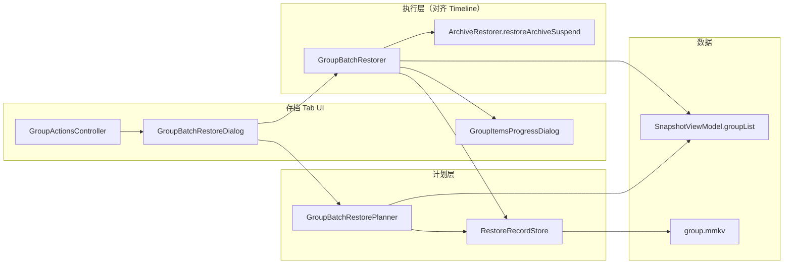

# Group 批量恢复功能设计文档

> 版本：v1.1 · 日期：2026-06-17 · 状态：待评审 · 前置：时间线批量恢复已落地（`TimelineBatchOperator`）

---

## 文档索引

| 章节 | 文档 | 内容 |
|------|------|------|
| 1 | [背景与目标](group-batch-restore/01-overview.md) | 需求背景、目标、非目标、已定决策 |
| 2 | [现状分析](group-batch-restore/02-current-state.md) | 数据模型、现有能力、与时间线的差异 |
| 3 | [UI 设计](group-batch-restore/03-ui-design.md) | 组头布局重构、批量菜单、配置对话框 |
| 4 | [核心业务逻辑](group-batch-restore/04-business-logic.md) | 恢复范围、快照策略、RestoreRecord、执行流程 |
| 5 | [模块与文件结构](group-batch-restore/05-implementation.md) | 新增/修改文件、类职责、与 Timeline 对齐清单 |
| 6 | [边界 / 测试 / 实施计划](group-batch-restore/06-quality-roadmap.md) | 边界情况、测试范围、Phase 划分与验收 |
| 7 | [附录](group-batch-restore/07-appendix.md) | 与 `TimelineBatchOperator` 的对照表、集成代码片段 |

---

## 快速摘要

在 **存档 Tab** 的分组卡片上，为「全部归档」补齐对称的 **批量恢复** 能力。用户通过配置对话框选择：

| 维度 | 选项 |
|------|------|
| **恢复范围** | 未安装 / 全部有快照 / 自上次恢复以来 |
| **快照选择** | 最新 / 最旧 / 与上次恢复相同 |

组头工具栏改为 **标题一行 + 图标一行**，「全部归档 / 批量恢复」收入 **批量操作菜单**（`btn_batch`），避免第 6 个 40dp 按钮挤占标题区。

**执行层**直接镜像 `TimelineBatchOperator.batchRestore`：`ArchiveRestorer.restoreArchiveSuspend` + `GroupItemsProgressDialog` + 结束后 `snapshotViewModel.loadGroups()`。

**新增基础设施**：`RestoreRecord`（group MMKV）支撑「自上次恢复以来」与「与上次相同」策略；单应用恢复成功时也写入，保证语义一致。

---

## 架构一览

---

## 与时间线批量恢复的关系

| 维度 | 时间线 Tab | Group 批量恢复（本方案） |
|------|------------|--------------------------|
| 入口 | 多选工具栏 → 策略对话框 | 组头批量菜单 → **统一配置对话框** |
| 范围 | 时间区域 + 用户多选 | 组内 + 范围枚举 |
| 快照策略 | `RestoreStrategy`（新/旧） | `ArchivePickStrategy`（新/旧/与上次相同） |
| 运行时解析 | `TimelineRepository.resolveEntry` | `GroupBatchRestorePlanner.resolveTaskAt` |
| 恢复引擎 | `restoreArchiveSuspend` | 相同 |
| 进度 UI | `GroupItemsProgressDialog` | 相同 |
| 批量互斥 | `TimelineViewModel.isBatchRunning` | **迁移至** `SnapshotViewModel.isBatchRunning`（跨 Tab 共用） |

两者互补：时间线解决 **跨组、按时间段**；Group 批量恢复解决 **单组、按安装状态 / 增量**。

---

## 阅读建议

| 角色 | 建议阅读顺序 |
|------|--------------|
| 产品 / 评审 | [01 背景](group-batch-restore/01-overview.md) → [03 UI](group-batch-restore/03-ui-design.md) → [06 验收标准](group-batch-restore/06-quality-roadmap.md#验收标准) |
| 开发 | [02 现状](group-batch-restore/02-current-state.md) → [04 业务逻辑](group-batch-restore/04-business-logic.md) → [05 实现结构](group-batch-restore/05-implementation.md) → [07 附录](group-batch-restore/07-appendix.md) |
| 测试 | [06 边界与测试](group-batch-restore/06-quality-roadmap.md) |

---

## 预估工期

| Phase | 内容 | 工期 |
|-------|------|------|
| 0 | `SnapshotViewModel.isBatchRunning` 抽取（含 Timeline 迁移） | 0.5 天 |
| 1 | RestoreRecord + Planner + 单元测试 | 1 天 |
| 2 | 组头 UI + 配置对话框 | 1 天 |
| 3 | GroupBatchRestorer + 集成 | 1 天 |

**合计约 3.5 天**（含联调与手工验证）。
