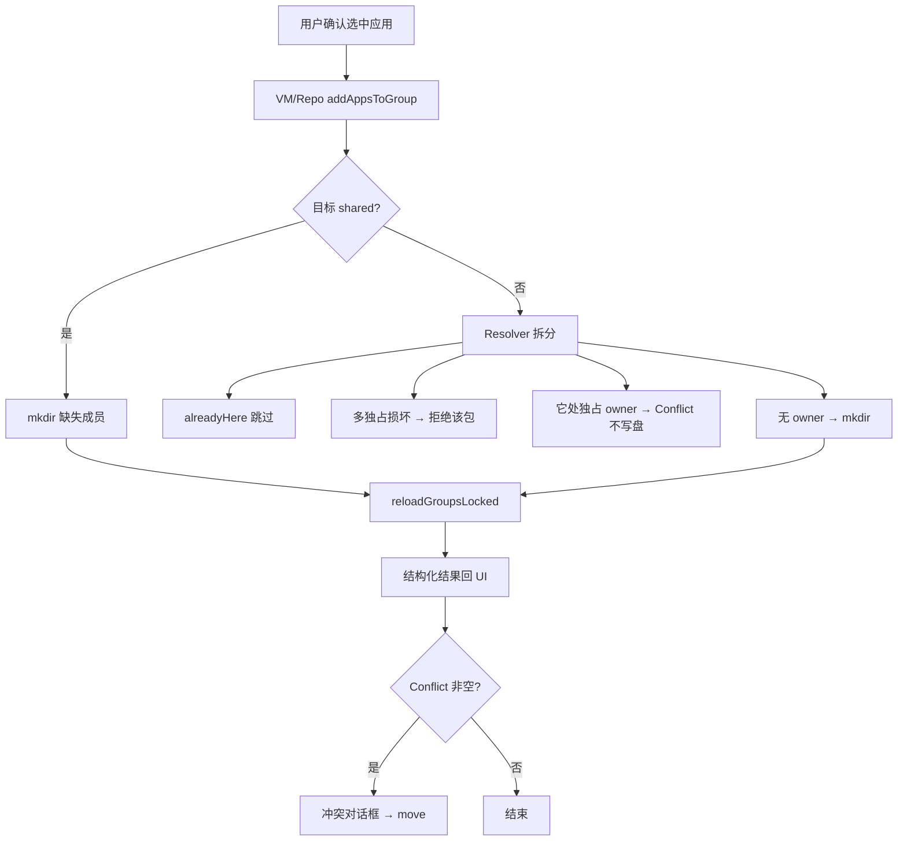
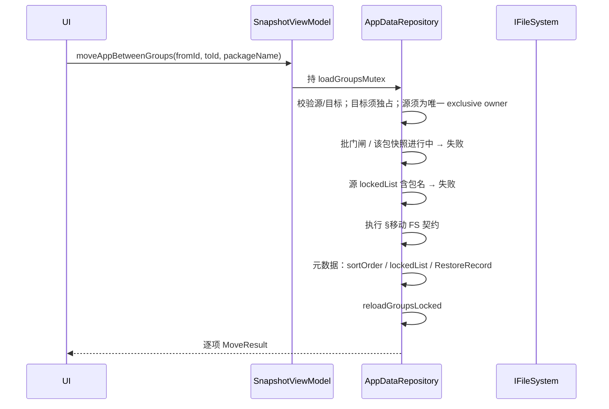

# 分组应用归属与移动

> 版本：v1.2 · 日期：2026-08-21 · 状态：active（Phase 1 已落地）  
> 关联：`SnapGroup`、`AppDataRepository.addAppsToGroup`、`SelectAppFragment`、应用 Tab「未分组」筛选  
> 实施计划：[dev/plans/2026-08-group-membership.md](../../../dev/plans/2026-08-group-membership.md)  
> 修订：v1.1/v1.2 Grok must-fix 已并入。Phase 1 代码已落地（repository 守卫、Guard、move、Setting 开关、冲突对话框）。

## 文档索引

| 章节 | 内容 |
|------|------|
| 1 | [背景与目标](#背景与目标) |
| 2 | [现状分析](#现状分析) |
| 3 | [已定决策](#已定决策) |
| 4 | [功能设计](#功能设计) |
| 5 | [核心业务逻辑](#核心业务逻辑) |
| 6 | [模块与文件结构](#模块与文件结构) |
| 7 | [边界与质量](#边界与质量) |
| 8 | [实施计划](#实施计划) |

## 快速摘要

分组默认 **独占**：同一 `(packageName, userId)` 至多属于一个独占组。可选将组设为 **共享**，其成员不占用归属、不参与冲突检测。向独占组添加应用时若已在其它独占组，返回冲突并由 UI 提示 **移动**（连同 `packageDir` 存档一起迁到目标组）。向共享组添加一律放行。

**不变量强制点是 `AppDataRepository`**（含 `addAppsToGroup` 写入时二次校验），UI 只消费结构化结果弹窗；禁止仅靠 Select 确认流守卫。首版不做「复制存档到多组」。

---

## 背景与目标

### 需求背景

用户向分组添加应用时，期望：

1. 若应用已在其它组，能 **看到提示**，并可选将应用/存档 **移动过来**；
2. 同时保留「部分应用出现在多个组」的能力（例如收藏型、主题型分组）。

当前实现 **无任何归属检测**：`addAppsToGroup` 仅在目标路径下创建包名目录并保存图标，同一应用可静默出现在多组，各自独立存档树。对「主备份组」场景容易造成两套历史、误操作；对「多组收藏」场景又缺少正式语义。

### 目标

1. 引入组级 **成员模式**：`exclusive`（独占，默认）与 `shared`（共享）。
2. **冲突仅发生在独占 ↔ 独占**：目标为独占且应用已在另一独占组时，提示并支持移动。
3. 提供 `moveAppBetweenGroups`（文件系统迁 `packageDir`），与「仅加成员」路径分离。
4. 「未分组」筛选语义对齐：**不在任何独占组中**（共享组不算「已归属」）。
5. 配置可同步：字段落在 `group.json`，随分组目录一起被 Syncthing 等同步。

### 非目标

| 排除项 | 说明 |
|--------|------|
| 复制存档到多组 | 首版不提供「把历史存档拷到另一组」；共享组加入只建目标侧空壳目录（与现状 `mkdir` 一致） |
| 跨组共享同一物理存档目录 | 仍一组成员一路径；不做硬链接/符号链接统一存储 |
| 全局「每应用唯一」硬约束 | 共享组刻意允许多成员关系 |
| 共享组改为「仅 JSON 成员、不 mkdir」 | 仍用目录表示成员（与现网一致）；**接受**共享组「全部归档」可写出第二套历史（产品风险见 §残余风险） |
| 自动合并两边都有的存档历史 | 目标侧已有非空 `packageDir` 时移动失败 |
| 时间线条目去重 | 同应用多组仍可有多条时间线记录；不在本方案改 Timeline 投影 |
| per-app 例外表 | 不用「本组独占但个别包可共享」打穿组级开关 |

---

## 现状分析

### 数据与存储

| 事实 | 含义 |
|------|------|
| 成员 = 磁盘目录 | `group.path/<packageName>/` 存在即视为在组内 |
| 存档物理归属在组路径下 | 快照写入该目录；多组 = 多套独立历史 |
| `group.json` | `GroupConfigData`：`userId`、`name`、`sortConfig`、`lockedList` |
| 无跨组索引 | 归属需扫描已加载的 `groupList` |

### 相关代码路径

| 组件 | 路径 | 现状 |
|------|------|------|
| `addAppsToGroup` | `AppDataRepository.kt` | 无冲突检测；`mkdir` + 图标 + `reloadGroupsLocked` |
| `SelectAppFragment` | `main/selectapp/` | 选完直接回调；不展示「已在其它组」 |
| `AppsViewModel.groupedAppKeys` | `main/apps/AppsViewModel.kt` | 任意组成员均算「已分组」 |
| `AppTagHelper.isAppInGroup` | `app/tag/AppTagHelper.kt` | 按目录是否存在判断 |
| 组配置 UI | `GroupConfigFragment` / `GroupSettingFragment` | 无成员模式开关 |

### 可复用能力

- 写后刷新：`loadGroupsMutex` + `reloadGroupsLocked`（添加应用刷新文档已落地）
- 组内锁定：`GroupConfig.lockedList` — 移动源组时若锁定，应阻止或要求先解锁
- 文件系统：`IFileSystem.move` / `copyRecursively` **已存在**；`move` 语义为「目标已存在即失败」+ `renameTo`（跨卷可能失败）。迁目录须按 §移动 FS 契约，不能假定单次 `move` 万能

---

## 已定决策

| # | 决策 | 理由 |
|---|------|------|
| D1 | 组级开关，默认独占 | 新建组开箱即「主存档组」语义；共享为显式选择 |
| D2 | 冲突检测只看独占组 | 共享组「隐身」于归属；满足多组收藏又不干扰主组 |
| D3 | 冲突主操作是「移动」 | 对齐用户期望；避免默认再造第二套空壳 |
| D4 | `add` 与 `move` 分入口 | 移动要处理存档、锁定、排序、恢复记录；勿塞进现有 `addAppsToGroup` |
| D5 | 未分组 = 无独占归属 | 与「主备份是否已安排」一致；仅在共享组的应用仍显示为未分组 |
| D6 | 字段名 `membershipMode` | 取值 `exclusive` \| `shared`；避免「可重复」被理解成重复快照 |
| D7 | 缺省 exclusive + **存量重叠须可检测** | 无字段按独占；但现网已可多组同包，升级后必须检测多独占损坏态（见 §D7 升级），禁止静默 `firstOrNull` 当真相 |
| D8 | 首版不做批量冲突「部分勾选」 | 多选：plain 可先加入；conflict 整批移动或取消 |
| D9 | **不变量在 repository 强制** | UI 预检可保留；权威拒绝在 `addAppsToGroup` / `moveAppBetweenGroups` / `setMembershipMode`；防新入口绕过 |
| D10 | 成员模式 UI SSOT = `GroupSettingFragment` | 与 name / userId / path 同级；**不**放进 `GroupConfigFragment` |
| D11 | **占用 SSOT 在 repository** | 全局批 + 按 `packageDir` 的进行中快照/恢复登记在 repository（或由其持有的 Guard）；`SnapshotViewModel.isBatchRunning` 仅作 LiveData 门面；含**单应用** `SnapshotCreator`（现网不置 `isBatchRunning`） |
| D12 | **结果类型替换 `() -> Unit`** | `AddAppsResult` / `MoveResult` 为唯一回调载荷；禁止并行保留吞掉冲突的 Unit API |

### 考虑过的替代方案（拒绝）

| 方案 | 拒绝理由 |
|------|----------|
| 每次加入时选「共享/独占」 | 无组级默认，心智碎、易误造双历史 |
| 全局每应用唯一（无共享组） | 不满足收藏/多视图需求 |
| 共享组只写 JSON、不 mkdir | 改动成员模型与扫描约定过大；留作后续若第二套历史不可接受 |
| 冲突只拦 UI、`add` 无守卫 | 新入口 / Timeline / 脚本调用会立刻打穿不变量 |

---

## 功能设计

### 概念

| 术语 | 定义 |
|------|------|
| **独占组 (exclusive)** | 默认。成员占用归属；同一 `(packageName, group.userId)` 全局至多一个独占组拥有该成员 |
| **共享组 (shared)** | 可选。成员不占用归属；不参与冲突检测；适合收藏/主题/临时集合 |
| **归属冲突** | 向 **独占** 目标添加应用时，该应用已存在于 **另一独占** 组 |
| **移动** | 将源独占组下的 `packageDir`（含存档与组内元数据）迁到目标组路径，并清理源侧引用 |

键：`packageName` + **目标/源组的 `userId`**（与现网「分组绑定 userId」一致）。跨 userId 的同包名视为不同归属，不互相冲突。

### 冲突矩阵

| 目标组 \\ 已所在 | 仅共享组 / 无组 | 另一独占组 | 已在本独占组 |
|------------------|-----------------|------------|--------------|
| **独占** | 直接加入（`add`） | **冲突 → 提示移动** | 跳过 / Toast 已在本组 |
| **共享** | 直接加入 | 直接加入（不提示） | 跳过 / Toast 已在本组 |

说明：「已所在」只统计 **独占** 成员关系时，「仅共享」与「无组」对独占目标等价。

### 交互设计

#### 1. 组配置：成员模式

- **位置（SSOT）**：`GroupSettingFragment`（与名称、userId、路径同级）
- 控件：开关 — 「允许共享成员」（开 = `shared`，关 = `exclusive`）
- 文案要点（i18n）：
  - 标题：允许共享成员
  - 说明：开启后，本组成员不占用应用归属，其它独占组仍可单独管理该应用存档
- 从共享改回独占：经 **`AppDataRepository.setMembershipMode`** 校验；若本组成员已在其它独占组 → **拒绝写入** 并返回冲突包名；Fragment 只展示。`GroupConfig.membershipMode` setter **不得**成为绕过入口（与 `updateGroupPath` 一样走 repository）
- exclusive→shared：**显式允许**（D7 修复主路径之一）

### D7 升级与多独占损坏态

现网升级前，同一 `(packageName, userId)` **可以**已在多个组。缺省全部视为 exclusive 后会出现「多独占 owner」。

**Phase 1 必做（最小集）：**

1. `reloadGroupsLocked` 末尾扫描：同一 `(pkg, userId)` 出现在 ≥2 个独占组 → 记入损坏集合并 `Log.w`
2. 损坏态下：
   - `findExclusiveOwners`（复数）暴露；**禁止** `firstOrNull` / `singleOrNull` 假装唯一
   - `addAppsToGroup` / `moveAppBetweenGroups` 涉及该包 → 拒绝
3. **修复路径（写清，move 不能修损坏）：**
   - 将其中一组改为 **shared**（`setMembershipMode`），或
   - 从多余独占组 **删除成员**（现网 `ArchiveManager.deleteAppCompletely`）
   - **不要**建议用 move 修复：move 要求唯一 exclusive owner，损坏态下会被拒绝

可选：启动非阻塞提示「检测到 N 个应用在多个独占组」。

归属计数与「未分组」自洽：

| 独占 owner 数 | 语义 |
|---------------|------|
| 0 | 未分组（可仅在共享组） |
| 1 | 正常归属 |
| ≥2 | 损坏（仍算「已分组」，不会出现在未分组筛选） |

#### 2. 选应用加入（`SelectAppFragment` + 编排）

编排落在 **Controller / ViewModel**（现网入口 `GroupActionsController` → `SnapshotViewModel`），Fragment 只负责选应用回调；冲突对话框由编排层根据 **repository 返回结果** 展示。

**列表态（推荐 Phase 2，可后置）**

- 若应用已在其它 **独占** 组：副标题或角标「已在：{组名}」
- 已在当前组：灰显不可选或选中后确认时跳过

**确认态（Phase 1 必做）**

```
调用 addAppsToGroup(targetId, selected)
  → repository 拆分并执行 plain；conflict 不写盘，随结果返回
UI:
  plain 成功部分已入组
  conflict 非空 → 冲突对话框（移动 / 取消）
  alreadyHere 跳过（可 Toast）
```

UI 可做一次 Resolver 预检以减少失败往返，但 **写入时 repository 必须再检**（防 TOCTOU / Syncthing / 并发）。

**冲突对话框（单应用）**

- 标题：应用已在其它分组
- 正文：`{应用名}` 已在独占组「{源组名}」。可将存档移动到「{目标组名}」。
- 操作：
  - **移动过来** → `moveAppBetweenGroups`
  - **取消**
- 首版 **不提供**「仅加入（不移动）」按钮。

**冲突对话框（多应用）**

- 列表展示：应用名 → 源独占组名
- 主按钮：**全部移动过来**（逐项结果；失败项可重试，禁止整批单一 boolean）
- 次要：**取消**（整批不移动；已成功的 plainAdd 保留）

#### 3. 应用 Tab「未分组」

- `groupedAppKeys` 仅收录 **membershipMode == exclusive** 的组成员
- 仅存在于共享组的应用，在「未分组」筛选下 **仍出现**

#### 4. 可选弱提示（非阻塞）

共享组头部或空态：短文案说明「共享组适合整理收藏；主存档建议放在独占组」。不强制。

---

## 核心业务逻辑

### 数据模型

`GroupConfigData`（`group.json`）新增：

```java
/**
 * 成员模式：exclusive（默认）| shared
 * JSON 缺省或未知值按 exclusive
 */
public String membershipMode = "exclusive";
```

Kotlin 侧可读封装（建议）：

```kotlin
enum class GroupMembershipMode {
    EXCLUSIVE,
    SHARED;

    companion object {
        fun fromStorage(raw: String?): GroupMembershipMode =
            if (raw.equals("shared", ignoreCase = true)) SHARED else EXCLUSIVE
    }
}
```

`GroupConfig` 暴露只读查询；**写入走 repository**：

```kotlin
val membershipMode: GroupMembershipMode
    get() = GroupMembershipMode.fromStorage(groupConfigData.membershipMode)

val isExclusive: Boolean get() = membershipMode == GroupMembershipMode.EXCLUSIVE
```

### 结果类型（冻结，替换 `() -> Unit`）

```kotlin
sealed class AddAppItemResult {
    data object AlreadyHere : AddAppItemResult()
    data object Added : AddAppItemResult()
    data class Conflict(val ownerGroupId: String) : AddAppItemResult()
    data object CorruptMultiOwner : AddAppItemResult()
    data object Busy : AddAppItemResult()
    data class Error(val message: String) : AddAppItemResult()
}

data class AddAppsResult(val items: Map<String, AddAppItemResult>) // key = packageName

sealed class MoveAppResult {
    data object Moved : MoveAppResult()
    data object AlreadyAtTarget : MoveAppResult() // 源无目标有 → 补元数据成功
    data object Locked : MoveAppResult()
    data object TargetNonEmpty : MoveAppResult()
    data object CorruptMultiOwner : MoveAppResult()
    data object Busy : MoveAppResult()
    data class Error(val message: String) : MoveAppResult()
}
```

- `AppDataRepository.addAppsToGroup(..., onComplete: (AddAppsResult) -> Unit)`（或 suspend）
- `SnapshotViewModel` 同步改签名；**删除**旧 `() -> Unit` 重载
- 唯一调用方现网为 `GroupActionsController`；落地时更新 `add-app-refresh-stale-group.md` 回调契约
- repository **禁止**弹窗

### 占用 Guard（进程级 SSOT）

```text
AppDataRepository（或持有的 PackageOpGuard）:
  - beginGlobalBatch() / endGlobalBatch()
  - beginPackageOp(packageDir) / endPackageOp(packageDir)   // 单应用快照/恢复/move
  - isBusy(packageDir?): Boolean

SnapshotViewModel.tryBeginBatchOperation / endBatchOperation:
  → facade 到 repository，LiveData 仍供 UI 观察

必须登记的调用方:
  GroupBatchArchiver / GroupBatchRestorer / TimelineBatchOperator
  SnapshotCreator.createSnapshot（现网单应用路径不置 isBatchRunning）
  moveAppBetweenGroups（对该 packageDir begin/end）
```

`add`/`move` 只读 Guard。`loadGroupsMutex` **不是**与 ArchiveMaker 的互斥：大目录 copy 期间用 packageDir 占用；mutex 只串行成员元数据变更与 `reloadGroupsLocked`。

实施时同步更新 `GROUP_BATCH_RESTORE.md` 等「批互斥 SSOT = ViewModel」的叙述。

### 查询：归属解析

纯函数（便于单测），输入已加载的 `List<SnapGroup>`：

```text
findExclusiveOwners(groups, packageName, userId): List<SnapGroup>
  = groups.filter {
        it.isExclusive
        && it.userId == userId
        && 成员含 packageName   // 优先内存 apps
    }

// 唯一 owner 时返回该组；0 个 → null；≥2 → 损坏态（调用方不得静默取 first）
exclusiveOwnerOrNull(...) = owners.singleOrNull()
```

批量：一次扫描独占组构建 `Map<pkg, List<SnapGroup>>`。

### 操作流程：加入



`addAppsToGroup` **必须**：

| 情况 | 行为 |
|------|------|
| 已在本组成员 | 幂等 no-op |
| 目标共享 | 允许 mkdir（即使它处有独占 owner） |
| 目标独占且无它处独占 owner | mkdir |
| 目标独占且它处有唯一独占 owner | **不写盘**，返回 `Conflict(owner)` |
| 目标独占且多独占损坏 | **不写盘**，返回损坏/拒绝 |
| 全局 batch / 该包快照进行中 | 拒绝（与 move 同门闸） |

返回值建议结构化（勿只 `boolean` + 吞异常），例如：`alreadyHere` / `added` / `conflict(ownerId)` / `corruptMultiOwner` / `busy` / `error`。

### 操作流程：移动



#### 移动 FS 契约

`IFileSystem.move`：源不存在 → false；**目标已存在 → false**；内部 `renameTo`（跨卷可能失败）。另有 `copyRecursively(source, target, overwrite)`。

**锁与占用：**

1. `beginPackageOp(源与目标 packageDir)`（Guard）；忙则 `Busy`
2. 短临界区持 `loadGroupsMutex` 做校验与元数据；**大目录 copy/move IO 在 mutex 外、仍持 packageDir 占用**（避免堵住 `onResume`/`loadGroups`）
3. 元数据写回与 `reloadGroupsLocked` 再进 mutex

**空壳定义：** 无 `.tar.zst`（含嵌套）且无「非点文件」子目录。点文件（`.nomedia`、Syncthing `.stfolder` 等）**不**单独构成「有存档」，也**不得**因「清空空壳」误删含 `.stfolder` 的目录——若仅有点文件：视为空壳可删前须确认无同步锚点，或改为「拒绝覆盖、要求用户手动处理」。推荐 MVP：**仅当 list 在忽略 `.`/`..` 后完全为空**才当空壳删除；若仅有点文件 → 视为非空失败（保守，避免毁同步）。

算法：

1. 目标存在且 **非空**（按上定义）→ `TargetNonEmpty`
2. 目标存在且为空（完全无条目）→ `delete` 目标空目录
3. 尝试 `move(源, 目标)`
4. 若 false → `copyRecursively(..., overwrite=false)`  
   - **完整性最小判据**：源侧相对路径集合 ⊆ 目标，且对应文件 size 一致（至少所有 `.tar.zst`）  
   - 通过后 `delete` 源  
   - **中途失败**：best-effort 删除**不完整目标**，返回 `Error`，保持源完整；重试时不得落入「源有 + 目标残缺非空 → 永久失败」。允许对「判定为残缺目标」（缺关键存档或 size 不符）在重试时覆盖删除后再 copy
5. 组根图标 `$packageName.png` 迁到目标组根；目标已有可覆盖
6. 源 `sortOrder` / `lockedList` 移除；目标自定义排序追加；`group.json` save
7. RestoreRecord：经 `RestoreRecordStore`（补 `remove`）读源 → 写目标 → 删源；失败只打日志
8. `reloadGroupsLocked`；`endPackageOp`

**幂等（重试）：**

| 重试时状态 | 行为 |
|------------|------|
| 源有、目标无 | 正常迁 |
| 源无、目标有且完整 | **AlreadyAtTarget**：补元数据成功 |
| 源有、目标有且完整非空 | `TargetNonEmpty` |
| 源有、目标有且判定残缺 | 删残缺目标后重试 copy |
| 源无、目标无 | `Error` |
| 只迁了目录、图标仍在源 | 补迁图标，可重入 |

**禁止 fallback add：** 源不存在时默认失败。唯一例外须同时满足「无任何独占 owner」且产品显式允许（本方案默认不启用该例外）。

**并发：**

- `add`/`move` 只读 Guard（全局批 + packageDir）
- `ArchiveMaker` mkdir 前：若目标组独占且它处已有唯一/多 owner → **拒绝快照**（防御；现网主路径通常只对已是成员的 app 快照）
- Syncthing 闪烁：接受

### 与现有子系统关系

| 子系统 | 影响 |
|--------|------|
| 时间线 | 移动后 `groupId` 随重载变化 |
| 批量恢复 / `RestoreRecordStore` | 补 `remove`；move 迁本机记录 |
| 分组集 | 无直接冲突 |
| 应用标签 `group_*` | 仍按目录；共享/独占均可 |
| 锁定 | 源锁定禁 move；目标锁定不挡迁入 |
| `ArchiveMaker` | mkdir 前防御防御校验；占用登记 |
| 批互斥文档 | 落地时改 SSOT 叙述为 repository Guard |

---

## 模块与文件结构

| 文件 | 操作 | 说明 |
|------|------|------|
| `config/GroupConfigData.java` | 改 | 增 `membershipMode` |
| `config/GroupConfig.kt` | 改 | 封装 get/set / `isExclusive` |
| 新建 `group/GroupMembershipMode.kt`（或放 config 包） | 新增 | 枚举 + fromStorage |
| 新建 `group/GroupMembershipResolver.kt`（建议） | 新增 | `findExclusiveOwners`、拆分、损坏检测；纯函数 + 单测 |
| 新建 `group/AddAppsResult.kt` 等（或 repository 包） | 新增 | `AddAppsResult` / `MoveAppResult` / 占用 Guard |
| `repository/AppDataRepository.kt` | 改 | add 守卫；move；`setMembershipMode`；Guard；多独占检测 |
| `main/launch/batch/RestoreRecordStore.kt` | 改 | 补 `remove` |
| `SnapshotViewModel.kt` | 改 | 结果回调；批 API facade 到 Guard |
| `SnapshotCreator` / Batch* / TimelineBatch* | 改 | 登记/释放 packageDir 或全局批占用 |
| `ArchiveMaker`（或调用前） | 改 | 独占防御：它处已有 owner 则拒快照 |
| `main/selectapp/SelectAppFragment.kt` | 改 | 仅选应用 |
| `GroupActionsController.kt` | 改 | 消费 `AddAppsResult` → 对话框 → move |
| `GroupSettingFragment.kt` | 改 | 开关 → `setMembershipMode` |
| `AppsViewModel.kt` | 改 | `groupedAppKeys` 仅独占 |
| `add-app-refresh-stale-group.md` / 批恢复文档 | 改 | 回调与占用 SSOT（落地时） |
| `res/values*/strings.xml` | 改 | `group_membership_*`、`group_move_*` |
| 单测 | 新增 | Resolver、幂等/残缺目标、mode 切换 |

---

## 边界与质量

### 边界情况

| 场景 | 行为 |
|------|------|
| 目标已有空 `packageDir`（完全无条目） | 删除空壳后迁入 |
| 目标已有非空 / 仅点文件 | `TargetNonEmpty`（保守，防误删 `.stfolder`） |
| 源目录不存在 | `Error`；**不** fallback add |
| 源应用在 `lockedList` | `Locked` |
| 源/目标为共享却调 move | 拒绝 |
| 多独占损坏 | add/move 拒绝；修复 = shared 或删成员 |
| shared → exclusive 冲突 | `setMembershipMode` 拒绝并返回包名 |
| 批 / 该包快照进行中 | `Busy` |
| copy 中途失败留下残缺目标 | 删残缺目标后 `Error`；允许重试覆盖残缺 |
| 仅图标、无 packageDir | 按无成员；add 仍 mkdir |

### 残余风险（产品接受）

| 风险 | 说明 |
|------|------|
| 共享组第二套历史 | 共享组仍是完整存档树，「共享」只管归属冲突，不管双历史；用户仍可在共享组「全部归档」 |
| Syncthing 双端离线 add | 两机各写入不同独占组后同步 → 多独占；只能检测，不能自动合并 |
| `move` 布尔失败无 errno | 跨卷 / 权限 / 目标存在对用户可能同一句失败；copy 回退时磁盘加倍 |
| RestoreRecord 不同步 | 换机后本无记录；move 只保证本机连续性 |
| 组级 mode 无 per-app 例外 | 存量重叠只能改整组为 shared 或移出包 |

### 性能

- 冲突检测：O(独占组数 × 成员数) 或先建 Map；写入路径再检一次
- 移动：IO 在 `AppDataRepository.scope` + `loadGroupsMutex`；大目录 copy 回退可能慢/占盘
- 列表角标（Phase 2）：一次性 owner Map

### 测试范围

| 类型 | 用例 |
|------|------|
| 单测 | `fromStorage`；冲突矩阵；多独占损坏；`groupedAppKeys` 忽略 shared |
| 单测 | add 守卫（UI 未预检时 repository 仍拒绝）；move 幂等表 |
| 真机 | 独占冲突 → 移动保留存档；共享加入不弹窗；升级后多组同包检测 |
| 回归 | 添加后刷新、全部归档、时间线跳转、锁定应用 |

### i18n

所有用户可见文案进 `values` / `values-zh-rCN` / `values-en`，前缀建议：

- `group_membership_allow_shared`
- `group_membership_allow_shared_summary`
- `group_move_conflict_title`
- `group_move_conflict_message`
- `group_move_action`
- `group_move_failed_*`

---

## 实施计划

### Phase 1 — MVP（归属 + 移动）

- [ ] `membershipMode` 模型与缺省 exclusive
- [ ] `AddAppsResult` / `MoveAppResult`；替换 `() -> Unit`
- [ ] 进程级占用 Guard；VM 批 API facade；单应用 `SnapshotCreator` 登记
- [ ] `GroupSettingFragment` → `setMembershipMode`（repository 校验）
- [ ] `GroupMembershipResolver` + 单测
- [ ] `addAppsToGroup` 守卫 + 结构化结果
- [ ] 加载时多独占检测（D7）；修复文案 = shared 或删成员
- [ ] Controller：Conflict → 对话框 → move（逐项）
- [ ] `moveAppBetweenGroups`：§FS 契约（残缺目标可重试）、图标、元数据、`RestoreRecordStore.remove`
- [ ] ArchiveMaker 路径独占防御校验
- [ ] `groupedAppKeys` 仅独占
- [ ] locale；更新刷新文档回调契约 / 批 SSOT 叙述（可同 PR）

### Phase 2 — 体验（可选）

- [ ] Select 列表「已在：组名」角标
- [ ] 多冲突部分勾选移动
- [ ] 共享组空态弱提示
- [ ] 多独占修复向导 UI

### 验收标准

- [ ] 绕过 UI 调 `addAppsToGroup`：非法独占加入不写盘并返回 Conflict
- [ ] 绕过 UI 调 `setMembershipMode(shared→exclusive)`：冲突时不写盘
- [ ] 应用仅在共享组 → 加入独占组成功
- [ ] 独占 A → 独占 B：提示并移动后存档保留
- [ ] 独占 A → 共享 C：成功且 A 保留
- [ ] 「未分组」= 0 独占 owner；多独占不算未分组
- [ ] 损坏态：move/add 拒绝；改 shared 或删成员可修复
- [ ] 单应用快照进行中：move 返回 Busy
- [ ] copy 失败留残缺目标后重试可成功
- [ ] move 源无目标有 → AlreadyAtTarget
- [ ] 不回归：添加刷新、全部归档

### 风险

| 风险 | 缓解 |
|------|------|
| `renameTo` 跨卷失败 | copy + 完整性判据；残缺目标可清后重试 |
| 占用双真相 | Guard 为 SSOT；VM 仅 facade |
| `.stfolder` 误删 | 仅完全空目录当空壳 |
| 共享组双历史 | 文档接受 |
| 与 ArchiveMaker 并发 | packageDir Guard + mkdir 防御 |

---

## 相关文档

- [应用 Tab Item 长按 Popup](APPS_TAB_ITEM_POPUP.md) — 应用 Tab 新加入入口；add/move 仍走本方案不变量
- [快照系统索引](INDEX.md)
- [添加应用后刷新不及时](add-app-refresh-stale-group.md) — 写后 `reloadGroupsLocked` 约定
- [分组集](GROUP_SET.md) — 分组组织容器；本方案不改集模型
- [多用户适配](multi-user-adaptation.md) — 归属键含 `userId`
- [存储策略](../../architecture/cross-cutting/storage.md) — 落地时补 `group.json` 的 `membershipMode`（实施期）
- [架构审查 2026-08](../../architecture/review-2026-08.md) — 错误勿以布尔吞掉；本方案 add/move 用结构化结果
