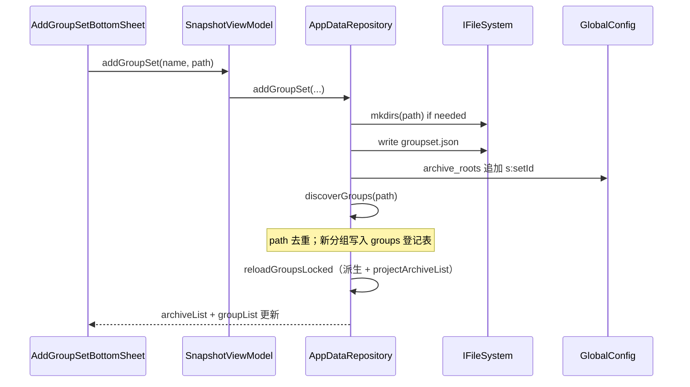

# 分组集功能设计文档

> 版本：v1.4 · 日期：2026-08-21 · 状态：active（已落地；Header 吸顶；底栏快跳含拖选）  
> 关联：存档 Tab（`LauncherFragment`）、`SnapGroup`、`AppDataRepository`、[存储策略](../../architecture/cross-cutting/storage.md)  
> 修订：Grok 二轮 must-fix 已并入。第三轮为 **Grok 等价审查（降级）→ Approve**（子代理 resource_exhausted）。底栏快跳已接 `GroupSetJumpPopup` 拖选。

## 文档索引

| 章节 | 内容 |
|------|------|
| 1 | [背景与目标](#背景与目标) |
| 2 | [现状分析](#现状分析) |
| 3 | [已定决策](#已定决策) |
| 4 | [功能设计](#功能设计) |
| 5 | [核心业务逻辑](#核心业务逻辑) |
| 6 | [模块与文件结构](#模块与文件结构) |
| 7 | [边界与质量](#边界与质量) |
| 8 | [实施计划](#实施计划) |

## 快速摘要

**分组集**是同一父目录下多个分组的组织容器。该父目录即分组集目录；添加分组集时扫描直接子目录，自动登记为 `SnapGroup`。快照/恢复/配置仍以分组为单元。

存档 Tab 顶层由「分组集块 + 独立分组」拼接。**同一集内的分组必须连续排在一起**，默认折叠为一条 Header；展开后在 Header 下插入现有分组卡片（缩进，不再套一层卡片）。长按悬浮底栏存档 Tab 可弹出分组集菜单，点击或拖选跳到对应块。

---

## 背景与目标

### 需求背景

存档 Tab 将所有 `SnapGroup` 平铺为卡片。分组变多后难以扫视和滚动。用户侧已有（或打算采用）「若干分组目录放在同一个父目录」的文件布局，但应用无法识别该父目录：

- `SnapGroup.loadApps` 会跳过不含 `.` 的子目录（包名启发式），把父目录加成「分组」时，下面的分组目录不会出现。
- 每组仍需在「添加分组」里单独登记；新设备 / Syncthing 同步后也要逐个加。

### 目标

1. 引入 **分组集（Group Set）**：名称 + 目录；添加、刷新、设置、删除的**交互**对齐分组。折叠交互也对齐（点标题折展），**实现不对齐**：集折叠是 repository 重新投影 `archiveList`，禁止抄 `SnapGroup.isCollapsed` + ViewHolder 本地改 visibility。
2. **添加分组集 = 扫描父目录的直接子目录**，自动登记尚未存在的分组（按 path 去重）。
3. 存档列表上 **同一集的分组连续成块**；新建集 **默认折叠**。
4. 独立分组仍然存在，可与分组集在顶层交错，但 **不能插入某个集的内部**。
5. 时间线、快照、恢复、分组配置的操作单元不变，仍是 `SnapGroup`。
6. （Phase 3 可裁）长按悬浮底栏 **存档 Tab** 弹出分组集列表，点击或按住拖选即可跳到对应块。

### 非目标（v1）

- 嵌套分组集（集里再套集）
- 分组集级批量快照 / 批量恢复
- 与目录无关的虚拟收藏夹、标签式分组
- 把分组集当成第三种快照类型
- 时间线按集筛选（可后续加；v1 最多显示「集名 / 分组名」并支持跳转时展开）
- 应用 Tab 改动

---

## 现状分析

### 当前数据模型

| 概念 | 实现 | 真源 |
|------|------|------|
| 分组登记与顺序 | `GlobalConfig.groups`（MMKV `groups_order`） | 本机 |
| 分组路径 | `GroupConfig.rootPath`（`mmkvWithID("group:" + id)`） | 本机 |
| 分组名称 | `group.json` → 目录 basename → `id` | 文件系统（可同步） |
| 分组成员 | `SnapGroup.loadApps` 扫描 `path` 下像包名的子目录 | 文件系统 |
| 折叠 | `SnapGroup.isCollapsed`（分组 MMKV） | 本机 |
| 存档列表 | `GroupsAdapter : ListAdapter<SnapGroup>`，每项一张卡片，内嵌应用网格 | — |

### 当前文件布局

```
{groupPath}/
  group.json
  com.example.app/*.tar.zst
  com.example.app.png
```

路径由 SAF 选择，不强制落在默认根目录下。

### 可复用

- `AddGroupBottomSheet` + `GroupPathPickerHelper`（名称、路径、从 JSON 预填）
- `GroupSettingFragment` 删除确认（可镜像为集的删除档位）
- `GroupSortBottomSheet` 拖拽排序（需升级为两级）
- `AppDataRepository.scope` + `loadGroupsMutex`（添加后刷新必须走这条链路，见 [添加分组后列表不刷新](add-group-refresh.md)）
- `SnapshotViewModel.navigateToGroup` 的 **LiveData 事件槽**（时间线 → 存档）。**不要**复用现码消费协议（立刻 `value = null` + `indexOfFirst`）
- 悬浮底栏 `bottom_nav_archive` 现为 `setOnClickListener` 切 Tab，可在其上叠加快跳手势（短按仍切 Tab）
- 分组卡片 `item_group.xml` 及 `GroupActionsController`（**仅 GroupCard 内部**三态；集 Header 折叠禁止抄这条路径）

### 不能复用的误区

把父目录登记成一个 `SnapGroup`：**不会**列出子分组，只会得到一个空组（或误把像包名的子目录当应用）。

---

## 已定决策

| 决策 | 结论 | 理由 |
|------|------|------|
| 成员关系 | **路径派生**：分组 `path` 的直接父目录 == 集 `path` 则为该集成员 | 与用户心智、Syncthing、刷新扫盘一致；不另存 ID 列表当真源 |
| 操作单元 | 快照/恢复/shot 配置仍在 `SnapGroup` | 集只是组织层 |
| 列表形态 | 同一 RecyclerView 的密封列表；集是 **连续块** | 禁止卡片套卡片、禁止三层嵌套 RV |
| 存档列表 SSOT | Repository 投影 `archiveList`；**凡改变列表形状的写都走 mutex 投影** | 禁止 Adapter/Fragment 本地增删 `GroupCard`；禁止 `submitList(groupList)`。筛选（搜索）是另一份展示形状，只经 `LauncherViewModel.displayedArchiveList`，见 [存档 Tab 搜索](ARCHIVE_SEARCH.md) |
| 顶层顺序 | **只写** `archiveRoots`；本机集登记 == 其中的 `s:` 项 | 删除平行的 `group_sets_order`；不另存 set ID 集合 |
| `groups` | 本机全部 SnapGroup ID **登记表**；List 顺序无 UI 语义 | 禁止新代码依赖 `groups` 的排列顺序；时间线 / `resolveGroup` / 标签用扁平 `groupList` |
| 集折叠 | 交互：点 Header 标题折展。实现：repository 改 `isCollapsed` 再投影 | **禁止**抄 `GroupActionsController` 本地 visibility；与 `SnapGroup.isCollapsed` 是两条轴 |
| 默认折叠 | 新集 `isCollapsed = true` | 解决「分组太多」 |
| 顶层排序 | 拖的是整块（整个集，或一个独立分组）；只写 `archiveRoots` | 否则会把子分组拖出连续块；**禁止** `GlobalConfig.groups = 可见 ID` |
| 集内排序 | 只在该块内部交换；`groupOrder` 存 **子目录 basename** | 成员与顺序同一身份，Syncthing 才有效；禁止把本机 UUID 写入 `groupset.json` |
| 底栏快跳 | 长按存档 Tab 弹出**仅分组集**；精简移植 Singular session，**超时后才 show** | 短按仍切 Tab；Phase 3 **可裁**，不阻塞 Phase 1–2 |
| 嵌套 | v1 不支持 | 避免第三层列表 |
| userId | 只在分组上 | 同一集可含不同用户的分组 |
| 配置文件 | 集目录下 `groupset.json` | 与 `group.json` 并列，可同步 |
| 删除默认 | 只取消集登记，子分组变为独立分组，不删文件 | 与「组织层」一致，破坏性操作需另选 |
| 应用 Tab 标签 | 仍只用 `SnapGroup` 名；**集名不进 Tag** | `AppTagHelper` 现读 `GlobalConfig.groups` |

---

## 功能设计

### 信息架构

存档 Tab 仍是唯一入口。顶层列表项只有两类：

```text
ArchiveListItem
├── SetHeader      分组集一行（折叠时仅此行）
└── GroupCard      现有分组卡片（独立，或紧跟在所属 SetHeader 之后）
```

**不变量**：属于同一 `setId` 的 `GroupCard` 必须彼此相邻，且紧挨在该集 `SetHeader` 后面。独立 `GroupCard`（`setId == null`）不得插入任何集的内部。

```
┌─ 工作（3）                         ↻ ⚙ ┐   SetHeader（折叠）
└─────────────────────────────────────┘
┌─ 日常                                ┐   独立 GroupCard
│  [app] [app] [app]                   │
└──────────────────────────────────────┘
┌─ 游戏（8）                         ↻ ⚙ ┐   SetHeader（展开）
├─   ┌─ 主机游戏                       ┐
│    │  [app] [app]                    │   连续 GroupCard，缩进 8–12dp
│    └─────────────────────────────────┘
│    ┌─ 手游                           ┐
│    │  [app] [app] [app]              │
│    └─────────────────────────────────┘
```

折叠时只保留 Header；展开时插入该集全部分组卡片。不要用「集白卡片包裹分组白卡片」。

### 分组集 Header

| 元素 | 行为 |
|------|------|
| 文件夹图标 + 名称 | 15sp；点击展开/折叠（整行可点，**交互**对齐分组标题） |
| 计数 | `N 个分组` |
| 刷新 | 再扫直接子目录，增删本机登记 |
| 设置（tune） | 打开分组集设置 |
| 标题长按 | 同样打开设置 |

高度约 32dp。滚动时 **吸顶**：真实 overlay（`fragment_launcher` 内 `sticky_set_header`），不是 ItemDecoration 绘制，以便折展/刷新/设置仍可点。下一块（下一集 Header 或独立分组）顶上来时把当前条推走。独立分组在顶部时不吸顶。Header 视觉：强调色**描边一圈** + 中间 `@color/surface`（与分组卡片同底）；按压叠 `fluent_reveal_pressed`，不用 ripple。

点标题折展：调用 repository（如 `setGroupSetCollapsed(setId, collapsed)`），在 mutex 内改集 MMKV `isCollapsed` → **内存再投影** `reprojectArchiveListLocked` → `postValue(archiveList)`。**禁止**为此调用 `reloadGroupsLocked` / `loadApps`（见 [折展性能](group-set-expand-perf.md)）。**禁止**在 Adapter/ViewHolder 里本地 insert/remove `GroupCard`，也禁止用 Header 内 visibility 藏子卡片。`navigateToGroup` 为露出卡片而展开时走同一条路径。

分组卡片折叠仍走现有 `GroupActionsController` + `renderBody`（不改 adapter 项数）。两条实现不得混用。

### 底栏长按快跳

悬浮底栏左侧是存档 Tab（`bottom_nav_archive`，主界面「主页」项）。**长按**该按钮弹出分组集菜单，用于跳到存档列表中对应的连续块。短按行为不变：切到存档 Tab。

```
                ┌─────────────┐
                │ 工作     3  │  ← 拖选高亮
                │ 游戏     8  │
                │ 资料     2  │
                └─────────────┘
         [ 存档 ]  时间线  应用     ← 手指从存档 Tab 向上滑
```

#### 菜单内容

| 项 | 规则 |
|----|------|
| 条目 | **仅分组集**，顺序与 `archiveRoots` 中 `s:` 出现顺序一致（与列表顶层集块相同） |
| 行内容 | 集名称 + 分组数量；无图标或仅小文件夹图标，保持单行 |
| 独立分组 | **不出现**（仍靠列表滚动；本菜单解决的是「集」定位） |
| 无分组集 | 不弹出菜单，长按无效果（不 Toast，避免空菜单） |

#### 交互协议（参考 Singular）

拖选不能用 `PopupMenu` / `setOnLongClickListener`：`PopupWindow` 与锚点不在同一 window，若在 `OnClickListener` 的 `UP` 之后才 `show`，本次手势的 `MOVE/UP` 进不了 popup。

Singular 已把该问题收成标准 picker 协议，本功能**按该协议精简移植**，不依赖 Singular 工程、不搬 WidthStyle / Shell token / `ActionListPopupItem` 全家桶。

| 参考 | 路径 |
|------|------|
| Session（手势） | `Singular/android/ui/shared/.../popup/PopupPickerTouchSession.kt` |
| Handle（命中） | `Singular/android/ui/shared/.../popup/AnchoredActionListPopup.kt` → `PickerPopupHandle` |
| 规范 | `Singular/docs/architecture/ui-interaction/popup/README.md` §6.1；`popup/AnchoredActionListPopup.md` |

核心循环与 Singular `PICKER` 相同：

1. 锚点 `OnTouchListener` **消费**整次 pointer session（`ACTION_DOWN` 起返回 `true`），并 `requestDisallowInterceptTouchEvent(true)`，防止底栏父级抢走后续 MOVE。
2. Session 用 `event.rawX/rawY` 映射到 popup 列表：`RecyclerView.getLocationOnScreen` → `findChildViewUnder` → 高亮行（`updateHover`）。
3. 移动超过 `ViewConfiguration.scaledTouchSlop` 进入 **pickerMode**；`ACTION_UP` 时 `commitSelection`，命中行则回调并 dismiss；未过 slop 的 UP **保持 popup 打开**，供松手后点行（tap 路径）。
4. 空列表不 `show`。Hover / commit 只命中可点行。
5. 因 listener 消费了 DOWN，须手动 `drawableHotspotChanged` + `isPressed`；`PopupWindow` 抢焦点会清掉 pressed，需 `OnWindowFocusChangeListener` 在 popup 仍显示时重新按下（Singular `installPressFocusGuard`）。

**与 Singular 的差异（须写全，不能说「其余完全一致」）**：Singular combo/More 在 `ACTION_DOWN` 就 `createPopup`（短按=打开选择器）。存档 Tab 短按必须仍是切 Tab，因此增加 **long-press 门闩**：

| 阶段 | 行为 |
|------|------|
| `DOWN` | 消费事件、记坐标、启动 long-press timer；**此时不 show** |
| 超时前 `MOVE` 超过 slop | **取消** pending show；该次手势结束时不 `performClick`、不弹菜单（当作滑动取消，不是切 Tab） |
| 超时前 `CANCEL` | 同取消 pending；不切 Tab、不弹菜单 |
| 超时前 `UP`（未过 slop） | 取消 timer；`performClick()` 切 Tab |
| 超时且仍按住、未过 slop | 震动 + `show`（`preferAbove`）；之后才进入与 Singular 相同的 tap / pickerMode 分叉 |
| 已 show 后 `MOVE` 过 slop | `pickerMode`：`updateHover` |
| 已 show 后 `UP` | pickerMode → `commitSelection` 并 dismiss；否则菜单保持供点选 |
| 菜单已开再 `DOWN` 锚点 | dismiss（对齐 Singular 二次按下关闭） |

```text
DOWN 存档 Tab（不 show）
  ├─ 超时前过 slop / CANCEL → 取消，不切 Tab、不弹菜单
  ├─ 超时前 UP（未过 slop）  → performClick（切 Tab）
  └─ 超时（仍按住、未过 slop）→ 震动 + show
        ├─ 未过 slop 就 UP → 菜单保持，点行跳转（tap）
        └─ 过 slop MOVE    → hover 跟手；UP 命中则跳转（拖选）
```

禁止：全局关掉 `isOutsideTouchable`；用透明 bridge view 跨 window 接力 MotionEvent。

底栏快跳为 Phase 3 **可裁独立交付**：Phase 1–2 验收不依赖它。Activity 只接管手势并 `navigateToGroupSet`；不计算成员、不投影。

手势与短按互斥：

| 手势 | 结果 |
|------|------|
| 短按存档 Tab | 切到存档（已在存档则无操作） |
| 长按超时 | 震动一次并显示菜单；本次抬手不再当短按 |
| 拖选出菜单外抬手 | dismiss，不跳转、不切 Tab |
| 当前在时间线/应用 Tab 时长按并选中 | 先 `selectBottomNavTab(launcherFragment)`，再滚到目标集 |

#### 跳转语义

现有 `navigateToGroup` **不能直接复用**：今天所有分组卡片始终在 adapter 里（折叠只改卡片内部 visibility），所以 `value = null` 后立刻 `indexOfFirst` 能命中。集默认折叠后，目标 `GroupCard` 可能不在 `currentList`。

新增 `navigateToGroupSet`；**改写** `navigateToGroup` 的消费协议。可复用的只是 LiveData 事件槽，不是 `LauncherFragment` 现码 75–81 行。

| 事件 | 折叠 | 滚动目标 | 消费时机 |
|------|------|----------|----------|
| `navigateToGroupSet(setId)` | **不改** | `SetHeader` 顶到可见区顶部 | 见下方 commit |
| `navigateToGroup(groupId)` | 若所属集折叠：repository `setGroupSetCollapsed(false)` 并投影 | 对应 `GroupCard` | 见下方 commit |

**消费钉死在 `ListAdapter` commit**：

```text
archiveList.observe { items ->
  adapter.submitList(items) {
    tryConsumeNavigate()   // 这里看 currentList
  }
}

tryConsumeNavigate():
  若 pending 是 SetHeader 且 currentList 已有 → scroll + 置 null
  若 pending 是 GroupCard 且 currentList 已有 → scroll + 置 null
  否则保持 pending（禁止在 observe 里 submitList 后立刻 indexOfFirst）
```

`ListAdapter.submitList` 异步。在 `observe` 里同步读 `currentList` 仍是旧列表，与现码立刻 `value = null` 同类，默认折叠下会丢事件。

切 Tab（若尚未在存档）由发出方或 Fragment 调用 `selectBottomNavTab(launcherFragment)`。Activity / 时间线 **不**自己算列表下标。

条目很多时菜单可滚动，最大高度约屏幕 40%。拖选只命中当前可见行（与 Singular `findChildViewUnder` 相同）；v1 不强制边缘自动滚。

#### 视觉

- 锚点：`bottom_nav_archive`，`preferAbove`：菜单在按钮**上方**，水平 START 对齐存档 Tab，避免挡住另外两个 Tab
- 高亮：hover 行用现有 pressed/selected 底（`pressed_background` / 浅底），不要另做一套强调色
- 文案：`contentDescription` 走 `group_set_jump_*`

### 添加入口

工具栏现有「添加分组」改为先选类型：

1. **添加分组** — 现有 `AddGroupBottomSheet`（名称、路径、userId）
2. **添加分组集** — 新 BottomSheet：仅 **名称 + 路径**，无 userId Spinner

成功 Toast：`已添加分组集「%s」，发现 %d 个分组`。

若所选路径已是某集，或所选路径看起来是在把集目录加成分组：拒绝并提示改用「添加分组集」。

若该父目录**已经被加成一个空 `SnapGroup`**（`loadApps` 跳过无点号子目录，用户看到空组）：必须先取消该分组登记，再添加分组集；与「集 path 等于分组 path 则拒绝」对齐，否则用户卡死。设置里可提供「将此空分组升级为分组集」作为同一 repository 操作。

在已有集内添加分组：走现有添加入口，默认路径 `{setPath}/{用户输入的名称}`，加完后因 path 派生自动属于该集。空集展开后的「在此添加分组」同样预填路径，**不**在 Header 上再放添加按钮。

### 分组集设置

对齐 `GroupSettingFragment`，字段更少：

- 名称、路径（**改 path 必须走 repository**：重跑 discover / 成员派生 / 更新 `archiveRoots`，禁止只写 `GroupSetConfig.rootPath` 就 dismiss）
- 删除：三档（见[删除](#删除分组集)）

不做 shot / exclude / 保留策略（那些仍在子分组上）。

`GroupSettingFragment` / `GroupSetSettingFragment` 保存（至少 path；建议 name+path 一次提交）走 repository。结构变化的完成信号是 **`archiveList` 更新**，禁止只调现有 `onRefresh(单卡)`（现码 `saveConfig()` 后 listener 就是单卡刷新）。

若某分组属于一个集，分组设置里只读显示「所属分组集」。

### 排序

`GroupSortBottomSheet` 改为两级：

| 层级 | 可拖项 | 写入 |
|------|--------|------|
| 顶层 | 分组集 + 独立分组 | **只写** `GlobalConfig.archiveRoots` |
| 集内 | 该集下的分组 | **只写** 该集 `groupset.json` 的 `groupOrder`（basename 列表） |

禁止把子分组拖到集外或插入另一集中间。要把分组移出某集，改它的路径（走 repository），不要靠排序。

**禁止** `GlobalConfig.groups = 当前可见/排序后的 ID`（现码 `GroupSortBottomSheet.saveSortOrder()` 就是这样写的）。排序不得改变 `groups` 的 ID **集合**；只允许 `archiveRoots` 与 basename `groupOrder` 变化。保存必须经 repository + mutex 投影，禁止 UI 写完 `archiveRoots` 再自行 `loadGroups()` / `submitList`。两级排序用两个列表 + `ItemTouchHelper` 限制 drop target。

### 时间线

数据源仍是扁平 `groupList`（操作单元），**不要**用 `groups_order` 驱动存档列表。v1：

- 条目副标题显示 `集名 / 分组名` 为 **可选**（不阻塞）
- `navigateToGroup` 按[跳转语义](#跳转语义)：先展开所属集并投影，pending 到 `GroupCard` 可见再滚

不做按集筛选 Chip。集名不进入应用 Tab 标签。

### 空态

- 新建集扫到 0 个子目录：仍创建集；展开后显示「在此添加分组」
- 集下全是被启发式跳过的目录：Toast 说明跳过原因

---

## 核心业务逻辑

### 文件布局

```
{setPath}/                            # 分组集目录
  groupset.json                       # 集名称、集内分组顺序
  工作/                               # SnapGroup
    group.json
    com.foo.app/*.tar.zst
  游戏/
    group.json
    com.bar.game/*.tar.zst
```

独立分组布局不变。默认根目录下可以同时存在独立分组目录与分组集目录。

### `groupset.json`

```json
{
  "name": "工作",
  "groupOrder": ["工作", "游戏"]
}
```

| 字段 | 必填 | 说明 |
|------|------|------|
| `name` | 否 | 缺省时回退：目录 basename → 集 `id`（与 `SnapGroup.name` 相同） |
| `groupOrder` | 否 | 集内顺序，值为 **直接子目录 basename**（与 path 成员同一身份）。未知名忽略；新发现的目录名追加末尾。**禁止**写入本机 7 位 UUID |

`ConfigFiles.GROUP_SET_CONFIG_FILE = "groupset.json"`。不另在集 MMKV 存一份顺序。

应用成员仍只由 `SnapGroup.loadApps` 扫包名子目录决定；`group.json` **没有** `apps[]` 字段（`GroupConfigData` 现状）。扫描分组集时不要去读不存在的 apps 列表。

### 本机登记（MMKV）

代码键名（避免再与文档 `groupOrder` 漂一层）：现有 `groups`（Set，兼容）+ `groups_order`（逗号分隔）。

`GlobalConfig` 增加：

| 键 | 类型 | 说明 |
|----|------|------|
| `archive_roots` | `String` | 顶层块顺序的**唯一可写真源**，见下 |

**不再增加** `group_sets_order`。所有 `s:` 即本机分组集登记。

`groups` / `groups_order`：**本机全部 SnapGroup ID 登记表**（含集内分组），供 `loadGroups`、时间线、`resolveGroup`、`AppTagHelper`。**不是**存档 Tab 的显示顺序。

`archive_roots` 编码：

```text
s:{setId}     顶层一项是分组集
g:{groupId}   顶层一项是独立分组
```

例：`s:aa11bb,g:cc22dd,s:ee33ff`

迁移：**仅当 `archive_roots` 键不存在**时，用当前 `groups` 生成全 `g:` 并**写出该键**。已迁过的空列表保持为空，不得把「空串」当成未迁移再 flatten（会把磁盘上仍在的集降成独立分组）。本机集登记 == `archiveRoots` 中的 `s:` 项，不另存 set ID 集合。

`groups` 的 List 顺序无 UI 语义；KDoc 写明禁止新代码依赖该排列。

每集独立 MMKV：`mmkvWithID("groupset:" + setId)`

| 键 | 说明 |
|----|------|
| `rootPath` | 集目录 |
| `isCollapsed` | 默认 `true` |

### 领域对象

```kotlin
data class SnapGroupSet(val id: String) {
    var name: String   // groupset.json → basename → id
    var path: String   // MMKV rootPath
    var isCollapsed: Boolean  // 默认 true
    var groupOrder: List<String>  // groupset.json：子目录 basename，仅排序
}

sealed class ArchiveRoot {
    data class Set(val setId: String) : ArchiveRoot()
    data class Group(val groupId: String) : ArchiveRoot()
}

sealed class ArchiveListItem {
    data class SetHeader(
        val set: SnapGroupSet,
        val groupCount: Int,
        val expanded: Boolean,  // 投影快照
    ) : ArchiveListItem()

    data class GroupCard(
        val group: SnapGroup,
        val setId: String?,  // null = 独立分组
        val collapsed: Boolean,  // 投影快照，对齐 SetHeader.expanded；禁止 DiffUtil 读 group.isCollapsed
    ) : ArchiveListItem()
}
```

示意不完整。完整字段见 `ArchiveListItem.kt`（`SetHeader.name` / `accentColor`、`GroupCard.accentColor` / `name` / `appsFingerprint`、`EmptySetHint`）。`collapsed` / `expanded` / `appsFingerprint` 必须在投影时快照，见 [折展性能](group-set-expand-perf.md)。

`AppDataRepository` 的 `archiveList: LiveData<List<ArchiveListItem>>` 是存档 Tab **结构** SSOT。全量路径：`reloadGroupsLocked` 覆盖锁内工作集 `loadedGroups` / `loadedSets` → `postValue(groupList, groupSetList)` → `reprojectArchiveListLocked()` 只 `archiveList.postValue`。mutex 内禁止读 `*.value`。`groupList` 保持扁平，供时间线 / 主线程 `resolveGroup` / 标签。详见 [折展性能](group-set-expand-perf.md)。

筛选形状只经 `LauncherViewModel.displayedArchiveList`（无查询 = 原样 `archiveList`，有查询 = `ArchiveSearchFilter` 物化）。`LauncherFragment` 观察展示列表，不把 raw `archiveList` 直接 `submitList`。底栏快跳仍读未过滤 `archiveList`。见 [存档 Tab 搜索](ARCHIVE_SEARCH.md)。

**禁止**：UI 自己 join 两份列表；`LauncherFragment` 排序回调 `submitList(groupList)`；「`groupSetList` 或 `ArchiveUiState`」二选一的含糊出口。

集折叠与分组折叠是两条轴，不要复用 `SnapGroup.isCollapsed`。GroupCard 内部仍走现有 `renderBody` 三态（`expand_group` / `empty_layout` / `app_layout` 互斥）。集折叠只用 DiffUtil 增删该块内的 `GroupCard`，禁止在 Header 里用 visibility 藏子卡片。

### 成员派生

```text
group ∈ set  当且仅当
  Paths.get(group.path).normalize().parent
    == Paths.get(set.path).normalize()
```

比较前规范化：去掉尾斜杠；注意 `/storage/emulated/0` 与 `/sdcard` 可能指向同一位置——v1 按字符串规范化比较，设置里保存 SAF 给出的绝对路径，避免混用两种前缀。

一个分组最多属于一个集。若因路径错误匹配到多个集（不应发生），取 `archiveRoots` 中靠前的 `s:` 并打日志。

`archive_roots` 里不得再出现已属于某集的 `g:{groupId}`。纠偏只发生在 repository 写路径末尾（见下），不是 UI 层的长期业务。

### 扫描：何为子分组目录

对 `set.path` 的 `listDir` 结果：

| 规则 | 处理 |
|------|------|
| 以 `.` 开头 | 忽略（`.stfolder`、`.nomedia`） |
| 文件 | 忽略（含 `groupset.json`） |
| 子目录名像包名（含 `.`）且 **没有** `group.json` | **跳过**，视为误放在集根下的应用目录；可汇总进 Toast |
| 其它非隐藏子目录（含空目录、已有 `group.json`） | 视为分组 |

已有 `SnapGroup` 且 **path 相同** → 复用 ID，不新建。  
否则分配 7 位 UUID（与 `addGroup` 相同），写 `rootPath`，若无 `group.json` 则按目录名生成并 `save()`。已有 `group.json` 则加载 name / userId。

子目录存在 `groupset.json`（误嵌套）：v1 **仍当分组处理**，不递归成集。

集根上若有 `group.json`：忽略，不把集目录本身登记为分组。

### 添加分组集



必须在 `AppDataRepository.scope` 内写完即投影，禁止 `SnapshotViewModel.viewModelScope`。

下列写路径**全部**在 `loadGroupsMutex` 内执行同一流水线：改登记 → 按 path 派生（从 `archiveRoots` 去掉已入集的 `g:`，独立分组补 `g:`）→ 覆盖工作集 → `postValue(groupList, groupSetList)` → `reprojectArchiveListLocked()`（只 `archiveList.postValue`）：

| 写路径 | 对 `groups` | 对 `archiveRoots` |
|--------|-------------|-------------------|
| `addGroup` | 追加 groupId | 若 path 已在某集下：不追加 `g:`；否则追加 `g:` |
| `deleteGroup` | 移除 groupId | 若是独立项则去掉对应 `g:` |
| `addGroupSet` | discover 可能追加若干 groupId | 追加 `s:setId` |
| `deleteGroupSet` 默认档 | 保留子分组 ID | 去掉 `s:`，在原位置插入这些分组的 `g:`（相对顺序） |
| `deleteGroupSet` 取消子登记 / 删目录 | 移除子分组 ID | 去掉 `s:` |
| `discoverGroups`（刷新） | 增删与目录一致 | 迁入的旧独立分组去掉 `g:` |
| 改分组 `path` / 改集 `path` | 不变（除非变成非法空登记） | 按新 path 重算成员与 `g:`/`s:`；若分组仍在同一集内仅 basename 变：改写该集 `groupOrder` 旧名→新名 |
| 集 `isCollapsed` 折展 | 不变 | 不变；**只** `reprojectArchiveListLocked`（禁止 `reloadGroupsLocked` / `loadApps`） |
| 两级排序保存 | **ID 集合不变** | 顶层只写 `archiveRoots`；集内只写 basename `groupOrder` |

`addGroup` 今天写 `GlobalConfig.groups` 在 mutex 外，只靠随后 `loadGroups`。落地后上述步骤必须进锁，避免 `archiveRoots` 漏写变成「靠下次纠偏」。

### 刷新分组集

与添加共用 `discoverGroups`：

- 新子目录 → 新登记，basename 追加到该集 `groupOrder` 末尾
- 子目录消失 → 从 `GlobalConfig.groups` 移除该分组 ID，清其 MMKV；**默认不删文件**（刷新即与目录对齐，v1 无宽限期；Syncthing 中途刷新可能暂缺）
- 已在本机、path 现已落在该集下的旧独立分组 → 从 `archive_roots` 去掉对应 `g:`，归入该集块

### 删除分组集

| 档位 | 集登记 | 子分组登记 | 文件 |
|------|--------|------------|------|
| 仅移除集（默认） | 删除 | 保留；这些分组变为独立，插入到原集在 `archive_roots` 的位置（保持相对顺序） | 不删 |
| 移除集和分组登记 | 删除 | 删除（清分组 MMKV） | 不删 |
| 删除目录 | 删除 | 删除 | `fileSystem.delete(set.path)` |

### 投影到列表

```text
items = []
for root in archiveRoots:
  if Set(setId):
    items += SetHeader(set, count, expanded = !set.isCollapsed)
    if !set.isCollapsed:
      for group in orderGroups(set):  # groupOrder basename ∩ 当前成员，其余追加
        items += GroupCard(group, setId, collapsed = group.isCollapsed)
  if Group(groupId) and group 不属于任何集:
    items += GroupCard(group, setId = null, collapsed = group.isCollapsed)
```

`collapsed` 在 `materializeArchiveList` 写入当时值。DiffUtil 只比该快照，禁止读 `group.isCollapsed`。

`orderGroups`：按 `groupset.json.groupOrder` 的 basename 排当前成员；未出现的 basename 追加在末尾。

`GroupsAdapter` 改为 `ListAdapter<ArchiveListItem>`，只观察 `archiveList`。`GroupCard` 绑定逻辑从现有 `GroupViewHolder` 迁出复用。

DiffUtil：`SetHeader` 以 `set.id` 为 identity；`GroupCard` 以 `group.id` 为 identity。折叠只是移除/插入该块内的 `GroupCard`，不要用 payload 改 visibility 去「藏」卡片。

纯函数 `projectArchiveList` 必须有单测锁连续块不变量。

### 在集外「添加分组」但路径落在某集内

允许。保存后走 repository 写路径：按 path 派生，从顶层去掉对应 `g:`。不必强制用户走「集内添加」。

反之：把分组路径改到集目录之外（repository）→ 离开该集，成为独立分组，`archive_roots` 末尾追加 `g:`（除非已有）。v1 不要求插回原 `s:` 之后。

若分组仍属于同一集、仅目录 basename 变化：必须改写该集 `groupset.json` 的 `groupOrder`（旧名换新名），否则 `orderGroups` 会把该项当未知名丢到末尾，与「成员与顺序同一身份」矛盾。

---

## 模块与文件结构

全部在 `:app`。`api` / `provider` / native 不改。

| 文件 | 操作 | 说明 |
|------|------|------|
| `group/SnapGroupSet.kt` | 新增 | 集领域对象；name / path / collapsed |
| `config/GroupSetConfig.kt` | 新增 | 集 MMKV + 读写 `groupset.json` |
| `config/GroupSetConfigData.java` | 新增 | `name`、`groupOrder`；FastJSON2 |
| `config/ConfigFiles.java` | 修改 | `GROUP_SET_CONFIG_FILE` |
| `config/GlobalConfig.kt` | 修改 | `archiveRoots`；`groups` 明确为登记表；**键不存在**才迁移 |
| `repository/AppDataRepository.kt` | 修改 | 写路径进 mutex（含折展/排序/改 path）；`projectArchiveList` → `archiveList` |
| `repository/ArchiveListProjector.kt` | 新增 | 纯函数投影 + 连续块不变量；单测主目标 |
| `SnapshotViewModel.kt` | 修改 | 门面；`archiveList`；`navigateToGroup` pending；`navigateToGroupSet` |
| `main/MainActivity.kt` | 修改 | Phase 3：存档 Tab jump session；短按仍 `performClick` |
| `main/launch/GroupSetJumpPopup.kt` | 新增 | Phase 3：精简 `PickerPopupHandle` |
| `main/launch/GroupSetJumpTouchSession.kt` | 新增 | Phase 3：long-press 门闩 + Singular hover/commit |
| `res/layout/popup_group_set_jump.xml` | 新增 | 菜单容器 |
| `res/layout/item_group_set_jump.xml` | 新增 | 菜单行：名称 + 数量 |
| `main/launch/ArchiveListItem.kt` | 新增 | 密封列表项 |
| `main/launch/LauncherFragment.kt` | 修改 | 观察 `displayedArchiveList`（无查询即 `archiveList`）；`submitList` commit 后、且 query 空白才 `tryConsumeNavigate`；禁止 observe 里立刻 `indexOfFirst`；挂载吸顶 overlay |
| `main/launch/GroupsAdapter.kt` | 修改 | 多 viewType；只 bind 投影结果；**禁止**本地增删 GroupCard；复用组内 Adapter |
| `main/launch/groupset/GroupSetHeaderBinder.kt` | 新增 | 列表项与吸顶条共用 Header 绑定 |
| `main/launch/groupset/GroupSetStickyHeader.kt` | 新增 | 滚动时钉住当前集 Header，下一块顶上来时推走 |
| `ui/widget/MaxHeightRecyclerView.kt` | 新增 | 组内网格超过 3 行封顶自滚；顶/底渐隐；竖滑交接 |
| `res/layout/item_group_set.xml` | 新增 | SetHeader |
| `main/launch/addgroup/AddGroupSetBottomSheet.kt` | 新增 | 名称 + 路径 |
| `res/layout/bottom_sheet_add_group_set.xml` | 新增 | — |
| `main/launch/groupset/GroupSetSettingFragment.kt` | 新增 | 设置 + 删除三档 |
| `main/launch/groupsort/GroupSortBottomSheet.kt` | 修改 | 两级；只写 `archiveRoots` / basename `groupOrder`；禁止改写 `groups` 集合 |
| `main/launch/group/GroupSettingFragment.kt` | 修改 | 改 path 走 repository |
| `utils/GroupPathPickerHelper.kt` | 修改 | 可选读取 `groupset.json` 预填名称 |
| `main/timeline/TimelineRepository.kt` | 修改 | 展示用集名缓存（可选） |
| `res/values/strings.xml` 等三份 | 修改 | 前缀 `group_set_*` |
| `res/menu/menu_launcher.xml` | 修改 | 添加入口改为选择或 overflow |

字符串键前缀：`group_set_*`、`group_set_jump_*`（见 [i18n](../../guides/getting-started/i18n.md)）。三份 locale 同步。

---

## 边界与质量

### 边界情况

| 场景 | 行为 |
|------|------|
| 路径不存在 | `mkdirs` 后创建空集 |
| 空集 | 允许；计数 0 |
| 子目录像包名且无 `group.json` | 跳过，不登记 |
| 已登记分组的 path 迁入集目录 | 刷新或下次 load 后并入该集块，顶层去掉 `g:` |
| 两个集 path 相同 | 添加时拒绝 |
| 集 path 等于某分组 path | 添加时拒绝；若该分组是空壳，提供「升级为分组集」（先取消分组登记） |
| 超时前滑动离开存档 Tab | 取消 pending show；不切 Tab、不弹菜单 |
| 把集 path 当作「添加分组」的路径 | 拒绝，提示改用添加分组集 |
| 分组 path 改到集外 | 变为独立分组 |
| 删除集（默认档） | 子分组按原相对顺序插入顶层 |
| Syncthing 同步来新子目录 | 用户点集上「刷新」（v1 不自动后台扫） |
| 新设备 | 添加一次分组集即可发现子分组；MMKV id 不会跨设备复用 |
| 集内分组正在批量归档 | 沿用现有 `isBatchRunning`；Header 折叠仍可用，集刷新可 disable |
| `/sdcard` vs `/storage/emulated/0` | v1 不自动视为同一 path；文档/Toast 提示尽量用同一形式 |
| 无分组集时长按存档 Tab | 不弹菜单；短按切 Tab 仍有效 |
| 长按后拖出菜单再抬手 | 关闭菜单，不跳转、不误触短按 |
| 在时间线/应用 Tab 拖选某集 | 切到存档再滚到该 SetHeader；不强制展开 |
| 分组集很多 | 菜单可滚，最大约屏高 40%；拖选只命中可见行（对齐 Singular `findChildViewUnder`） |

### 性能

- 添加/刷新只 `listDir` 集的 **一层**，再对每个新分组走现有 `loadApps`（与现在加载全部分组同量级）。
- 折叠用 DiffUtil 增删 `GroupCard`。组内网格嵌套 RV：4 列、超过 3 行（12 个）后 `MaxHeightRecyclerView` 封顶自滚，避免把外层列表撑开。
- 投影在 `loadGroupsMutex` 内、IO 线程完成，主线程只 `postValue`。
- **折展不得扫盘**：只写 `isCollapsed` 后内存再投影（见 [分组集折展性能](group-set-expand-perf.md)）。

### 测试范围

优先单测（不需 Root）：

- path 成员派生（尾斜杠、非直接子目录、独立分组）
- `discoverGroups` 启发式：隐藏目录、包名目录、空目录、已有 path 去重
- `archive_roots` 迁移（**键不存在**才用 `groups` 生成全 `g:`；空串不 flatten）
- 删除集默认档：子分组变为独立且相对顺序保留
- 列表投影：折叠/展开、连续块不变量、独立分组不插入集内
- 集内 `groupOrder`：basename；未知名忽略、新目录名追加
- 排序保存后 `GlobalConfig.groups` 的 ID **集合**不变（只变 `archiveRoots` / basename 序）
- 集折展只改变 `archiveList` 形状，不经 Adapter 本地增删
- `navigateToGroup`：`submitList` commit 后才消费；折叠集先投影再滚
- 改 path 仅换 basename 时 `groupOrder` 旧名→新名
- `archive_roots` 键不存在才迁移；空串不 flatten

UI：添加集、折叠成块、在集内添加分组、排序两级、时间线跳转展开、底栏长按拖选跳转。

---

## 实施计划

详细任务见 [dev/plans/2026-08-group-set.md](../../../dev/plans/2026-08-group-set.md)。

### Phase 1 — 模型与扫描（无完整 UI）

- [x] `SnapGroupSet` / `GroupSetConfig` / `groupset.json`（basename `groupOrder`）/ `archiveRoots` 迁移
- [x] `discoverGroups` + `addGroupSet` / `deleteGroupSet` / 集折展 / 排序保存；全部写路径进 mutex
- [x] `projectArchiveList` 纯函数；`archiveList` 在 `reloadGroupsLocked` 末尾排放
- [x] 改分组/集 path 走 repository
- [x] 单测：扫描、去重、删除默认档、连续块、排序不改 `groups` 集合、**键不存在才迁移**、折展只经投影

### Phase 2 — 存档 UI

- [x] `GroupsAdapter` 只吃 `ArchiveListItem`；`LauncherFragment` 只观察 `archiveList`
- [x] SetHeader：折叠、刷新、设置；空集「在此添加分组」预填路径
- [x] 添加类型选择 + `AddGroupSetBottomSheet`；空 SnapGroup 升级为集
- [x] 默认折叠；连续块不变量
- [x] 三份 `group_set_*` 字符串

### Phase 3 — 排序与跳转（快跳可裁）

- [x] 两级 `GroupSortBottomSheet`（不写 `groups` 集合）
- [x] `navigateToGroup`：`submitList` commit 里 `tryConsumeNavigate`；`navigateToGroupSet` 滚 Header 不改折叠
- [x] （可裁）存档 Tab 长按 `GroupSetJumpTouchSession` + `GroupSetJumpPopup`（超时后弹出；支持点选与拖选 hover）
- [ ] （可选）时间线条目显示 `集名 / 分组名`

### 验收标准

- [x] 添加分组集后，直接子目录成为分组；已有相同 path 的分组不重复（代码路径）
- [x] 存档列表中同一集的分组连续成块；折叠后只见 Header
- [x] 独立分组可与集在顶层交错，但不会出现在某集 Header 与其最后一个子分组之间
- [x] 顶层排序只改 `archiveRoots`；集内排序只改 basename `groupOrder`；`groups` ID 集合不变
- [ ] 删除集默认不删文件，子分组出现在顶层（待真机验）
- [ ] 时间线跳到集内（默认折叠）分组时，先展开再见到该卡片（不丢事件）（待真机验）
- [x] （Phase 3 可裁）长按存档 Tab 弹出分组集；超时前滑动不切 Tab；点选与拖选均可跳转
- [ ] 快照/恢复/分组配置行为与改前一致（待真机验）
- [x] 添加/刷新/改 path 走 `AppDataRepository.scope` + mutex，列表即时更新

---

## 相关文档

- [存储策略](../../architecture/cross-cutting/storage.md) — 落地时改全局键说明：`groups`/`groups_order` = 登记表，`archive_roots` = 存档顶层顺序；`groupOrder` 一词只表示 `groupset.json` 的 basename 列表（现文档把 `groupOrder` 当成分组 ID 排序，与代码 `groups_order` 及本方案冲突）
- [配置系统](../config/INDEX.md) — 同步上条；去掉「`groupOrder` = 分组 ID 排序」
- [添加分组后列表不刷新](add-group-refresh.md) — 落地后数据流改为 `archiveList` → `submitList`，不再观察 `groupList` 驱动存档页
- [分组 body 三态可见性](group-body-visibility.md) — GroupCard 内部仍走 `renderBody`；集折叠不得用该三态藏子卡片
- [分组集折展性能](group-set-expand-perf.md) — 折展只内存再投影，禁止 `reloadGroupsLocked`
- [存档 Tab 搜索](ARCHIVE_SEARCH.md) — 筛选形状只经 `displayedArchiveList`，不改 `archiveList` / 不写折叠换命中
- [主界面壳层](../../guides/getting-started/ui-shell.md) — 存档 Tab 为 `LauncherFragment`；底栏长按快跳挂在 `bottom_nav_archive`
- 拖选协议参考（另一仓库）：`/home/clarence/Projects/Agents/Singular/android/ui/shared/.../popup/PopupPickerTouchSession.kt`、`AnchoredActionListPopup.kt`；规范 `docs/architecture/ui-interaction/popup/README.md` §6.1
- [术语表](../../glossary.md)
