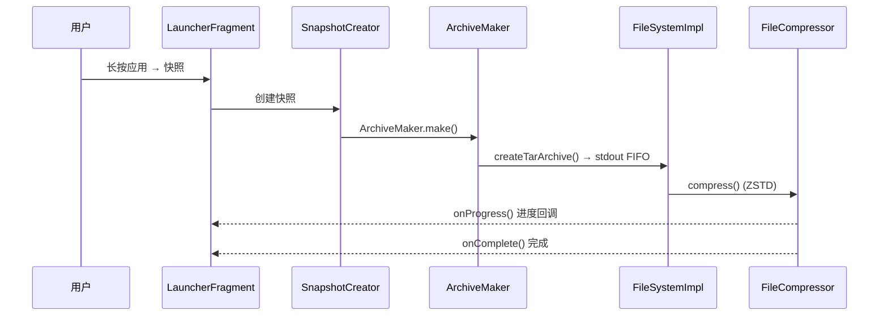
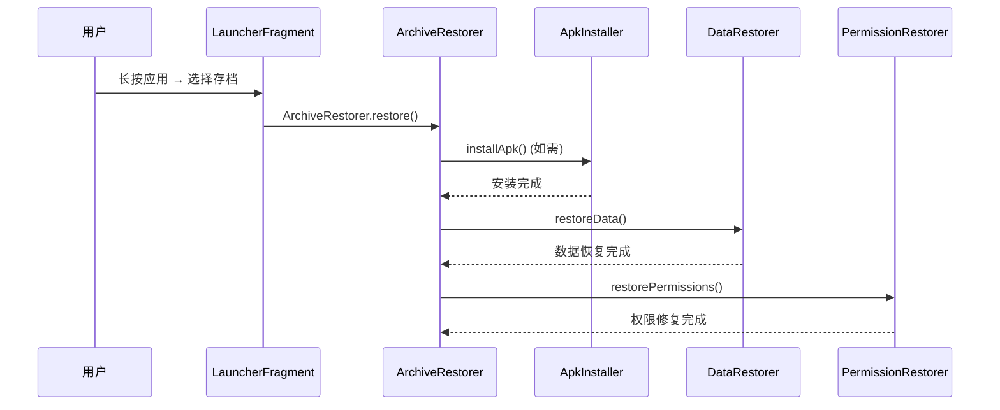

# 快照系统

## 概述

快照系统是 AppSnapshoter 的核心功能，负责将应用的 APK、数据目录、OBB、媒体文件打包为压缩快照，并支持一键恢复。

## 核心流程

### 快照创建

**关键类**：
- `SnapshotCreator` (`app/.../makearchive/SnapshotCreator.kt`) — 编排快照创建流程
- `ArchiveMaker` (`app/.../archive/make/ArchiveMaker.kt`) — 核心创建逻辑
- `SnapshotTasks` (`app/.../archive/make/SnapshotTasks.kt`) — 异步任务
- `FileSystemImpl.createTarArchive()` — 构建 `tar -cpf` 命令
- `ZstdCompressor` — 三阶段管线（TAR → FIFO → ZSTD）

### 快照恢复

**关键类**：
- `ArchiveRestorer` (`app/.../archive/restore/ArchiveRestorer.kt`) — 恢复流程编排
- `ApkInstaller` (`app/.../archive/restore/ApkInstaller.kt`) — APK 安装（session 或 shell）
- `DataRestorer` (`app/.../archive/restore/DataRestorer.kt`) — 数据文件恢复
- `PermissionRestorer` (`app/.../archive/restore/PermissionRestorer.kt`) — 权限和 SSAID 恢复
- `ZstdDecompressor` — 两阶段管线（ZSTD 解压 → FIFO → extractTar）

### APK 智能去重

多个应用共享同一 APK 时（如多用户场景），只压缩一次：
- `PackageManagerDelegate.getInstalledAppStorages()` 计算存储时识别共享 APK
- `createTarArchiveForMultiple()` 合并多个应用的打包

### 保留策略

`RetentionPolicyExecutor` (`app/.../archive/manage/RetentionPolicyExecutor.kt`) 按配置自动清理旧存档。

## 存档元数据

| 字段 | 来源 |
|------|------|
| 时间戳 | 文件名（`2026-01-01_120000.tar.zst`） |
| 包名 | 目录名 |
| 文件大小 | 文件系统 |
| 内容项 | `MetaInfo`（JSON，嵌入存档或独立文件） |

## 异常类型

| 异常 | 场景 |
|------|------|
| `ArchiveFailedException` | 快照创建失败 |
| `RestoreFailedException` | 恢复失败 |
| `InstallFailedException` | APK 安装失败 |
| `MissingDataFileException` | 数据文件缺失 |
| `MissingUidException` | UID 获取失败 |

## 涉及模块

| 模块 | 职责 |
|------|------|
| [`provider`](../../modules/provider/INDEX.md) | 快照流程编排、Root 服务调用 |
| [`api`](../../modules/api/INDEX.md) | `IPackageManager`、`IFileSystem`、`IFileCompressor` |
| [`io-tar`](../../modules/io-tar/INDEX.md) | TAR 打包（内嵌 GNU tar） |
| [`io-zstd`](../../modules/io-zstd/INDEX.md) | ZSTD 压缩/解压 |
| [`io-nativefs`](../../modules/io-nativefs/INDEX.md) | 文件遍历（FTS） |
| [`app`](../../modules/app/INDEX.md) | UI、ViewModel、快照/恢复编排 |

## 相关架构

- [压缩管线](../../architecture/compression-pipeline.md)
- [Root 服务架构](../../architecture/root-service.md)

## 相关文档

- [分组集](GROUP_SET.md) — 父目录组织多个分组；存档 Tab `archiveList` 连续成块、默认折叠；底栏长按快跳
- [分组集折展性能](group-set-expand-perf.md) — 折展/一键折叠只内存再投影；mutex 内 `loaded*` 唯一读源（Phase A 已落地）
- [分组应用归属与移动](GROUP_MEMBERSHIP.md) — 独占/共享成员模式；冲突提示与存档目录移动（Phase 1 已落地）
- [Group 批量恢复设计](GROUP_BATCH_RESTORE.md) — 存档 Tab 分组级批量恢复（v1.1 设计 · 待实施）
- [多用户适配分析](multi-user-adaptation.md) — Android 多用户场景下的适配现状、压缩/恢复链路与已知问题
- [添加分组后列表不刷新](add-group-refresh.md) — Application 单例 `viewModelScope` 失效导致 `addGroup` 后 UI 不更新；已改走 `AppDataRepository.scope`
- [添加应用后刷新不及时](add-app-refresh-stale-group.md) — SnapGroup stale 引用与 DiffUtil；已于 6f21f95 完成修复
- [分组 body 三态可见性](group-body-visibility.md) — expand/empty/content 互斥投影；折叠×空组不再双图标
