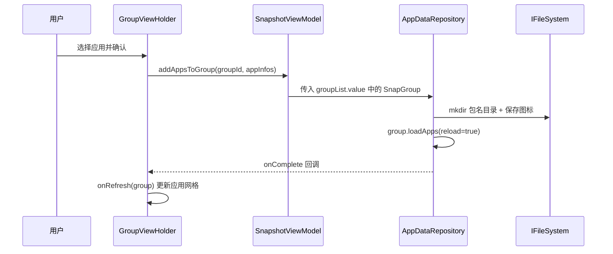
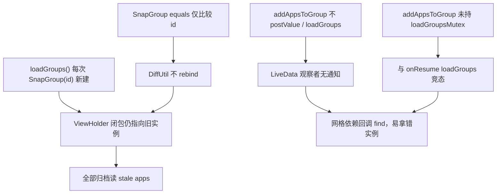
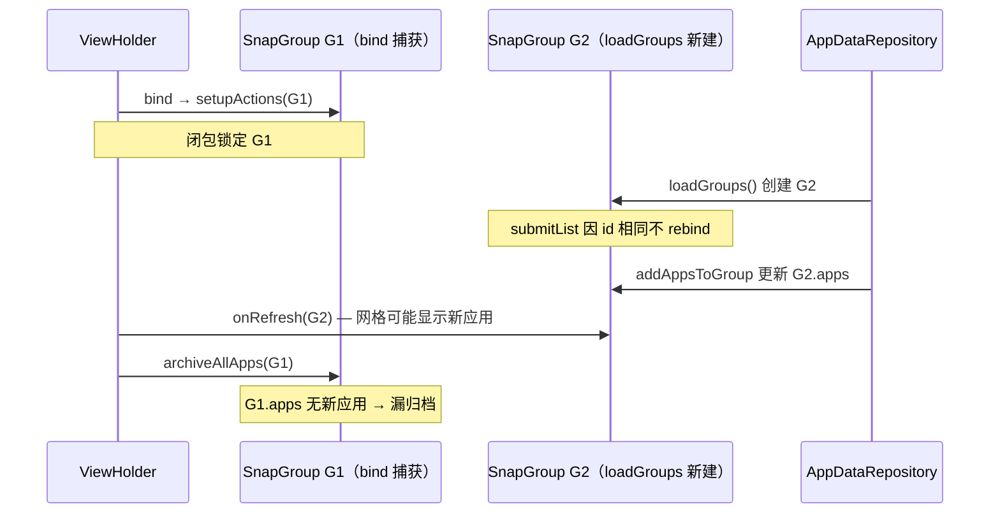
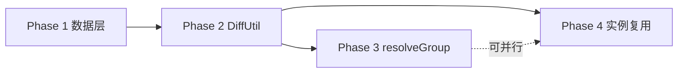

# 添加应用后刷新不及时 — 根因与修复

[← 返回快照系统索引](INDEX.md)

> **实施状态**：已于 `6f21f95` / `0ce6cdb` 落地 Phase 1–4（数据层 mutex + `reloadGroupsLocked`、DiffUtil、`resolveGroup`、实例复用）。下文 §6 保留设计说明；验收见 §7。  
> **修订（2026-08-21）**：mutex 内最新列表改为 `loadedGroups` / `loadedSets`，不再读 `groupList.value`。见 [分组集折展性能](group-set-expand-perf.md)。§6.2 / §6.5 中「mutex 内 `*.value` 即最新」在该方案落地后作废。`resolveGroup`（主线程）仍读 `groupList.value`。

---

## 0. 结论摘要

| 症状 | 直接原因 | 修复（已实施） |
|------|----------|----------------|
| 添加后网格不立即显示 | `addAppsToGroup` 不通知 `groupList`；`onRefresh` 可能拿到 stale 实例 | Phase 1：`loadGroupsMutex` + `reloadGroupsLocked`；Phase 2：DiffUtil 比较包名列表 |
| 「全部归档」漏新应用 | `GroupActionsController` 闭包持有 bind 时的旧 `SnapGroup` | Phase 3：`SnapshotViewModel.resolveGroup` + 各入口解析 |
| 手动刷新可恢复 | 在闭包实例上 `loadApps(reload=true)` 重扫磁盘，绕过 `groupList` | 说明 stale 是内存引用问题，非磁盘写入失败 |

**实施提交**：`0ce6cdb`（文档与 repository 互斥锁）、`6f21f95`（DiffUtil、`resolveGroup`、实例复用、空分组入口修复）。

---

## 1. 现象

| 现象 | 用户侧描述 |
|------|------------|
| 列表刷新延迟 | 添加应用到分组后，分组内应用网格有时不能立即显示新应用 |
| 全部归档漏项 | 菜单「全部归档」提示可归档数量偏少，或 Toast「没有已安装的应用可归档」，但新应用已在列表中可见 |
| 手动刷新可恢复 | 点击分组头部的刷新按钮后，列表与全部归档行为恢复正常 |

磁盘侧操作（创建包名目录、保存图标）通常已成功；问题出在 **内存中的 `SnapGroup` 实例与 UI 闭包引用不一致**。

---

## 2. 涉及代码

| 组件 | 路径 | 职责 |
|------|------|------|
| `AppDataRepository` | `app/.../repository/AppDataRepository.kt` | `addAppsToGroup`、`loadGroups` |
| `SnapGroup` | `app/.../group/SnapGroup.kt` | 分组模型；`loadApps()` 扫描磁盘 |
| `GroupsAdapter` | `app/.../main/launch/GroupsAdapter.kt` | 分组列表；`GroupDiffCallback` |
| `GroupActionsController` | `app/.../main/launch/GroupActionsController.kt` | 分组头按钮；捕获 `group` 闭包 |
| `GroupItemAdapter` | `app/.../main/launch/GroupItemAdapter.kt` | 单应用操作；构造时绑定 `group` |
| `GroupBatchArchiver` | `app/.../main/launch/GroupBatchArchiver.kt` | 「全部归档」；读 `group.apps` |
| `LauncherFragment` | `app/.../main/launch/LauncherFragment.kt` | `onResume` 触发 `loadGroups()` |

---

## 3. 正常数据流（设计意图）



预期：`group.apps` 与 UI 展示、批量操作使用同一份内存数据。

---

## 4. 根因链

三个根因相互叠加，单独修一项往往无法覆盖全部症状。



### 4.1 `SnapGroup` 实例分裂

`loadGroups()` 对每个分组 ID 执行 `SnapGroup(groupId).apply { loadApps(...) }`，并 `postValue` 到 `groupList`：

```kotlin
// AppDataRepository.kt
val groups = groupIds.map { groupId ->
    SnapGroup(groupId).apply {
        loadApps(context, fileSystem, appManager, true)
    }
}
groupList.postValue(groups)
```

触发 `loadGroups()` 的场景包括：启动 `loadData()`、`LauncherFragment.onResume()`、删除分组、批量归档/恢复完成、单应用删除/快照完成等。

每次调用都会产生 **全新的 `SnapGroup` 实例**；已 bind 的 ViewHolder 闭包仍指向旧对象。

### 4.2 DiffUtil 不触发 rebind

```kotlin
// GroupsAdapter.kt — GroupDiffCallback
override fun areItemsTheSame(oldItem: SnapGroup, newItem: SnapGroup) =
    oldItem.id == newItem.id

override fun areContentsTheSame(oldItem: SnapGroup, newItem: SnapGroup) =
    oldItem == newItem
```

`SnapGroup` 为 `data class SnapGroup(val id: String)`，**相等性仅比较 `id`**。`apps` 变化时 DiffUtil 仍判定内容相同 → **`onBindViewHolder` 不执行**，`setupActions` / `GroupItemAdapter` 不更新。

对比：`GroupSortAdapter.areContentsTheSame` 至少比较了 `name`，存档列表侧未做类似处理。

### 4.3 闭包绑定旧实例

`GroupActionsController.setupActions(group, ...)` 在 bind 时注册监听，闭包捕获当时的 `group`：

| 入口 | 读取的 `group` | 添加应用后风险 |
|------|----------------|----------------|
| `menu_batch_archive` | bind 时闭包 | **高** — `archiveAllApps(group)` 读 stale `apps` |
| `menu_batch_restore` | bind 时闭包 | 中 — 执行中 `resolveTaskAt` 会重查 `groupList` |
| `btnAdd` 回调 | `groupList.find { id }` | 中 — 竞态时 find 到未更新的新实例 |
| `btnRefresh` | bind 时闭包 + 磁盘重扫 | 低 — 手动刷新有效的原因 |
| `GroupItemAdapter` | 构造参数 | 中 — 单应用快照/删除后 `loadGroups` 会再次分裂 |

### 4.4 典型故障时序



### 4.5 `addAppsToGroup` 刷新不完整

`addAppsToGroup` 仅在传入的 `SnapGroup` 上 `loadApps(reload=true)`，**不** `postValue(groupList)`，也 **不** 调用 `loadGroups()`。

| 操作 | 完成后是否 `loadGroups()` | 是否持 `loadGroupsMutex` |
|------|---------------------------|--------------------------|
| `addGroup` | 是 | 是 |
| `deleteGroup` | 是 | 是 |
| `addAppsToGroup` | **否** | **否** |

竞态：`onResume` 的 `loadGroups` 若在 `mkdir` 完成前扫描磁盘，`groupList` 中新实例不含新应用；而 `addAppsToGroup` 更新的是调用瞬间 `currentGroups` 快照里的实例，回调 `find` 可能拿到未更新的对象。

### 4.6 手动刷新为何有效

```kotlin
group.loadApps(..., reload = true)
onRefresh(group)
```

在闭包实例上从磁盘重扫，不依赖 `groupList` 是否为最新实例，故可临时对齐。

---

## 5. 次要因素（通常非主因）

| 因素 | 说明 |
|------|------|
| `isAutoSnapshot` 过滤 | `GroupBatchArchiver` 仅归档 `actionConfig.isAutoSnapshot == true` 的应用；默认 `true` |
| `AppStatusHelper.isAppInstalled` | 依赖 `ArchivedApp.appInfo.userId`；`loadApps` 使用分组 `userId`，正常场景正确 |
| `loadApps` 包名过滤 | 跳过不以 `.` 开头的目录名 |
| 图标 `userId` | `addAppsToGroup` 保存图标时 `userId = 0`（见 [多用户适配](multi-user-adaptation.md)），不影响应用列表 |

---

## 6. 修复方案与实施

### 6.1 设计原则

1. **单一数据源**：主线程以 `groupList` LiveData 为权威，UI 操作前按 `groupId` 解析，不长期持有 bind 快照。**mutex 内**以 `loadedGroups` / `loadedSets` 为权威，禁止读 `*.value`（见 [折展性能](group-set-expand-perf.md)）。
2. **写后统一刷新**：`addAppsToGroup` 与 `deleteGroup` / `addGroup` 对齐，完成后走 `loadGroups()`。
3. **互斥磁盘扫描**：所有修改分组磁盘内容的路径与 `loadGroups` 共用 `loadGroupsMutex`。
4. **Diff 感知 `apps`**：`submitList` 后 apps 变化必须能触发 rebind。
5. **对齐既有模式**：批量恢复已在执行循环内用 `groupList` 重查（`GroupBatchRestorePlanner.resolveTaskAt`），存档 Tab 应复用同一思路。

### 6.2 Phase 1 — 数据层 ✅

**目标**：消除 `addAppsToGroup` 与 `loadGroups` 竞态；写盘后 `groupList` 必然更新。

**实施**（`AppDataRepository.kt`）：抽出 `reloadGroupsLocked()`，避免在已持锁时再次调用 `loadGroups()` 导致 mutex 死锁。

```kotlin
fun addAppsToGroup(...) {
    scope.launch {
        try {
            loadGroupsMutex.withLock {
                val group = (groupList.value ?: currentGroups)
                    .find { it.id == groupId } ?: return@launch
                for (appInfo in appInfos) { /* mkdir + 图标 */ }
                reloadGroupsLocked(context, fileSystem, appManager)
            }
            withContext(Dispatchers.Main) { onComplete?.invoke() }
        } catch (e: Exception) { ... }
    }
}
```

要点：

- 写盘与重载在 **同一 mutex** 内；通过 `reloadGroupsLocked` 复用加载逻辑，而非嵌套 `loadGroups()`。
- 回调在 mutex **外** 切到 Main，避免阻塞其他读操作。
- 组查找：落地时优先 `groupList.value`（当时把 LiveData 当 mutex 内最新）。**已作废**：mutex 内改为 `loadedGroups`（见 [折展性能](group-set-expand-perf.md)）；`postValue` 未落地时 `.value` 仍是旧列表。

### 6.3 Phase 2 — DiffUtil ✅

**目标**：`groupList` 更新后 ViewHolder 重新 bind，闭包自动指向新实例。

**改动**：`GroupsAdapter.kt` — `GroupDiffCallback`

```kotlin
override fun areContentsTheSame(old: SnapGroup, new: SnapGroup): Boolean {
  if (old.name != new.name) return false
  if (old.isCollapsed != new.isCollapsed) return false
  val oldPkgs = old.apps.map { it.appInfo.packageName }
  val newPkgs = new.apps.map { it.appInfo.packageName }
  return oldPkgs == newPkgs
}
```

说明：

- 比较 **有序包名列表**（非仅 `Set`），与 `SortConfig` 自定义排序一致。
- `isCollapsed` 纳入比较，避免折叠状态与列表不同步。
- 不在 `SnapGroup.equals` 中加入 `apps`；仅 DiffUtil 层感知。

### 6.4 Phase 3 — 使用时解析 ✅

**目标**：即使 rebind 遗漏或用户极快连点，批量/配置操作仍读当前 `groupList`。

**改动**：新增小工具（任选一处集中定义）：

```kotlin
// SnapshotViewModel.kt 或 launch/GroupResolver.kt
fun resolveGroup(groupId: String, fallback: SnapGroup? = null): SnapGroup? =
    groupList.value?.find { it.id == groupId } ?: fallback
```

**调用点**（`GroupActionsController.kt` 为主）：

| 原调用 | 改为 |
|--------|------|
| `archiveAllApps(group)` | `archiveAllApps(resolveGroup(group.id, group)!!)` |
| `GroupBatchRestoreDialog.show(..., group)` | 传入 `resolveGroup(...)` |
| `SelectAppFragment` 回调 `onRefresh(updatedGroup ?: group)` | `onRefresh(resolveGroup(group.id, group)!!)` |
| `GroupSettingFragment.newInstance(group)` 等 Fragment 参数 | 传 `groupId`，Fragment 内 `resolveGroup`（`GroupSettingFragment` 已有类似写法） |

**已接入**（`GroupActionsController.kt`）：全部归档、批量恢复、添加应用回调、配置/设置、手动刷新、统计等均经 `resolveGroup(fallback)`。

`GroupItemAdapter` 仍通过 Phase 2 rebind 重建；若后续需加固可改为 `groupId` + 懒解析（未做）。

### 6.5 Phase 4 — 实例复用 ✅

**目标**：减少 `loadGroups` 分配与 MMKV/配置对象抖动；降低闭包分裂概率。

**改动**：`AppDataRepository.loadGroups`

```kotlin
val existing = groupList.value.orEmpty().associateBy { it.id }
val groups = groupIds.map { groupId ->
    (existing[groupId] ?: SnapGroup(groupId)).apply {
        loadApps(context, fileSystem, appManager, true)
    }
}
```

**修订后（mutex 内）：**

```kotlin
val existing = loadedGroups.associateBy { it.id }
val groups = groupIds.map { groupId ->
    (existing[groupId] ?: SnapGroup(groupId)).apply {
        loadApps(context, fileSystem, appManager, true)
    }
}
```

落地时从 `groupList.value` 取 `existing` 的代码已作废。禁止 mutex 内再读 `*.value`（`postValue` 后 `.value` 未更新）。主线程 `resolveGroup` 仍观察 `groupList`。

### 6.6 改动文件清单（已合并）

| Phase | 文件 | 状态 |
|-------|------|------|
| 1 + 4 | `AppDataRepository.kt` | ✅ `reloadGroupsLocked`、mutex、`addAppsToGroup` |
| 2 | `GroupsAdapter.kt` | ✅ `areContentsTheSame` |
| 3 | `GroupActionsController.kt` | ✅ `resolveGroup` 各入口 |
| 3 | `SnapshotViewModel.kt` | ✅ `resolveGroup` |
| — | `GroupsAdapter.kt`（空分组） | ✅ 空布局点击改调 `btnAdd` 而非重复 `setupActions` |

### 6.7 里程碑（已完成）



| 里程碑 | 包含 Phase | 状态 |
|--------|------------|------|
| M1 最小可用 | 1 + 2 | ✅ |
| M2 加固 | + 3 | ✅ |
| M3 优化 | + 4 | ✅ |

---

## 7. 验证清单

> 以下项建议在真机/仪器上手工确认；代码修复已合入 main。

### 7.1 功能

- [ ] 添加应用后，分组网格 **立即** 显示新应用，无需手动刷新
- [ ] 添加后 **立即** 点「全部归档」，对话框数量包含新应用（`installedApps.size` 与预期一致）
- [ ] 切换 Tab 再返回存档页，全部归档仍包含此前添加的应用
- [ ] 多选添加多个应用，列表顺序与数量正确
- [ ] `onResume` 与添加应用并发（快速切换 Tab + 添加）不产生漏项
- [ ] 单应用「创建快照」、删除、批量恢复仍正常

### 7.2 回归

- [ ] 批量归档/恢复完成后列表仍刷新（原有 `loadGroups` 路径未破坏）
- [ ] 分组折叠状态在 `loadGroups` 后保持（`isCollapsed` 存 MMKV，不随实例重建丢失）
- [ ] 空分组添加首个应用后，空状态布局正确切换

### 7.3 建议手工时序

1. 进入存档 Tab → 等待 `onResume` 完成 → 添加应用 → 立即全部归档  
2. 添加应用过程中切到应用 Tab 再切回 → 确认网格与归档一致  
3. 添加应用后不点刷新 → 直接全部归档（验证 Phase 3）

---

## 8. 相关文档

- [快照系统索引](INDEX.md)
- [Group 批量恢复 — 边界与 stale 处理](group-batch-restore/06-quality-roadmap.md)（`resolveTaskAt` 与执行中 `loadGroups()`）
- [多用户适配分析](multi-user-adaptation.md)（`addAppsToGroup` 图标 `userId`）
- [分组集折展性能](group-set-expand-perf.md) — mutex 内最新源改为 `loadedGroups` / `loadedSets`
