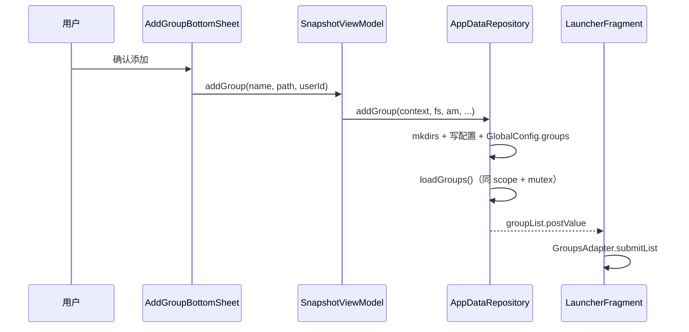

# 添加分组后列表不刷新 — 根因与修复

[← 返回快照系统索引](INDEX.md)

---

## 0. 结论摘要

| 症状 | 根因 | 修复 |
|------|------|------|
| 添加分组后归档页不出现新分组 | `addGroup` 保存配置成功，但回调里 `loadGroups()` 走已取消的 `viewModelScope`，刷新静默失败 | `addGroup` / `deleteGroup` 在 `AppDataRepository.scope` 同一协程内写完即 `loadGroups()` |
| 首次进入仍能看到旧分组 | 启动时 `loadData()` 内部使用 `repository.scope`，不受 `viewModelScope` 影响 | `SnapshotViewModel` 全部数据操作委托 `repository`，不再 `viewModelScope.launch` |
| 并发刷新偶发回退 | 多处同时 `loadGroups()`，后发先至可能覆盖新列表 | `loadGroupsMutex` 串行化扫描与 `postValue` |

**状态**：已于 2026-06-18 修复（`AppDataRepository.kt`、`SnapshotViewModel.kt`）。

---

## 1. 现象

用户在「存档」Tab 通过 **添加分组** BottomSheet 填写名称与路径并确认后：

- BottomSheet 正常关闭
- `GlobalConfig.groups` 与分组 MMKV / `group.json` 已写入（配置持久化成功）
- **归档页分组列表不增加新项**，需杀进程重进或依赖其它偶然触发的刷新才可见

与 [添加应用后刷新不及时](add-app-refresh-stale-group.md) 同属 **分组列表数据源刷新链路** 问题，但本页聚焦 **新建分组** 路径。

---

## 2. 涉及代码

| 组件 | 路径 | 职责 |
|------|------|------|
| `AddGroupBottomSheet` | `app/.../main/launch/addgroup/AddGroupBottomSheet.kt` | 收集名称、路径、userId，调用 `snapshotViewModel.addGroup()` |
| `SnapshotViewModel` | `app/.../SnapshotViewModel.kt` | 门面；`groupList` 来自 `AppDataRepository` |
| `AppDataRepository` | `app/.../repository/AppDataRepository.kt` | `addGroup`、`loadGroups`、`scheduleLoadGroups` |
| `GlobalConfig` | `app/.../config/GlobalConfig.kt` | MMKV 持久化分组 ID 顺序 |
| `LauncherFragment` | `app/.../main/launch/LauncherFragment.kt` | 观察 `groupList`，`submitList` 到 `GroupsAdapter` |

---

## 3. 根因

### 3.1 Application 单例 + `viewModelScope` 生命周期错位

`SnapshotApp.onCreate()` 直接 `SnapshotViewModel()`，再通过 `SingletonViewModelFactory` 注入 `activityViewModels()`。Activity 销毁时 `ViewModelStore` 会对**同一实例**调用 `onCleared()`，**取消 `viewModelScope`**。

修复前的 `addGroup`：

```kotlin
// SnapshotViewModel（修复前）
fun addGroup(...) {
    repository.addGroup(name, path, userId) {
        loadGroups()  // viewModelScope.launch —  scope 可能已取消
    }
}
```

`repository.addGroup` 在 `repository.scope`（`SupervisorJob + Dispatchers.IO`）中写配置，**不受** `viewModelScope` 影响，故配置能保存。回调触发的 `loadGroups()` 若落在已取消的 scope 上，协程不会执行，`groupList` 不 `postValue`，UI 不更新。

### 3.2 启动加载与增删刷新路径不一致

| 入口 | 修复前协程作用域 | 是否可靠 |
|------|------------------|----------|
| `loadData()` → `repository.loadData` | `repository.scope` | 是 |
| `loadGroups()` | `viewModelScope` | 否（单例失效后） |
| `addGroup` 完成后刷新 | `viewModelScope` | 否 |

用户侧表现为：**能看旧数据，增删后不刷新**。

### 3.3 次要：目录未创建

`addGroup` 原先不 `mkdirs` 分组路径；在部分路径下 `group.json` 写入可能失败。修复后于写配置前 `fileSystem.mkdirs(path)`。

---

## 4. 修复方案（已实现）

### 4.1 数据层：写后同协程刷新

```kotlin
// AppDataRepository.addGroup（修复后）
scope.launch {
    // mkdirs → 写 SnapGroup 配置 → 更新 GlobalConfig.groups
    loadGroups(context, fileSystem, appManager)
}
```

`deleteGroup` 同样在 `repository.scope` 内删除配置后调用 `loadGroups()`。

### 4.2 ViewModel：委托 repository，去掉 `viewModelScope`

```kotlin
// SnapshotViewModel（修复后）
fun loadGroups() {
    repository.scheduleLoadGroups(context, fileSystem, appManager)
}

fun addGroup(name: String, path: String, userId: Int = 0) {
    repository.addGroup(context, fileSystem, appManager, name, path, userId)
}
```

`scheduleLoadGroups` 在 `repository.scope` 中 `launch { loadGroups(...) }`。

### 4.3 互斥：`loadGroupsMutex`

所有 `loadGroups` 扫描在 `loadGroupsMutex.withLock { ... }` 内执行，避免与 `onResume`、批量操作等并发调用产生后发先至的 stale 列表。详见 [添加应用后刷新不及时 §5.2](add-app-refresh-stale-group.md#52-与-loadgroups-的竞态)。

---

## 5. 数据流（修复后）



---

## 6. 验收清单

- [x] 添加分组后，归档页 **立即** 出现新分组（可为空分组占位）
- [x] 杀进程重进后，新分组仍在（`GlobalConfig` 持久化）
- [x] 删除分组后列表立即移除对应项
- [x] Activity 重建 / 返回后再添加分组，仍能刷新

---

## 7. 相关文档

- [添加应用后刷新不及时](add-app-refresh-stale-group.md) — SnapGroup 实例分裂、`addAppsToGroup` 与 DiffUtil（同次架构收敛）
- [app 模块 — repository](../../modules/app/INDEX.md#repository--数据仓库)
- [AGENTS.md — ViewModels / Async](../../../AGENTS.md)
