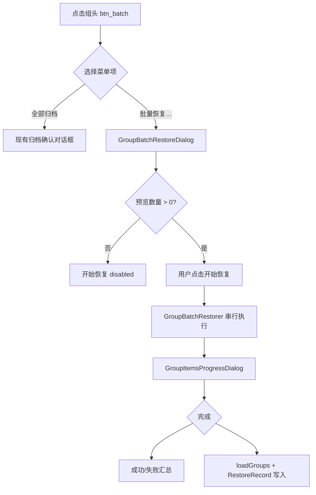

# UI 设计

[← 返回索引](../GROUP_BATCH_RESTORE.md)

---

## 3.1 组头布局重构

### 设计目标

- 为批量恢复腾出入口，**不增加单行按钮数量**
- 长组名可读（单行省略，不被图标挤没）
- 保持与现有 Material 图标风格一致

### 布局结构

由 **单行** 改为 **双行**：

```text
┌─────────────────────────────────────────┐
│ 游戏组（较长名称在此省略显示…）           │  ← 第 1 行：标题
│              [↻] [+] [⇅] [⚙] [▾]       │  ← 第 2 行：工具栏（右对齐）
└─────────────────────────────────────────┘
│  （应用列表 / 折叠区，与现有一致）         │
└─────────────────────────────────────────┘
```

### 尺寸规范

| 元素 | 现值 | 新值 |
|------|------|------|
| 标题字号 | 18sp | **16sp** |
| 标题行 | 与按钮同行 | **独占第一行**，`maxLines=1`，`ellipsize=end` |
| 图标按钮 | 40×40dp，margin 4dp，padding 8dp | **32×32dp**，margin **2dp**，padding **6dp** |
| 工具栏 | 无 | 第二行 `LinearLayout`，`gravity=end` |

### 按钮映射

| id | 图标 | 功能 | 变更 |
|----|------|------|------|
| `group_title` | — | 点击折叠/展开；长按分组设置 | 移到第一行 |
| `btn_confirm` | check | 确认自定义排序 | 保留，第二行 |
| `btn_refresh` | refresh | 刷新组内应用 | 保留；长按统计 |
| `btn_add` | app_add | 添加应用 | 保留 |
| `btn_move` | group_sort | 排序 PopupMenu | 保留 |
| `btn_tune` | tune | 分组配置 | 保留 |
| ~~`btn_archive_all`~~ | briefcase_download_outline | — | **移除独立按钮**（收入菜单项） |
| **`btn_batch`** | **layers / ic_folder_open**（待选，勿复用 `briefcase_download_outline`） | **批量操作 PopupMenu** | **新增** |

### 批量操作菜单（`btn_batch`）

```text
┌──────────────────┐
│ 全部归档          │  → 现有 GroupBatchArchiver.archiveAllApps()
│ 批量恢复…         │  → 打开 GroupBatchRestoreDialog
└──────────────────┘
```

- 点击 **全部归档**：行为与现有一致（简单确认对话框）
- 点击 **批量恢复…**：打开配置对话框（见 3.2）

### 备选方案（若 32dp × 5 仍偏紧）

将 **排序**、**设置** 收入 `btn_more`（⋮）溢出菜单，工具栏仅保留 `[↻] [+] [批量] [⋮]`。首版优先双行 + 32dp；真机验证后再决定是否启用溢出。

### 批量进行中 UI 状态

- `SnapshotViewModel.isBatchRunning == true` 时（存档 Tab **与** 时间线 Tab 共用）：
  - 禁用 `btn_batch`、各应用恢复入口
  - 可选：组内 `GroupItemAdapter` 整体 `alpha=0.5`
- 后触发的批量操作 Toast 提示「已有批量任务进行中」

---

## 3.2 批量恢复配置对话框

新建 `dialog_group_batch_restore.xml`，**一次配齐** 范围与快照策略。

### 线框图

```text
┌─ 批量恢复 ──────────────────────────────┐
│                                          │
│ 恢复范围                                  │
│  ○ 未安装的应用 (3)                       │
│  ● 全部有快照的应用 (8)                   │
│  ○ 自上次恢复以来 (2)                     │
│                                          │
│ ─────────────────────────────────────    │
│                                          │
│ 快照选择                                  │
│  ● 最新快照                               │
│  ○ 最旧快照                               │
│  ○ 与上次恢复相同                         │
│                                          │
│ ─────────────────────────────────────    │
│                                          │
│ 预览：将恢复 8 个应用                     │
│ ⚠ 已安装的应用将被清除数据并覆盖为存档状态  │
│                                          │
│              [取消]    [开始恢复]         │
└──────────────────────────────────────────┘
```

### 交互规则

| 规则 | 说明 |
|------|------|
| 实时预览 | 切换任一 Radio 时调用 `GroupBatchRestorePlanner.preview()` 更新括号内数字与底部预览文案 |
| 零命中 | 「开始恢复」按钮 **disabled**；预览区说明原因（如「没有符合范围的应用」） |
| 默认值 | 范围 = **全部**；快照 = **最新** |
| 破坏性警告 | 始终显示；不再额外弹二次确认（若评审要求更保守，可加最终确认） |
| 「与上次相同」 | 无记录的应用在预览脚注中标注「N 个应用将回退为最新快照」 |

### 字符串资源

新文案统一进 `strings.xml`（`GroupBatchArchiver` 现有硬编码中文不在本 PR 强制迁移，可后续单独整理）：

- `group_batch_restore_title`
- `group_batch_menu_archive` / `group_batch_menu_restore`
- `group_batch_restore_scope_*`
- `group_batch_restore_strategy_*`
- `group_batch_restore_preview`
- `group_batch_restore_warning`

---

## 3.3 执行进度对话框

复用 `GroupItemsProgressDialog`，字段映射：

| 对话框字段 | 批量恢复展示内容 |
|------------|------------------|
| 总进度 | 计划内应用数 |
| 当前序号 | 第几个应用 |
| `setLabel` | 应用 label |
| `setPackageName` | 包名 |
| `setCurrentItem` | 正在恢复的快照名（如 `2026-06-17_120000`） |

### 结束状态

与 `GroupBatchArchiver.updateDialogFinishState` 对齐：

- 总耗时
- 成功 / 失败数量
- 失败按钮 → 错误列表（带 icon、label、异常详情）
- 成功按钮 → 成功列表

### 取消行为

与 `TimelineBatchOperator` / `GroupBatchArchiver` 一致：

- 点取消 → 设置 `isCancelled`；**当前应用**恢复完成后停止，不启动下一项
- 对话框可显示「强制取消」按钮（`setFinishButtonAsForceCancel`），但 `restoreArchiveSuspend` 在 JNI 解压中途 **无法** 中断 — 与归档 force-cancel 能力不对等，UI 可保留按钮以统一体验，实际仅标记取消、等当前项自然结束

---

## 3.4 用户操作流程


