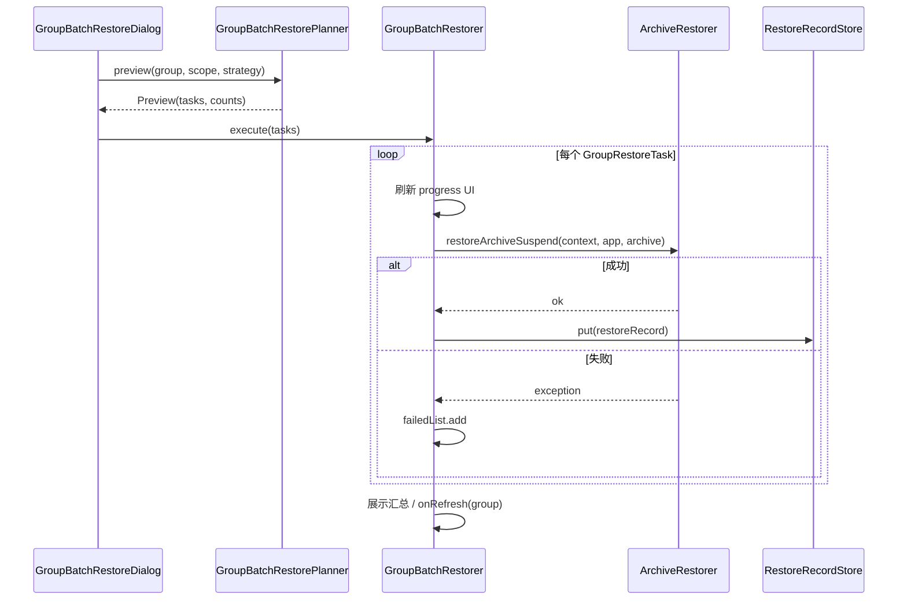

# 核心业务逻辑

[← 返回索引](../GROUP_BATCH_RESTORE.md)

---

## 4.1 枚举定义

```kotlin
/** 恢复范围 */
enum class GroupRestoreScope {
    NOT_INSTALLED,       // 未安装且有快照
    ALL,                 // 全部有快照的应用
    SINCE_LAST_RESTORE   // 自上次恢复以来需要再次恢复的应用
}

/** 快照选择策略（Group 专用，比 Timeline RestoreStrategy 多 LAST_RESTORED） */
enum class ArchivePickStrategy {
    NEWEST,          // makeTime 最大
    OLDEST,          // makeTime 最小
    LAST_RESTORED    // 与上次恢复相同的 archiveName；无记录则回退 NEWEST
}
```

> `RestoreStrategy`（`NEWEST_FIRST` / `OLDEST_FIRST`）保留给时间线；Group 使用 `ArchivePickStrategy`。新/旧选取逻辑统一放入 `ArchiveResolver`（见 [附录 §A.4](../07-appendix.md#a4-archiveresolver共享快照选取)），`TimelineRepository.resolveArchive` 改为薄包装。

---

## 4.2 恢复记录（RestoreRecord）

### 数据结构

```kotlin
data class RestoreRecord(
    val restoredAt: Long,        // 恢复完成时间（System.currentTimeMillis）
    val archiveName: String,     // 实际恢复的快照目录名
    val archiveMakeTime: Long    // 该快照 MetaInfo.makeTime
)

/** 应用唯一键，与 TimelineEntryKey 字段一致 */
data class AppRestoreKey(
    val groupId: String,
    val packageName: String,
    val userId: Int
) {
    val storageKey: String get() = "$groupId:$packageName:$userId"
}
```

### 存储

- **位置**：`SnapGroup.mmkv`（即 `group.config.mmkv`，MMKV id = `"group:" + groupId`）
- **Key 格式**：`restore_record:{packageName}:{userId}`
- **Value**：JSON 序列化的 `RestoreRecord`（FastJSON2，与项目一致）

```kotlin
object RestoreRecordStore {
    fun get(group: SnapGroup, packageName: String, userId: Int): RestoreRecord?
    fun put(group: SnapGroup, packageName: String, userId: Int, record: RestoreRecord)
    fun loadAll(group: SnapGroup): Map<String, RestoreRecord>  // key = storageKey 后缀
}
```

### 写入时机

| 场景 | 是否写入 | 实现位置 |
|------|----------|----------|
| 单应用 `restoreLatest` / `restoreArchiveItem` 成功 | ✅ | `RestoreRecordWriter.onRestoreSuccess`（在 `ArchiveRestorer` 成功路径调用） |
| 单应用高级恢复成功 | ✅ | 同上 |
| 批量恢复单项成功 | ✅ | 同上（`restoreArchiveSuspend` 成功即写入；`GroupBatchRestorer` 不重复写） |
| 批量恢复单项失败 | ❌ | — |
| 用户取消批量（未完成项） | ❌ | — |

---

## 4.3 范围过滤逻辑

**公共前置条件**（所有范围）：`app.archives.isNotEmpty()`

```kotlin
fun matchesScope(
    app: ArchivedApp,
    scope: GroupRestoreScope,
    record: RestoreRecord?,
    isInstalled: Boolean
): Boolean = when (scope) {
    GroupRestoreScope.NOT_INSTALLED ->
        !isInstalled

    GroupRestoreScope.ALL ->
        true

    GroupRestoreScope.SINCE_LAST_RESTORE ->
        needsRestoreSinceLast(app, record)
}

fun needsRestoreSinceLast(app: ArchivedApp, record: RestoreRecord?): Boolean {
    val latest = app.latestArchive ?: return false
    if (record == null) return true
    return latest.metaInfo.makeTime > record.archiveMakeTime
}
```

### 范围语义说明

| 范围 | 用户心智 | 典型场景 |
|------|----------|----------|
| 未安装 | 只补装缺失应用 | 刷机、恢复出厂后 |
| 全部 | 组内所有有快照的应用都恢复 | 整组回滚 |
| 自上次恢复以来 | 上次恢复后又 **新归档** 的应用 | 增量恢复，避免重复覆盖 |

**注意：**「自上次恢复以来」不是按日历时间筛 snapshot，而是对比 **最新快照 makeTime** 与 **上次成功恢复的快照 makeTime**。

---

## 4.4 快照选取逻辑

由 `ArchiveResolver.pick(archives, strategy, record?)` 实现：

```kotlin
fun pick(
    archives: Collection<ArchiveItem>,
    strategy: ArchivePickStrategy,
    record: RestoreRecord?
): ArchiveItem {
    require(archives.isNotEmpty())
    return when (strategy) {
        ArchivePickStrategy.NEWEST ->
            archives.maxBy { it.metaInfo.makeTime }

        ArchivePickStrategy.OLDEST ->
            archives.minBy { it.metaInfo.makeTime }

        ArchivePickStrategy.LAST_RESTORED -> {
            if (record == null) {
                archives.maxBy { it.metaInfo.makeTime }
            } else {
                archives.find { it.name == record.archiveName }
                    ?: archives.maxBy { it.metaInfo.makeTime }  // 快照已删除则回退
            }
        }
    }
}
```

`LAST_RESTORED` 回退最新时，`GroupRestoreTask.fallbackToNewest = true`，供对话框脚注展示。

---

## 4.5 计划构建（Planner）

```kotlin
data class GroupRestoreTask(
    val app: ArchivedApp,
    val archive: ArchiveItem,
    val fallbackToNewest: Boolean = false  // LAST_RESTORED 回退标记，用于预览脚注
)

object GroupBatchRestorePlanner {

    data class Preview(
        val tasks: List<GroupRestoreTask>,
        val skippedNoArchive: Int,
        val fallbackCount: Int
    )

    fun preview(
        group: SnapGroup,
        scope: GroupRestoreScope,
        strategy: ArchivePickStrategy,
        records: Map<String, RestoreRecord>,
        isInstalled: (ArchivedApp) -> Boolean
    ): Preview

    /** 执行前 / 循环内重查，对齐 TimelineRepository.resolveEntry */
    fun resolveTaskAt(
        task: GroupRestoreTask,
        groups: List<SnapGroup>
    ): GroupRestoreTask?
}
```

### 构建步骤

```
group.apps
  → filter archives.isNotEmpty()
  → filter matchesScope(scope)
  → map { app → GroupRestoreTask(app, resolveArchive(...)) }
  → 统计 skipped / fallback 数量供 UI 展示
```

---

## 4.6 批量恢复执行流程



### 伪代码

```kotlin
class GroupBatchRestorer(
    private val context: Context,
    private val coroutineScope: CoroutineScope,
    private val snapshotViewModel: SnapshotViewModel
) {
    fun execute(group: SnapGroup, tasks: List<GroupRestoreTask>) {
        if (!snapshotViewModel.tryBeginBatchOperation()) {
            Toast.makeText(context, R.string.batch_operation_in_progress, Toast.LENGTH_SHORT).show()
            return
        }
        val loadingDialog = GroupItemsProgressDialog(context)
        loadingDialog.setTotalProgress(tasks.size)
        val succeeded = mutableListOf<ArchivedApp>()
        val failed = mutableMapOf<ArchivedApp, Exception>()
        val isCancelled = AtomicBoolean(false)
        val startTime = System.currentTimeMillis()

        loadingDialog.setOnCancelListener { /* 同 TimelineBatchOperator */ }

        coroutineScope.launch(Dispatchers.IO) {
            try {
                var index = 0
                while (index < tasks.size && !isCancelled.get()) {
                    val task = GroupBatchRestorePlanner.resolveTaskAt(
                        tasks[index],
                        snapshotViewModel.groupList.value.orEmpty()
                    ) ?: run {
                        failed[tasks[index].app] = IllegalStateException(
                            context.getString(R.string.timeline_entry_stale)
                        )
                        index++
                        continue
                    }
                    updateProgress(loadingDialog, index, task)
                    try {
                        ArchiveRestorer.restoreArchiveSuspend(context, task.app, task.archive)
                        // RestoreRecord 由 ArchiveRestorer 成功路径写入
                        succeeded.add(task.app)
                    } catch (e: Exception) {
                        failed[task.app] = e
                    }
                    index++
                }
            } finally {
                withContext(Dispatchers.Main) {
                    snapshotViewModel.endBatchOperation()
                    snapshotViewModel.loadGroups()
                    updateDialogFinishState(loadingDialog, ...)
                }
            }
        }
        loadingDialog.show()
    }
}
```

结构 **逐项对照** `TimelineBatchOperator.batchRestore`（详见 [附录 §A.1](../07-appendix.md#a1-与-timelinebatchoperator-的对照)）。

---

## 4.7 与全部归档的过滤对比

| 维度 | 全部归档 | 批量恢复 |
|------|----------|----------|
| 需要已安装 | ✅ 是 | ❌ 否（未安装可走 APK 安装） |
| `isAutoSnapshot` | ✅ 过滤 | ❌ **不过滤**（有快照即可恢复） |
| 需要快照 | ❌ 否（创建新的） | ✅ 是 |
| 范围枚举 | 无（组内符合条件的已安装 app） | 未安装 / 全部 / 自上次恢复以来 |

---

## 4.8 单应用恢复集成

通过 `RestoreRecordWriter.onRestoreSuccess(archivedApp, archiveItem)` 在 `ArchiveRestorer` 成功路径统一写入（见 [附录 §A.2](../07-appendix.md#a2-restorerecord-写入点)）。

`ArchivedApp` 已持有 `group: SnapGroup`，无需额外传 groupId。

**注意：** 首版上线前必须覆盖 `restoreLatest`，否则「自上次恢复以来」在仅使用点击恢复的用户上无 record 基线（会视为从未恢复，符合 §4.3 语义）。
