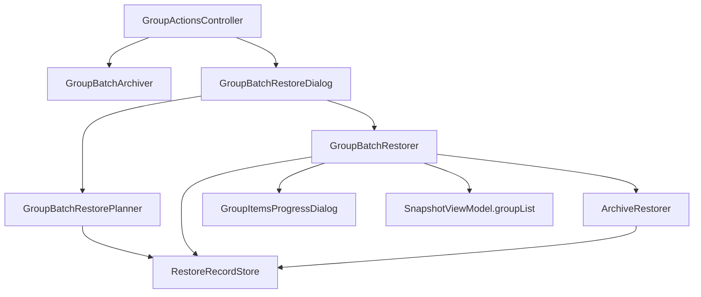

# 模块与文件结构

[← 返回索引](../GROUP_BATCH_RESTORE.md)

---

## 5.1 源码目录

建议新增包路径：

```
app/src/main/java/tiiehenry/android/app/snapshot/main/launch/batch/
├── GroupRestoreScope.kt           // enum GroupRestoreScope
├── ArchivePickStrategy.kt         // enum ArchivePickStrategy
├── RestoreRecord.kt               // data class + AppRestoreKey
├── RestoreRecordStore.kt          // MMKV 读写
├── GroupBatchRestorePlanner.kt    // preview / buildPlan
├── GroupBatchRestoreDialog.kt     // 配置对话框
└── GroupBatchRestorer.kt          // 串行执行
```

也可平铺在 `main/launch/` 下与 `GroupBatchArchiver` 并列；以上子包仅为建议。

---

## 5.2 文件变更清单

| 文件 | 操作 | 说明 |
|------|------|------|
| `res/layout/item_group.xml` | **修改** | 双行布局；32dp 按钮；`btn_batch` 替代 `btn_archive_all` |
| `res/layout/dialog_group_batch_restore.xml` | **新增** | 范围 + 策略 + 预览 |
| `res/values/strings.xml` | **修改** | 对话框与菜单文案 |
| `res/menu/menu_group_batch.xml` | **新增**（可选） | 批量 PopupMenu 定义 |
| `GroupActionsController.kt` | **修改** | 绑定 `btn_batch`；创建 `GroupBatchRestorer` |
| `GroupBatchArchiver.kt` | **修改**（可选） | 提取与 Restorer 共用的 finish / error dialog |
| `LauncherViewModel.kt` | **修改** | `isBatchRunning: MutableLiveData<Boolean>` |
| `LauncherFragment` / `GroupsAdapter` | **修改** | 观察 `isBatchRunning`，禁用交互 |
| `ArchiveRestorer.kt` | **修改** | 成功路径写入 `RestoreRecord` |
| `TimelineRepository.kt` | **修改**（可选） | 抽取 `resolveArchive` 到共享 `ArchivePickHelper` |
| `docs/systems/snapshot/INDEX.md` | **修改** | 增加本方案链接 |

---

## 5.3 类职责

| 类 | 职责 |
|----|------|
| `RestoreRecordStore` | group MMKV 读写；JSON 序列化 |
| `GroupBatchRestorePlanner` | 纯函数：范围过滤 + 快照选取 + 预览统计 |
| `GroupBatchRestoreDialog` | 展示配置 UI；监听 Radio 变化刷新 preview；回调 `(scope, strategy, tasks)` |
| `GroupBatchRestorer` | 串行调用 `restoreArchiveSuspend`；进度 UI；成功/失败汇总；写 record |
| `GroupActionsController` | 组头 `btn_batch` PopupMenu；调度 Archiver / Restorer |
| `LauncherViewModel` | 批量运行状态；可选：记住上次对话框选项（v2） |

---

## 5.4 依赖关系



---

## 5.5 ViewModel 状态

```kotlin
// LauncherViewModel
val isBatchRunning = MutableLiveData(false)
```

互斥规则：

- `isBatchRunning == true` 时拒绝新的批量归档 / 批量恢复
- 与时间线共用全局锁（可选）：`SnapshotViewModel` 层 `batchOperationRunning`，由 Archiver / Restorer / TimelineBatchOperator 统一读写

---

## 5.6 布局 XML 要点（item_group.xml）

```xml
<LinearLayout android:orientation="vertical">
    <TextView
        android:id="@+id/group_title"
        android:layout_width="match_parent"
        android:layout_height="wrap_content"
        android:maxLines="1"
        android:ellipsize="end"
        android:textSize="16sp"
        android:textStyle="bold" />

    <LinearLayout
        android:layout_width="match_parent"
        android:layout_height="wrap_content"
        android:gravity="end|center_vertical"
        android:orientation="horizontal">
        <!-- 32dp ImageButton: refresh, add, move, tune, batch -->
    </LinearLayout>

    <!-- 下方 FrameLayout 折叠区不变 -->
</LinearLayout>
```

`GroupActionsController.updateButtonVisibility` 需适配第二行工具栏中 `btn_confirm` 的显示逻辑。

---

## 5.7 可选重构（非阻塞）

| 重构项 | 说明 |
|--------|------|
| `BatchProgressDialogs` | 提取 `GroupBatchArchiver` 与 `GroupBatchRestorer` 共用的 error/success/finish 对话框 |
| `ArchivePickHelper` | 合并 `TimelineRepository.resolveArchive` 与 Group 的 `LAST_RESTORED` 逻辑 |
| `BatchOperationGuard` | 统一 Archiver / Restorer / Timeline 的 `isBatchRunning` 互斥 |

首版可接受适度重复，与 `TimelineBatchOperator` 初期做法一致。
