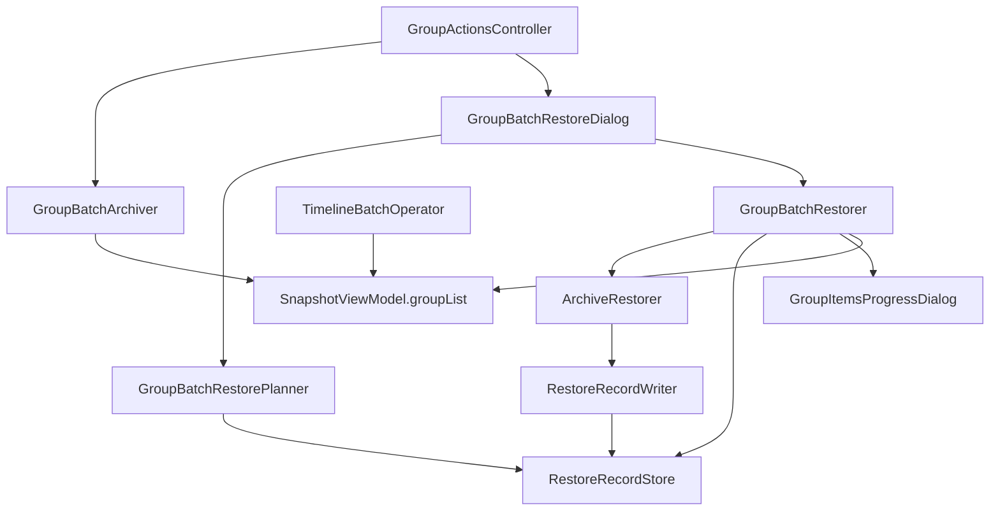

# 模块与文件结构

[← 返回索引](../GROUP_BATCH_RESTORE.md)

---

## 5.1 源码目录

建议新增包路径：

```
app/src/main/java/tiiehenry/android/app/snapshot/main/launch/batch/
├── GroupRestoreScope.kt           // enum GroupRestoreScope
├── ArchivePickStrategy.kt         // enum ArchivePickStrategy
├── RestoreRecord.kt               // data class + AppRestoreKey
├── RestoreRecordStore.kt          // SnapGroup.mmkv 读写
├── RestoreRecordWriter.kt         // ArchiveRestorer 成功路径调用
├── ArchiveResolver.kt             // 时间线 + Group 共享快照选取
├── GroupBatchRestorePlanner.kt    // preview / resolveTaskAt
├── GroupBatchRestoreDialog.kt     // 配置对话框
└── GroupBatchRestorer.kt          // 串行执行（对照 TimelineBatchOperator）
```

也可平铺在 `main/launch/` 下与 `GroupBatchArchiver` 并列；以上子包仅为建议。

---

## 5.2 文件变更清单

| 文件 | 操作 | 说明 |
|------|------|------|
| `res/layout/item_group.xml` | **修改** | 单行布局；36dp 按钮；`btn_batch` 替代 `btn_archive_all` |
| `res/layout/dialog_group_batch_restore.xml` | **新增** | 范围 + 策略 + 预览 |
| `res/values/strings.xml` | **修改** | 对话框、菜单、批量互斥 Toast |
| `res/values/ids.xml` | **新增**（若无） | `menu_batch_archive` / `menu_batch_restore` |
| `GroupActionsController.kt` | **修改** | 绑定 `btn_batch` PopupMenu；创建 `GroupBatchRestorer` |
| `GroupBatchArchiver.kt` | **修改**（可选） | 接入 `tryBeginBatchOperation`；提取共用 finish / error dialog |
| `SnapshotViewModel.kt` | **修改** | `isBatchRunning` + `tryBeginBatchOperation` / `endBatchOperation` |
| `TimelineBatchOperator.kt` | **修改** | 改用 `snapshotViewModel.isBatchRunning` |
| `TimelineFragment.kt` | **修改** | 观察 `snapshotViewModel.isBatchRunning` |
| `LauncherFragment` / `GroupsAdapter` | **修改** | 观察 `isBatchRunning`，禁用交互 |
| `ArchiveRestorer.kt` | **修改** | 成功路径调用 `RestoreRecordWriter` |
| `TimelineRepository.kt` | **修改** | `resolveArchive` 委托 `ArchiveResolver` |
| `docs/systems/snapshot/INDEX.md` | **修改** | 更新本方案状态 |

---

## 5.3 类职责

| 类 | 职责 |
|----|------|
| `RestoreRecordStore` | `SnapGroup.mmkv` 读写；JSON 序列化 |
| `RestoreRecordWriter` | 恢复成功时写 record；供 `ArchiveRestorer` 调用 |
| `ArchiveResolver` | 时间线 / Group 共享的快照选取 |
| `GroupBatchRestorePlanner` | 纯函数：范围过滤 + 预览 + `resolveTaskAt` |
| `GroupBatchRestoreDialog` | 配置 UI；Radio 变化刷新 preview；回调 `(scope, strategy, tasks)` |
| `GroupBatchRestorer` | 对照 `TimelineBatchOperator` 串行恢复 |
| `GroupActionsController` | 组头 `btn_batch` PopupMenu；调度 Archiver / Restorer |

---

## 5.4 依赖关系



---

## 5.5 全局批量互斥（SnapshotViewModel）

```kotlin
// SnapshotViewModel.kt
val isBatchRunning = MutableLiveData(false)

fun tryBeginBatchOperation(): Boolean {
    if (isBatchRunning.value == true) return false
    isBatchRunning.value = true
    return true
}

fun endBatchOperation() {
    isBatchRunning.value = false
}
```

互斥范围：

- `GroupBatchArchiver` / `GroupBatchRestorer` / `TimelineBatchOperator` 开始前均调用 `tryBeginBatchOperation()`
- `LauncherFragment` 与 `TimelineFragment` 观察同一 `LiveData`，禁用各自 Tab 内批量相关入口
- 失败时 `finally` 中必须 `endBatchOperation()`，避免 UI 永久锁死

详见 [附录 §A.5](../07-appendix.md#a5-全局批量互斥snapshotviewmodel)。

---

## 5.6 布局 XML 要点（item_group.xml）

```xml
<LinearLayout
    android:orientation="horizontal"
    android:gravity="center_vertical">
    <TextView
        android:id="@+id/group_title"
        android:layout_width="0dp"
        android:layout_height="wrap_content"
        android:layout_weight="1"
        android:maxLines="1"
        android:ellipsize="end"
        android:textSize="17sp"
        android:textStyle="bold" />
    <!-- 36dp ImageButton: confirm, refresh, add, move, tune, batch -->
</LinearLayout>
```

`GroupActionsController.updateButtonVisibility` 需适配同行工具栏中 `btn_confirm` 的显示逻辑。

---

## 5.7 可选重构（非阻塞）

| 重构项 | 说明 |
|--------|------|
| `BatchProgressDialogs` | 提取 `GroupBatchArchiver`、`GroupBatchRestorer`、`TimelineBatchOperator` 共用的 error/success/finish |
| `ArchiveResolver` | **Phase 1 纳入**；合并 Timeline / Group 快照选取 |
| `GroupBatchArchiver` 文案 | 硬编码中文迁移至 `strings.xml`（非阻塞） |

首版允许 Restorer 与 Timeline 在 progress 汇总上适度重复；**互斥锁与 ArchiveResolver 不建议推迟**。
