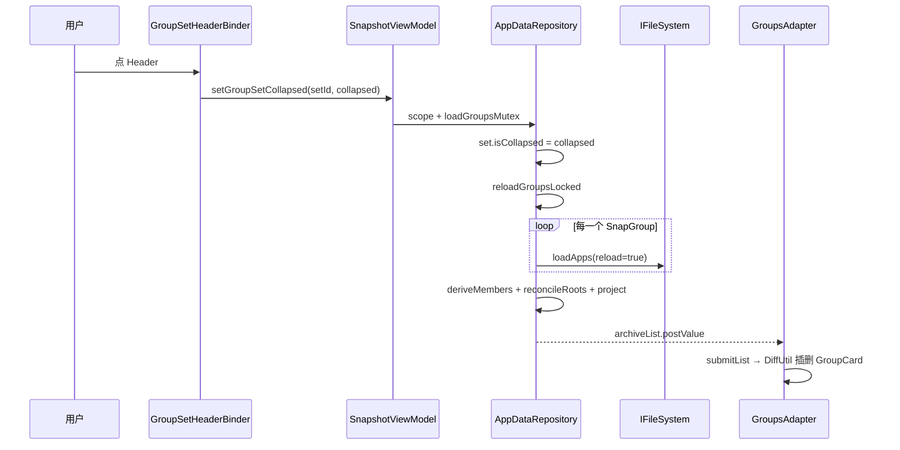

# 分组集折展性能

[← 返回快照系统索引](INDEX.md)

> 版本：v1.2 · 日期：2026-08-21 · 状态：active（Phase A 已落地）  
> 审查：Grok 第三轮 **Approve**  
> 关联：[分组集](GROUP_SET.md)、[分组 body 三态可见性](group-body-visibility.md)、[实施计划](../../../dev/plans/2026-08-group-set-expand-perf.md)

## 文档索引

| 章节 | 内容 |
|------|------|
| 1 | [背景与目标](#背景与目标) |
| 2 | [现状分析](#现状分析) |
| 3 | [已定决策](#已定决策) |
| 4 | [方案设计](#方案设计) |
| 5 | [核心业务逻辑](#核心业务逻辑) |
| 6 | [模块与文件结构](#模块与文件结构) |
| 7 | [边界与质量](#边界与质量) |
| 8 | [实施计划](#实施计划) |

## 快速摘要

点分组集 Header 折展时，设计要求只改 `isCollapsed` 再投影 `archiveList`。实现却调用了 `reloadGroupsLocked()`，对**全部分组** `loadApps(reload=true)`。折展延迟的主因是扫盘，不是 DiffUtil。

选定方案：抽出 `reprojectArchiveListLocked()`，折展与一键折叠只走内存投影。投影输入是锁内工作集 `loadedGroups` / `loadedSets`（禁止 `LiveData.value`）。列表形状仍只经 repository；禁止 Adapter 本地插删 `GroupCard`，禁止在 Header 里用 visibility 藏子卡片。

---

## 背景与目标

### 需求背景

分组集落地后，存档 Tab 以 Header 折叠整块。集内分组一多，点标题展开会明显卡顿；一键折叠同样慢。用户感知是「点一下要等」，与分组卡片内部折展（本地 `renderBody`）不对齐。

[分组集设计](GROUP_SET.md) 已写明折展路径：mutex 内写集 MMKV `isCollapsed` → `projectArchiveList` → `postValue(archiveList)`。实现把这条路径接到了全量重载。

### 目标

1. 折展与一键折叠**不再扫盘、不再 `loadApps`**；延迟降到一次内存投影 + DiffUtil 插删。
2. 保持 `archiveList` SSOT、连续块不变量、`navigateToGroup` 的 `submitList` commit 消费协议。
3. 一键折叠后，仍留在列表里的独立 `GroupCard` 必须能 Diff 到 body 折叠（见 [4.3](#43-groupcard-折叠快照)）。

### 非目标

- 改变「折叠只留 Header、展开插入 `GroupCard`」的列表形态
- 用 Header 内 visibility 或 Adapter 本地 insert/remove 换投影
- 改分组卡片内部三态（`renderBody`）的语义
- 嵌套分组集、集级批量快照
- 为折展预计算 DiffResult / 换成 ConcatAdapter
- 用 `groupList.value` 当投影工作集
- 本次实施包含 Phase B 绑定优化

---

## 现状分析

### 热路径（现行）



`collapseAllArchive()` 同样在写完所有 `isCollapsed` 之后调用 `reloadGroupsLocked`。

### 瓶颈分层

| 优先级 | 层 | 事实 | 折展是否需要 |
|--------|----|------|----------------|
| P0 | 数据 | `reloadGroupsLocked` 对每个分组 `loadApps(reload=true)`：root `listDir`、补图标、`loadArchives`、`getPackageInfo` | **否** |
| P0 | 锁 | 与添加/刷新抢 `loadGroupsMutex`；加载中点 Header 要等扫盘结束 | 折展只需短临界区 |
| P1 | UI | 展开插入多张带嵌套 RV 的 `GroupCard`；组默认 `isCollapsed = false`，一屏多张 3 行网格 + Glide | 需要绑定可见卡片 |
| P1 | bind | 每次 `bind` 重建 Archiver/Restorer、重绑 listener；折叠组仍先 `submitList` 内层再 `renderBody` | 可减 |
| P2 | Diff | `areContentsTheSame` 映射整份包名列表；`DefaultItemAnimator` 对 insert 做动画 | 次要 |
| — | 投影 | `ArchiveListProjector.project` + `materializeArchiveList` | **需要**，成本可忽略 |

### 涉及代码

| 组件 | 路径 | 现行职责 |
|------|------|----------|
| `GroupSetHeaderBinder` | `app/.../groupset/GroupSetHeaderBinder.kt` | 点标题 → `setGroupSetCollapsed` |
| `AppDataRepository` | `app/.../repository/AppDataRepository.kt` | `setGroupSetCollapsed` / `collapseAllArchive` → `reloadGroupsLocked` |
| `ArchiveListProjector` | `app/.../repository/ArchiveListProjector.kt` | 纯函数投影；折展不需改 |
| `ArchiveListItem` | `app/.../launch/ArchiveListItem.kt` | `SetHeader.expanded` 已快照；`GroupCard` 未快照 `isCollapsed` |
| `GroupsAdapter` | `app/.../launch/GroupsAdapter.kt` | `ListAdapter` + 嵌套网格；`refresh()` 无条件 `submitList` |
| `LauncherFragment` | `app/.../launch/LauncherFragment.kt` | `archiveList` → `submitList { tryConsumeNavigate() }` |

### 可复用

- `ArchiveListProjector.project` / `materializeArchiveList` / `deriveLiveMembers`（已是纯投影，折展只应调用它们）
- `SetHeader.name` / `expanded` / `accentColor` 投影快照模式（避免 DiffUtil 读到已原地修改的同一对象）
- `loadGroupsMutex` + `AppDataRepository.scope`（折展仍走这条，不改到 `viewModelScope`）
- 分组 body 三态：`renderBody`；集折叠不得抄这条轴

### 设计与实现的缺口

[GROUP_SET.md](GROUP_SET.md) 写路径表已规定：集 `isCollapsed` 折展不改 `groups` / `archiveRoots`，只重新投影。实现写成了全量 `reloadGroupsLocked`，把「形状变化」和「扫盘刷新」绑死。

---

## 已定决策

| 决策 | 结论 | 理由 |
|------|------|------|
| 列表 SSOT | 折展仍只经 `archiveList` 投影 | 与分组集不变量一致；`navigateToGroup` pending 依赖 `submitList` commit |
| 快路径 | 新 `reprojectArchiveListLocked()`：内存投影，**禁止** `loadApps` / `discoverGroups` / 改 `archiveRoots` | 成员与 roots 未变；扫盘是错误耦合 |
| 投影输入 | 锁内工作集 `loadedGroups` / `loadedSets` 是 **`loadGroupsMutex` 内分组/集列表的唯一读源**；LiveData 只 `postValue` | `postValue` 后 `.value` 仍可能是旧列表；只改投影函数、其它锁内路径继续读 `*.value` 会漏新组或丢掉工作集实例 |
| 再投影副作用 | `reproject*` **只** `archiveList.postValue` | 全量路径先更新工作集并 `postValue(groupList/groupSetList)`，再调用再投影 |
| 形状-only API | `setGroupSetCollapsed` / `collapseAllArchive` 不接收 `IFileSystem` / `IAppManager` | 类型上禁止再调用 `reloadGroupsLocked` |
| 未知 setId | 工作集找不到则 **no-op** | 禁止 `?: SnapGroupSet(setId)` 造孤儿写 MMKV 再投影 |
| 谁调用全量重载 | 仅添加/删除/刷新/改 path/`loadGroups` | 折展不是发现变化 |
| Adapter | **禁止**本地 insert/remove `GroupCard`；**禁止** Header 内 visibility 藏子卡片 | 两条折叠轴不得混用 |
| 协程 | 仍 `repository.scope` + mutex | 单例 VM 的 `viewModelScope` 会被 `onCleared` 取消 |
| `groupSetList` | 折展不必为此 `postValue` | Adapter 读的是 `SetHeader.expanded` 快照 |
| 一键折叠 | 同样走再投影，不扫盘 | 与单集折展同一缺口；独立组靠 `GroupCard.collapsed` rebind |
| GroupCard 折叠快照 | 投影时写入 `collapsed`（对齐 `SetHeader.expanded`） | 原地改 `SnapGroup.isCollapsed` 后 DiffUtil 两边读到同一对象，独立卡片 body 不会 rebind |
| DiffUtil 折叠字段 | 只比较快照；**禁止** `group.isCollapsed` / `set.isCollapsed` live getter | `name` / `apps` 仍走 live 是既有债，本次不扩 |
| Phase B | **不进本方案同一实施**；A 落地且 Trace 仍掉帧另开 | 先去掉扫盘；绑定成本是第二档 |

---

## 方案设计

分两阶段。A 是必须做的架构收敛；B 是展开后主线程绑定的收尾，不改数据流。

### Phase A — 内存再投影（必须）

从 `reloadGroupsLocked` 拆出只读**锁内工作集**的再投影，折展与一键折叠改走它。LiveData 是排放通道，不是投影输入。

```text
reloadGroupsLocked
  → loadApps / 派生 / 纠偏
  → loadedGroups / loadedSets = 本次建成的列表
  → postValue(groupList, groupSetList)
  → reprojectArchiveListLocked()    // 只 post archiveList

setGroupSetCollapsed / collapseAllArchive
  → repository.scope + loadGroupsMutex
  → 工作集找不到目标则 return
  → 写 isCollapsed（集 MMKV；一键折叠再写各组 MMKV）
  → reprojectArchiveListLocked()    // 只 post archiveList
```

`reprojectArchiveListLocked` 只做：

1. 读 `loadedGroups` / `loadedSets` / `GlobalConfig.archiveRoots`（已在锁内）
2. `deriveLiveMembers`（内存 path 派生，不扫盘、不缓存成员表）
3. `ArchiveListProjector.project` → `materializeArchiveList`
4. **只** `archiveList.postValue`

不做：`loadApps`、`discoverGroups`、`ensureArchiveRootsMigrated`、写出纠偏后的 `archiveRoots`、`postValue(groupList/groupSetList)`。纠偏属于全量加载；折展时 roots 与成员不变。

`requestNavigateToGroup` 为露出卡片而 `setGroupSetCollapsed(false)` 的路径自动变快。组级 `group.isCollapsed = false` 仍走 `renderBody` / `scrollToPackage`，**不要**改成再投影。消费协议不变：仍等 `submitList` commit 再 `indexOfFirst`。

### Phase B — 展开绑定（out of scope）

**不进本次实施。** 仅当 A 落地且 Trace 显示扫盘已消失、展开瞬间仍掉帧时另开计划。

| 项 | 做法 | 不做什么 |
|----|------|----------|
| 折叠组跳过内层列表 | `renderBody` 为 COLLAPSED/EMPTY 时不 `submitList` 嵌套 RV；点组标题展开再 `refresh` | 不把组网格提到外层 |
| listener 只绑一次 | `setupActions` 用 `boundGroup` / `resolveGroup(id)` | 不每次 bind 新建 Archiver |
| 插入动画 | 本次 `submitList` 临时关掉 `itemAnimator` | 不永久禁用所有动画 |
| 外层 ViewPool | `VIEW_TYPE_GROUP` RecycledViewPool 提到 8–12 | 不改内层 app pool 语义 |
| 排序持久化 | 自定义排序补齐 `sortOrder` 不在 bind 里 `save()` | 不改排序规则 |

产品向可选项（需另拍板，默认不做）：展开组集时把成员组强制折叠。现行语义是「集展开后各组恢复各自 MMKV」；多数组为展开态时一屏会同时 layout 多张 3 行网格。

### 明确拒绝

| 方案 | 拒绝原因 |
|------|----------|
| Header 内 GONE 藏子卡片 | 与 `renderBody` 轴混淆；滚动/吸顶/跳转下标全部失效 |
| Adapter 本地 `notifyItemRangeInserted` 不经 `archiveList` | 破坏 SSOT；`tryConsumeNavigate` 与吸顶读的是投影结果 |
| 折展走 `viewModelScope` | 单例 VM 被 `onCleared` 后静默不刷新（见 [添加分组后列表不刷新](add-group-refresh.md)） |
| ConcatAdapter / 三级嵌套 RV | 连续块不变量更难保；与「禁止卡片套卡片」冲突 |
| 为折展手写 DiffResult | 几十项 `ListAdapter` 后台 diff 足够；过早优化 |
| 再投影读 `LiveData.value` | `postValue` 未落地时用过期列表覆盖 `archiveList` |

---

## 核心业务逻辑

### 锁内工作集

`MutableLiveData.postValue` 在 IO 线程只写入 pending，观察者跑之前 `.value` 仍是旧列表。若 mutex 内任何路径读 `groupList.value`，会在「全量刚 `postValue`、主线程尚未落地」时拿到过期列表（例如 `addGroup` 后立刻点 Header / 一键折叠，新分组从存档 Tab 消失或漏折叠）。

```kotlin
private var loadedGroups: List<SnapGroup> = emptyList()
private var loadedSets: List<SnapGroupSet> = emptyList()
```

**不变量（可执行，不只约束投影函数）：**

1. `loadGroupsMutex` 内读/改分组或集**列表** → 只碰 `loadedGroups` / `loadedSets`。禁止 `groupList.value` / `groupSetList.value`。
2. 成员/登记变化 → 必须经 `reloadGroupsLocked`：**覆盖**工作集 → `postValue(groupList, groupSetList)` → `reprojectArchiveListLocked()`。
3. 形状-only（`setGroupSetCollapsed` / `collapseAllArchive`）→ 只改工作集里**已有元素**的 `isCollapsed`，不换列表引用，然后 `reproject*`。
4. `reproject*` 禁止 post `groupList` / `groupSetList`。

`reloadGroupsLocked` 的 `existingGroups` / `existingSets` 从工作集取，不再写 `groupList.value.orEmpty().associateBy`。主线程 `resolveGroup` / Fragment 观察 `groupList` **不在本条范围**。

现码 mutex 内须改读 `loaded*` 的触点（落地时全部替换，不只折展两处）：

| 符号 | 现行读法 |
|------|----------|
| `reloadGroupsLocked` | `existingGroups` / `existingSets` ← `*.value` |
| `collapseAllArchive` | 遍历 `groupSetList.value` / `groupList.value` |
| `addGroup` | `belongingSet` ← `groupSetList.value` |
| `discoverGroupsLocked` | `groupList.value.find` |
| `refreshGroupSet` / `deleteGroupSet` / `saveGroupSetOrder` | `groupSetList.value.find` |
| `updateGroupPath` / `updateGroupSetPath` / `upgradeEmptyGroupToSet` | `*.value.find` |
| `addAppsToGroup` / `setMembershipMode` / `moveAppBetweenGroupsLocked` / `deleteGroup` | `groupList.value` |
| `isPathOccupiedBySet` / `isPathOccupiedByGroup` | 仅 mutex 内调用；`*.value.any` 改为 `loaded*.any` |

若只在 `reloadGroupsLocked` 末尾赋值工作集、其它写路径继续读/改 LiveData 里的旧列表：`addGroup` 后立刻 `collapseAllArchive` 会漏新组；下一次 `reload` 用过期 `.value` 当 `existing` 会丢掉工作集实例（靠 MMKV + `loadApps` 自愈，但与「工作集是锁内真源」矛盾）。

交叉文档：[添加应用后刷新不及时](add-app-refresh-stale-group.md) §6.2 / §6.5 曾规定 mutex 内以 `groupList.value` 为最新；本方案落地后那两段改为工作集。

### `reprojectArchiveListLocked`

与全量路径末尾同一套 `project` + `materialize`，输入为工作集，不重建 `SnapGroup` / 不 `loadApps`。**禁止**在此函数里 `postValue(groupList)` / `postValue(groupSetList)`。

```kotlin
private fun reprojectArchiveListLocked() {
    val groups = loadedGroups
    val sets = loadedSets
    val groupsById = groups.associateBy { it.id }
    val setsById = sets.associateBy { it.id }
    val membersBySetId = deriveLiveMembers(sets, groups)
    val draft = ArchiveListProjector.project(
        ArchiveListProjector.Input(
            roots = GlobalConfig.archiveRoots,
            setsById = setsById.mapValues { (_, s) ->
                ArchiveListProjector.SetSnap(s.id, s.isCollapsed, s.groupOrder)
            },
            groupsById = groupsById.mapValues { (_, g) ->
                ArchiveListProjector.GroupSnap(g.id, g.path)
            },
            membersBySetId = membersBySetId.mapValues { (_, list) ->
                list.map { ArchiveListProjector.GroupSnap(it.id, it.path) }
            },
        )
    )
    archiveList.postValue(materializeArchiveList(draft, setsById, groupsById, membersBySetId))
}
```

### 形状-only 写路径

```kotlin
fun setGroupSetCollapsed(setId: String, collapsed: Boolean) {
    scope.launch {
        loadGroupsMutex.withLock {
            val set = loadedSets.find { it.id == setId } ?: return@withLock
            set.isCollapsed = collapsed
            reprojectArchiveListLocked()
        }
    }
}
```

找不到 set：**return**，不 `SnapGroupSet(setId)`。签名去掉 `Context` / `IFileSystem` / `IAppManager`（`collapseAllArchive` 同样）。`SnapshotViewModel` 门面不再为折展取 `appDeps()`。

```kotlin
fun collapseAllArchive() {
    scope.launch {
        loadGroupsMutex.withLock {
            for (set in loadedSets) {
                set.isCollapsed = true
            }
            for (group in loadedGroups) {
                group.isCollapsed = true
            }
            reprojectArchiveListLocked()
        }
    }
}
```

遍历必须是 `loaded*`，禁止抄现码 `groupList.value` / `groupSetList.value` 循环。`isCollapsed` 写入 MMKV（按 id）；DiffUtil 靠 `GroupCard.collapsed` 快照，不依赖是否换实例。

### 写路径对照

| 写路径 | 锁内动作 | 投影 |
|--------|----------|------|
| `setGroupSetCollapsed` | 只写该集 `isCollapsed` | `reprojectArchiveListLocked` |
| `collapseAllArchive` | 所有集 `isCollapsed = true`；所有组 `isCollapsed = true` | 同上 |
| `add*` / `delete*` / `refresh*` / 改 path / `loadGroups` | 登记变化 + `loadApps` | `reloadGroupsLocked`（末尾投影） |

### GroupCard 折叠快照

`SetHeader` 已快照 `expanded`，因为 `SnapGroupSet` 是可变对象：先写 `isCollapsed` 再 `postValue` 时，DiffUtil 若读 `set.isCollapsed` 会看到新旧同一值。

`GroupCard` 现行比较 `oldItem.group.isCollapsed`。`collapseAllArchive` 原地写各组 MMKV 后，新旧 `GroupCard` 持有**同一** `SnapGroup` 实例，`areContentsTheSame` 恒为 true，独立分组的 body 不会收起。全量 `reloadGroupsLocked` 也复用 `existingGroups` 实例，因此这是**现有缺陷**，不是再投影引入的。

投影时为 `GroupCard` 增加快照字段（名称建议 `collapsed`，避免与对象属性混淆）：

```kotlin
data class GroupCard(
    val group: SnapGroup,
    val setId: String?,
    val accentColor: Int? = null,
    val collapsed: Boolean,
)
```

`ArchiveDiffCallback.areContentsTheSame` 比较 `oldItem.collapsed == newItem.collapsed`，**禁止**再读 `group.isCollapsed` / `set.isCollapsed`。KDoc 钉死：折叠相关字段只比快照。`materializeArchiveList` 写入 `group.isCollapsed` 的当时值。`GROUP_SET.md` 领域对象示意同步补上 `collapsed`。

集折展不依赖该字段（靠 `GroupCard` 的 insert/remove），但一键折叠与「先展开集再折叠独立组」需要它。

### 主线程 Diff 结果（A 落地后）

| 操作 | DiffUtil |
|------|----------|
| 展开某集 | 该 `SetHeader` content change（`expanded`）；其后 insert N 张 `GroupCard`（或 1 条 `EmptySetHint`） |
| 折叠某集 | Header content change；remove 该块内 `GroupCard` / hint |
| 一键折叠 | 所有 Header `expanded=false`；集内卡片 remove；仍在列表的独立 `GroupCard` 因 `collapsed` 快照变化而 rebind → `renderBody` |

其它可见 `GroupCard`（未受影响的独立分组、其它已展开集）identity 与内容不变，不 rebind。

---

## 模块与文件结构

全部在 `:app`。`api` / `provider` / native 不改。

| 文件 | 操作 | 阶段 | 说明 |
|------|------|------|------|
| `repository/AppDataRepository.kt` | 修改 | A | 工作集；`reprojectArchiveListLocked` 只 post `archiveList`；形状-only 签名 |
| `SnapshotViewModel.kt` | 修改 | A | 折展/一键折叠不再传 FS/AppManager |
| `main/launch/ArchiveListItem.kt` | 修改 | A | `GroupCard.collapsed` 快照 |
| `repository/AppDataRepository.kt` `materializeArchiveList` | 修改 | A | 写入 `collapsed` |
| `main/launch/GroupsAdapter.kt` | 修改 | A | DiffUtil 只比 `collapsed` 快照；KDoc |
| [GROUP_SET.md](GROUP_SET.md) | 修改 | A | 密封类 `GroupCard.collapsed`；写路径禁止全量重载 |
| `GroupsAdapter` / `LauncherFragment` 绑定优化 | 不改 | B | **out of scope**；另开实施 |

字符串与布局：Phase A 不改。Phase B 不在本次改、不新增用户可见文案。

---

## 边界与质量

### 边界情况

| 场景 | 行为 |
|------|------|
| 连点同一 Header | mutex 串行；`postValue` 只保留最后一次 pending，UI 与最后一次写入一致 |
| 折展过程中 `loadGroups` | 同一 mutex，先后执行；全量重载覆盖内存态，不会把折展夹在半扫盘快照里 |
| 空集展开 | 投影插入 `EmptySetHint`，与现在相同，只是不再扫盘 |
| `requestNavigateToGroup` 目标在折叠集内 | 仍 `setGroupSetCollapsed(false)` 再 pending `navigateToGroup`；组 body 展开仍 `renderBody`；commit 后滚动 |
| 一键折叠时某集已折叠 | Header content 不变；该块无卡片可 remove |
| 一键折叠时独立组已折叠 | `collapsed` 快照相同，不 rebind |
| 分组正在批量归档 | Header 折展仍可用（与 GROUP_SET 现状一致） |
| 工作集没有该 `setId` | **no-op**（不写孤儿 MMKV、不投影） |
| `addGroup` 后立刻折展 | mutex 串行；再投影读已更新的 `loadedGroups`，不会用 `LiveData.value` 覆盖掉新分组 |

### 性能（A 落地后的预期）

- 折展临界区：MMKV 写 1 bit + 内存派生/投影。与分组数量成线性但无 IPC。
- 主线程：`submitList` 后台 diff；随后对可见范围 `onCreate`/`onBind`。
- 展开一个有 N 个成员的集：最多 bind 可见的几张 `GroupCard`（RecyclerView 回收），不是 N 次扫盘。
- 组内网格封顶（4 列 × 3 行）仍然有效，不在本方案放宽或收紧。

### 测试范围

优先单测（不需 Root）：

- `GroupCard` 快照：同一 `SnapGroup` 实例原地改 `isCollapsed` 后，新旧 `ArchiveListItem` 的 `collapsed` 不同 → `areContentsTheSame == false`
- `ArchiveDiffCallback`：折叠字段只比快照；读 live `group.isCollapsed` 不得让 contents 判定相同
- 投影：折叠/展开形状与连续块 — 已有 `ArchiveListProjectorTest`，不重复除非 materialize 契约变

代码审查钉死：

- `reprojectArchiveListLocked` 只读 `loadedGroups` / `loadedSets`，不读 `*.value`
- **`loadGroupsMutex` 内任何路径**（含 `reloadGroupsLocked` 的 existing、`collapseAllArchive`、`addGroup` / `discover*` / `delete*` / 改 path / `addAppsToGroup` / `isPathOccupied*`）都不读 `groupList.value` / `groupSetList.value`
- `setGroupSetCollapsed` / `collapseAllArchive` **不**调用 `reloadGroupsLocked`、**不**调用 `SnapGroup.loadApps`、**无** FS/AppManager 参数
- 仍无 Adapter 本地增删 `GroupCard`

真机：

- 点 Header 展开/折叠应跟手（无扫盘 log：`loadGroup: $groupId` 不应出现）
- 一键折叠：所有集只留 Header；独立分组只显示箭头（有应用时）
- 时间线跳到折叠集内分组：先展开再滚到卡片，不丢事件
- 展开后刷新按钮、批量归档仍针对当前 `resolveGroup` 实例

### 如何确认（Trace）

1. 点折展后 log / systrace：`reloadGroupsLocked` / `loadApps` 墙钟时间应消失。
2. 若 (1) 已消失而展开仍掉帧：再看 `GroupViewHolder.bind`、`GroupItemAdapter`、Glide，决定是否做 Phase B。

---

## 实施计划

详细任务见 [dev/plans/2026-08-group-set-expand-perf.md](../../../dev/plans/2026-08-group-set-expand-perf.md)。

### Phase A — 再投影（必须）

- [x] 锁内 `loadedGroups` / `loadedSets` 为 **mutex 内唯一读源**（`reloadGroupsLocked` existing、折展、以及所有 `withLock` 路径）；LiveData 只出不进
- [x] `reprojectArchiveListLocked()` **只** `archiveList.postValue`；`reloadGroupsLocked` 先更新工作集再调用它
- [x] `setGroupSetCollapsed` / `collapseAllArchive`：无 FS 参数；未知 id no-op；只再投影
- [x] `GroupCard.collapsed` 快照 + DiffUtil；`GROUP_SET.md` 密封类同步
- [x] 确认折展路径无 `loadApps`

### Phase B — 绑定（out of scope）

不在本次实施。A 落地且 Trace 仍掉帧另开计划。

### 验收标准

- [x] 代码路径：折展无 `reloadGroupsLocked` / `loadApps`；mutex 内无 `*.value`
- [x] 真机（PLK110）：点 Header「Basic」展开 → `archiveList` 变大且 **无** `loadGroup:`；一键折叠 → size=8（仅 Header + 独立组），无 `loadGroups`
- [x] 添加/刷新/改 path 仍走 `reloadGroupsLocked`（签名未改）
- [ ] 真机：时间线 `requestNavigateToGroup` 不丢事件（未测）

---

## 相关文档

- [分组集功能设计](GROUP_SET.md) — 列表形态、投影 SSOT、两条折叠轴
- [分组 body 三态可见性](group-body-visibility.md) — GroupCard 内部 `renderBody`；集折叠不得抄
- [添加分组后列表不刷新](add-group-refresh.md) — 必须走 `AppDataRepository.scope` + mutex
- [添加应用后刷新不及时](add-app-refresh-stale-group.md) — 可变 `SnapGroup` 与 DiffUtil；本方案的折叠快照是同类问题
- [实施计划](../../../dev/plans/2026-08-group-set-expand-perf.md)
