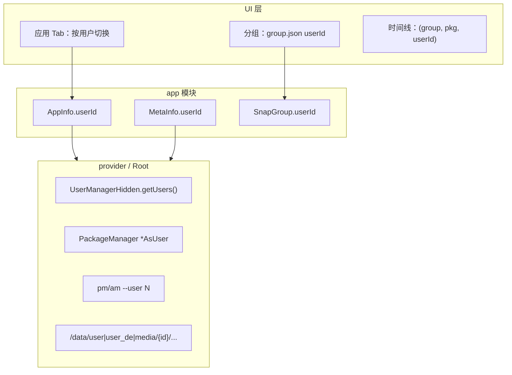

# 多用户适配分析

本文档记录 AppSnapshoter 在 Android 多用户（Multi-User）场景下的适配情况，涵盖数据模型、Root 服务、UI、压缩/恢复主链路，以及当前已知问题与改进优先级。

相关文档：

- [快照系统 INDEX](INDEX.md)
- [Root 服务架构](../../architecture/root-service.md)
- [时间线系统 — 质量说明](../timeline/TIMELINE_FEATURE.md)（`TimelineEntryKey` 含 `userId`）

---

## 1. 总体结论

项目**将多用户作为一等概念**进行设计：`userId` 贯穿数据模型、Root IPC、备份元数据、分组配置和主恢复流程。应用列表与时间线也考虑了多用户区分。

当前状态可概括为：

> **主用户（user 0）与副用户备份/恢复主链路在 Root 环境下可用；应用级配置、排除规则、忽略列表、进程控制与存储统计路径已与 `userId` 对齐。剩余缺口主要为图标展示（见 §1.1）、存档加载仍优先分组 `userId`（见 §6.9），以及工作资料等场景未专门验证。**

### 1.1 不在多用户适配范围

**应用图标不按用户区分**，属于已知且可接受的产品约束，**不纳入** §8 改进 backlog：

| 现象 | 位置 | 说明 |
|------|------|------|
| 系统图标加载未走 `AsUser` | §6.2 | 副用户 Tab 可能显示与主用户相同的系统图标 |
| 添加应用时图标 `userId = 0` | §6.8 | 分组目录 `{packageName}.png` 首次写入可能来自 user 0 |

分组内图标、存档详情图标仅用于 UI 展示；**压缩/恢复主链路不依赖**按用户加载的系统图标。已有存档图标文件或 `archiveIconFile` 时优先使用本地缓存。

### 1.2 已实现（2026-06-17）

以下项已在代码中落地（提交 `18c3dc1` 及同批变更）：

| 项 | 变更摘要 |
|----|----------|
| `getInstalledPackages` | 按 `userId` 过滤缓存列表 |
| `getPackageInfo` | 移除非 `AsUser` 的 `PackageManager` 回退 |
| `ExcludePatternBottomSheet` | 传入 `userId`，文件选择根路径与 `AppInfo` 一致（`/data/media/{userId}/...` 等） |
| `ExtraExcludePatternBottomSheet` | 传入 `userId` / `packageName`，空路径时回退至 `/data/user/{userId}/{packageName}` |
| `AppConfig` / `AppConfigManager` | `(packageName, userId)` 复合键；user 0 兼容旧版仅包名目录 |
| `AppConfigFragment` | `newInstance(packageName, userId)` |
| `IgnoreAppsConfig` | `packageName@userId` 持久化；旧数据仅包名视为 user 0 |
| `ProcessManager` | `pm suspend/unsuspend --user`；`isPackageRunning` 按 `uid/100000` 过滤 |
| `PathHelper` | 外部存储路径改为 `/data/media/{userId}/Android/...`，与 `AppInfo` 一致 |
| `ArchivedApp.loadArchives` | `metaInfo.userId` 与分组不一致时 `Log.w` 告警 |
| `ArchiveRestorer` | 恢复前校验 `metaInfo.userId == appInfo.userId`，不一致则阻止恢复 |

---

## 2. 架构概览



### 2.1 各层适配程度

| 层级 | 适配程度 | 说明 |
|------|----------|------|
| 数据模型 | 较好 | `AppInfo`、`MetaInfo`、`SnapGroup`、`TimelineEntryKey` 均含 `userId` |
| Root 服务 | 较好 | 枚举用户、按用户查包、安装/卸载/清数据/强停/挂起带 `--user` |
| 备份/恢复 | 较好 | 路径按 `userId` 构建，`meta-info.json` 持久化 `userId`；恢复前校验用户一致 |
| UI 展示 | 中等 | 应用列表有用户 Tab，存档详情显示用户 ID |
| 应用/排除配置 | 较好 | `AppConfig`、`IgnoreAppsConfig` 按 `(packageName, userId)` 区分 |
| 边界校验 | 中等 | 恢复前阻止跨用户写入；加载存档时对 userId 不一致告警 |

---

## 3. 已做好的部分

### 3.1 用户发现与枚举

Root 服务通过 `UserManagerHidden.getUsers()` 获取系统全部用户，并用 `getInstalledPackagesAsUser` 按用户枚举已安装应用。

关键代码：`provider/.../PackageManagerDelegate.kt` — `getInstalledAppInfos()`、`getUsers()`。

`AppManagerImpl.getInstalledPackages` 现按 `userId` 过滤缓存，语义与性能均正确。

### 3.2 分组绑定用户

每个存档分组在 `group.json` 的 `GroupConfigData.userId` 中保存目标用户。新建分组（`AddGroupBottomSheet`）和编辑分组（`app/.../main/launch/group/GroupSettingFragment.kt`）均可通过 Spinner 选择用户。

### 3.3 内部与外部数据路径

`AppInfo` 与 `PathHelper` 的路径策略已对齐：

| 类型 | 路径模式 |
|------|----------|
| USER | `/data/user/{userId}/{packageName}`（user 0 为 `/data/user/0/...`） |
| USER_DE | `/data/user_de/{userId}/{packageName}` |
| DATA | `/data/media/{userId}/Android/data/{packageName}` |
| OBB | `/data/media/{userId}/Android/obb/{packageName}` |
| MEDIA | `/data/media/{userId}/Android/media/{packageName}` |

### 3.4 备份元数据

`ArchiveMaker` 将 `appInfo.userId` 写入 `MetaInfo`，存档详情（`ArchiveItemAdapter`）展示「用户 ID」。

### 3.5 UI 多用户切换

`AppsListComponent` 根据 `appManager.getUsers()` 动态创建 Tab（id=0 显示「主用户」，其余显示「用户 N」），`AppsViewModel.setUserFilter` 按 `userId` 过滤列表。

### 3.6 时间线

列表粒度为 `(groupId, packageName, userId)`，避免跨用户同包名混淆。见 `docs/timeline/06-quality.md`。

### 3.7 厂商双开兼容

`AppManagerImpl.launchApp` 含 Flyme 双开 Intent 兼容（`mTargetUserId`、`flyme.intent.extra.NO_MULTI_OPEN_CHOOSE`）；Root 侧 `AppLauncher` 使用 `am start --user $userId`。

### 3.8 应用配置与忽略列表（2026-06-17）

- `AppConfigManager.getConfig(packageName, userId)` 使用 `packageName@userId` 缓存键
- `AppConfigFragment.newInstance(packageName, userId)` 从应用列表打开时传入正确用户
- `ExcludePatternBottomSheet` 文件浏览器根路径按 `userId` 构建
- `ExtraExcludePatternBottomSheet` / `ExtraItemEditBottomSheet` 同样传入 `userId`，排除模式文件选择器根路径与 `AppInfo` 一致
- `IgnoreAppsConfig` 以复合键持久化，旧版仅包名条目迁移为 user 0

---

## 4. 压缩（备份）链路

### 4.1 userId 传递路径

```
新建分组选择 userId
    → group.json (GroupConfigData.userId)
    → SnapGroup.loadApps() 用 config.groupConfigData.userId 构造 AppInfo
    → SnapshotCreator → ArchiveMaker.makeSnapshot(item.appInfo, ...)
    → appInfo.getUserDir() / getPackageDataDir() 等
    → meta-info.json 写入 userId
```

**结论：分组绑定了其他用户后，压缩读取的是该用户下的应用数据；分组 `userId` 是压缩时的权威来源。**

### 4.2 各步骤是否使用分组 userId

| 环节 | 是否使用分组 userId |
|------|---------------------|
| 读取包信息 / 版本 | 是 |
| 压缩 USER / USER_DE / DATA / OBB / MEDIA | 是 |
| 写入 meta-info.json | 是 |
| 备份前挂起应用 | 是（`pm suspend --user {userId}`） |

### 4.3 添加应用时的行为

`addAppsToGroup` 仅使用 `packageName` 创建目录，随后 `group.loadApps(reload=true)` 会按**分组**的 `userId` 重建 `AppInfo`。

因此：即使用户在「添加应用」对话框中切到错误用户 Tab 选择了同名包，压缩时仍使用**分组**的 `userId` 读取数据。建议在对应用户的 Tab 下添加，避免操作混淆。

---

## 5. 恢复链路

### 5.1 userId 传递路径

```
分组 group.userId
    → ArchivedApp.loadArchives() 构造 archiveItem.appInfo（userId = group.userId）
    → ArchiveRestorer.restoreArchive() 取 archiveItem.appInfo.userId
    → validateRestoreUserId：metaInfo.userId 须与 appInfo.userId 一致
    → isInstalled / clearAppData / installApk / 解压目标路径 / PermissionRestorer
```

**结论：在分组 userId 未修改、且存档在本分组内备份的前提下，恢复目标与压缩时一致，均指向该用户。若元数据用户与分组用户不一致，恢复会被阻止。**

### 5.2 各步骤是否按该用户执行

| 步骤 | 行为 |
|------|------|
| 用户一致性校验 | `validateRestoreUserId`，不一致抛 `IllegalStateException` |
| 检查是否已安装 | `isInstalled(packageName, userId)` |
| 清数据 | `pm clear --user {userId}` |
| 安装 APK | `pm install --user {userId}` |
| 解压 DATA/USER/USER_DE/OBB/MEDIA | `appInfo.getPackageDataDir()` 等 |
| 权限 / AppOps / SSAID | `PermissionRestorer` 传入同一 `userId` |
| chown / SELinux | `DataRestorer` 通过 `metaInfo.userId` 查 UID |

### 5.3 恢复时的 userId 来源说明

恢复主流程使用 `archiveItem.appInfo.userId`（来自**当前分组** `group.userId`），并在恢复前与 `metaInfo.userId` 比对。

`DataRestorer.restoreData` 在 chown 时使用 `archiveItem.metaInfo.userId` 调用 `getPackageInfo` 获取 UID。正常流程下两者一致；跨用户不一致时已在 `ArchiveRestorer` 层阻止恢复。

---

## 6. 已知问题与缺口

### 6.1 ~~`getInstalledPackages` 未按用户过滤~~（已修复，2026-06-17）

**位置：** `provider/.../AppManagerImpl.kt`

现实现：`getInstalledAppInfosCached().filter { it.userId == userId }.map { it.packageName }`。

`AppDataRepository.loadApps` 不再依赖二次 `getPackageInfo` 过滤来纠正错误包列表。

### 6.2 `loadIcon` 未按用户加载（不在范围）

`AppManagerImpl.loadIcon` 使用当前进程 `PackageManager`，未走 Root 的 `getApplicationInfoAsUser`。副用户应用 Tab 可能显示与主用户相同的系统图标。

**状态：** 已知且接受，见 §1.1。Root 侧 `PackageManagerDelegate.loadIcon` 已实现 `AsUser`，但 app 未委托；无需为多用户专门修复。

### 6.3 ~~挂起/解冻未带 `--user`~~（已修复，2026-06-17）

**位置：** `provider/.../ProcessManager.kt`

`suspendPackage` / `unsuspendPackage` 现使用 `pm suspend --user $userId` / `pm unsuspend --user $userId`。

### 6.4 ~~`isPackageRunning` 未区分用户~~（已修复，2026-06-17）

通过 `process.uid / 100000` 得到进程所属用户，再与目标 `userId` 及 `processName` 一并匹配。

### 6.5 ~~外部存储路径两套实现不一致~~（已修复，2026-06-17）

`PathHelper.getAppDataDir` / `getAppObbDir` / `getAppMediaDir` 已改为 `/data/media/{userId}/Android/...`，与 `AppInfo` 一致。`PackageManagerDelegate.getInstalledAppStorages()` 统计副用户存储时路径正确。

### 6.6 ~~应用配置未区分用户~~（已修复，2026-06-17）

- `AppConfigManager` / `AppConfig` 以 `packageName@userId` 为键（user 0 兼容旧目录）
- `AppConfigFragment.newInstance(packageName, userId)` 传入用户
- `ExcludePatternBottomSheet` 根路径按 `userId` 构建，例如：

```kotlin
CompressItems.COMPRESS_ITEM_USER -> "/data/user/$userId/$packageName"
CompressItems.COMPRESS_ITEM_DATA -> "/data/media/$userId/Android/data/$packageName"
```

### 6.7 ~~忽略应用列表未区分用户~~（已修复，2026-06-17）

`IgnoreAppsConfig` 持久化 `packageName@userId`；`isIgnored(packageName, userId)` 按复合键判断。旧 JSON 中仅包名的条目在加载时规范为 user 0。

### 6.8 添加应用时图标加载硬编码 user 0（不在范围）

**位置：** `app/.../AppDataRepository.kt` — `addAppsToGroup`

`AppIconUtils.loadAndSaveAppIcon(..., userId = 0, ...)` 写死为 0。后续 `loadApps` 会按分组 userId 重建 `AppInfo`；**仅影响分组目录下图标文件的首次来源**，不影响压缩数据与恢复。

**状态：** 已知且接受，见 §1.1。

### 6.9 存档加载时 userId 来源不一致（部分缓解）

**位置：** `app/.../ArchivedApp.kt` — `loadArchives`

构建 `AppInfo` 时仍使用 `group.userId`，而非 `metaInfo.userId`。若分组后来修改了用户，或存档从其他分组迁入，`meta-info.json` 中的 `userId` 可能与当前分组不同。

**已实现：** 加载时对 `metaInfo.userId != group.userId` 输出 `Log.w` 告警。

**未实现：** 未改为优先使用 `metaInfo.userId` 构造 `AppInfo`；跨用户恢复由 §6.10 的恢复校验阻止。

### 6.10 ~~无跨用户一致性校验~~（已修复，2026-06-17）

**位置：** `app/.../archive/restore/ArchiveRestorer.kt`

`validateRestoreUserId` 在 `restoreArchive` / `restoreArchiveSelected` 入口比对 `metaInfo.userId` 与 `appInfo.userId`（分组 userId），不一致则抛出异常并阻止恢复。

### 6.11 工作资料 / 访客等场景

无专门逻辑，完全依赖 `UserManager.getUsers()`。一般可用，但未区分主用户、工作资料、访客的类型与限制（如部分用户不可安装 APK）。

---

## 7. 场景评估

| 场景 | 可用性 | 说明 |
|------|--------|------|
| 单用户（user 0） | 完整 | 主路径均按 0 设计；配置兼容旧版仅包名目录 |
| 多用户（独立用户 10、11…） | 可用 | 备份/恢复/分组/配置/忽略/挂起均已按用户区分 |
| 同包名多用户并存 | 可用 | 时间线、存档元数据、应用配置、忽略列表均可区分 |
| 工作资料（Managed Profile） | 未专门验证 | 若出现在用户列表中，理论可走同一套 API |
| OEM 双开（Flyme 等） | 部分兼容 | 启动有 Flyme 兼容；运行检测已含用户维度 |

---

## 8. 改进优先级

| 优先级 | 项 | 说明 |
|--------|-----|------|
| 低 | `ArchivedApp.loadArchives` | 可选：不一致时优先 `metaInfo.userId` 或 UI 显式提示（当前已有 Log.w + 恢复层阻止） |
| 低 | 工作资料 / 访客 | 验证 `UserManager.getUsers()` 覆盖范围，必要时区分用户类型与安装限制 |

**已完成（2026-06-17）：** `getInstalledPackages` 过滤、`ExcludePatternBottomSheet` 路径、`ArchiveRestorer` 恢复校验、`AppConfig` / `IgnoreAppsConfig` 复合键、`suspend` / `unsuspend` / `isPackageRunning` 用户维度、`PathHelper` 与 `AppInfo` 路径统一、`getPackageInfo` 回退移除。

以下项**不在 backlog**（图标不按用户区分，见 §1.1）：`loadIcon` / `addAppsToGroup` 图标 `userId`。

---

## 9. 关键代码索引

| 主题 | 文件 |
|------|------|
| 分组 userId 配置 | `app/.../config/GroupConfigData.java` |
| 分组加载应用 | `app/.../group/SnapGroup.kt` |
| 存档加载 / AppInfo 构造 | `app/.../group/ArchivedApp.kt` |
| 应用列表按用户加载 | `app/.../repository/AppDataRepository.kt` |
| 用户 Tab UI | `app/.../main/apps/AppsListComponent.kt` |
| 应用配置 UI | `app/.../main/launch/app/AppConfigFragment.kt` |
| 排除规则 UI | `app/.../main/launch/config/fragments/ExcludePatternBottomSheet.kt` |
| 额外项目排除规则 UI | `app/.../main/launch/config/fragments/ExtraExcludePatternBottomSheet.kt` |
| 忽略应用配置 | `app/.../main/settings/IgnoreAppsConfig.kt` |
| 压缩入口 | `app/.../main/launch/makearchive/SnapshotCreator.kt` |
| 压缩实现 | `app/.../archive/make/ArchiveMaker.kt` |
| 恢复编排 | `app/.../archive/restore/ArchiveRestorer.kt` |
| 数据解压与 chown | `app/.../archive/restore/DataRestorer.kt` |
| Root 包管理 | `provider/.../PackageManagerDelegate.kt` |
| Root 包管理 IPC | `provider/.../appmanager/AppManagerImpl.kt` |
| 进程控制 | `provider/.../ProcessManager.kt` |
| 路径工具（存储统计） | `provider/.../appmanager/util/PathHelper.kt` |
| 路径方法（备份/恢复） | `app/.../app/AppInfo.kt` |
