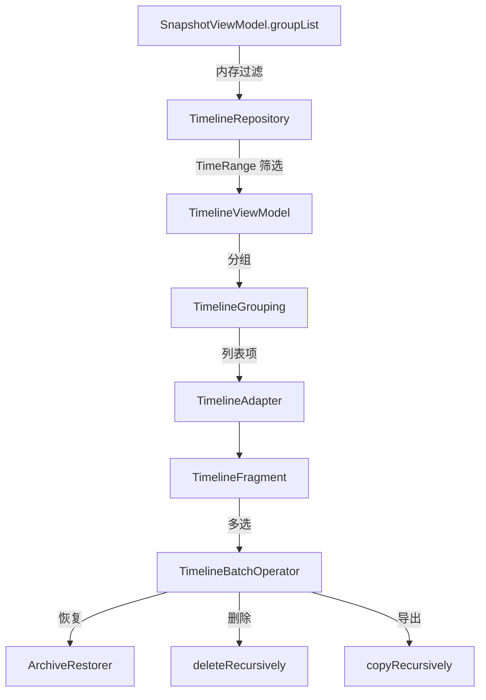

# 时间线系统

## 概述

时间线是首页底部导航的第二个 Tab（顺序：`存档 | 时间线 | 应用`），按时间区域跨分组展示有快照的应用，支持多选批量恢复、删除和导出。

## 文件结构

> 源码路径：`app/src/main/java/tiiehenry/android/app/snapshot/main/timeline/`

| 文件 | 职责 |
|------|------|
| `TimelineFragment.kt` | 主 Fragment，日期范围 Chip、搜索框、热力图 |
| `TimelineAdapter.kt` | RecyclerView 适配器，搜索高亮 |
| `TimelineViewModel.kt` | ViewModel，多选状态、时间范围、批量操作 |
| `TimelineRepository.kt` | 数据查询，从 `SnapshotViewModel.groupList` 内存过滤 |
| `TimelineModels.kt` | 数据模型：`TimelineEntry`、`TimelineEntryKey`、`TimeRange`、`TimePreset` |
| `TimelineGrouping.kt` | 时间段分组逻辑 |
| `TimelineListItem.kt` | 列表项模型 |
| `TimelineBatchOperator.kt` | 批量恢复/删除/导出操作 |
| `TimelineHeatmapView.kt` | 热力图自定义 View |
| `TimelineStickyHeaderDecoration.kt` | RecyclerView 粘性头部装饰 |
| `TimelineTextHighlight.kt` | 搜索文本高亮 |
| `RestoreStrategyDialog.kt` | 恢复策略选择对话框 |

## 核心特性

- **数据源**：内存过滤 `SnapshotViewModel.groupList`，不额外扫盘
- **列表粒度**：`(groupId, packageName, userId)` 一行
- **时间筛选**：`TimePreset` 枚举（TODAY、YESTERDAY、LAST_7_DAYS、LAST_30_DAYS、CUSTOM）
- **热力图**：`TimelineHeatmapView` 颜色深浅表示快照密度
- **搜索**：`TimelineTextHighlight` 高亮匹配文本
- **粘性头部**：`TimelineStickyHeaderDecoration` 日期分组标题固定顶部
- **批量操作**：多选后 `TimelineBatchOperator` 执行恢复/删除/导出
- **恢复策略**：`RestoreStrategyDialog` 选择 NEWEST_FIRST 或 OLDEST_FIRST

## 数据流

## 设计文档

完整设计文档见 [时间线功能设计](TIMELINE_FEATURE.md)，原始子文档在 `docs/timeline/`（8 篇）。

## 涉及模块

| 模块 | 职责 |
|------|------|
| [`app`](../../modules/app/INDEX.md) | 全部 UI 组件和 ViewModel |
| [`provider`](../../modules/provider/INDEX.md) | 批量恢复/删除/导出的 Root 服务调用 |

## 相关文档

- [存储策略](../../architecture/cross-cutting/storage.md) — 快照文件布局
- [时间线功能设计](TIMELINE_FEATURE.md) — 详细设计文档
