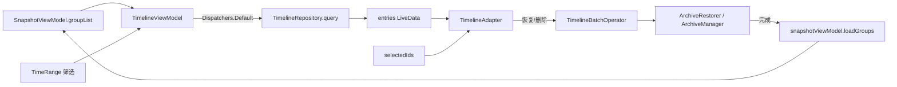

# 核心业务逻辑

[← 返回索引](../TIMELINE_FEATURE.md)

---

## 4.1 数据模型（轻量、防 stale）

> **关键优化：** `TimelineEntry` 不持有 `SnapGroup` / `ArchivedApp` 引用。批量操作前从最新 `groupList` 解析，避免 `loadGroups()` 后引用失效。

```kotlin
/** 列表项唯一键，也是多选 Set 的元素 */
data class TimelineEntryKey(
    val groupId: String,
    val packageName: String,
    val userId: Int
) {
    val id: String get() = "$groupId:$packageName:$userId"
}

data class TimelineEntry(
    val key: TimelineEntryKey,
    /** 展示缓存，不参与业务逻辑 */
    val appLabel: String,
    val groupName: String,
    val iconFile: String,
    /** 时间区域内匹配的快照名，已按 makeTime 降序 */
    val matchingArchiveNames: List<String>,
    val matchingArchiveTimes: List<Long>  // 与 names 一一对应，用于摘要展示
)

enum class TimePreset { TODAY, YESTERDAY, LAST_7_DAYS, LAST_30_DAYS, CUSTOM }

data class TimeRange(
    val startTime: Long,
    val endTimeExclusive: Long,
    val preset: TimePreset = TimePreset.LAST_7_DAYS
)

enum class RestoreStrategy {
    NEWEST_FIRST,  // matching 中 makeTime 最大
    OLDEST_FIRST   // matching 中 makeTime 最小
}
```

**运行时解析（批量操作入口调用）：**

```kotlin
fun resolveEntry(
    key: TimelineEntryKey,
    groups: List<SnapGroup>
): Pair<ArchivedApp, List<ArchiveItem>>? {
    val group = groups.find { it.id == key.groupId } ?: return null
    val app = group.apps.find {
        it.appInfo.packageName == key.packageName && it.appInfo.userId == key.userId
    } ?: return null
    return app to /* 按 key + timeRange 重新 filter archives，保证与列表一致 */
}
```

## 4.2 查询逻辑

```kotlin
object TimelineRepository {

    fun query(
        groupList: List<SnapGroup>,
        range: TimeRange
    ): List<TimelineEntry> {
        return groupList.flatMap { group ->
            group.apps.mapNotNull { app ->
                val matching = app.archives.values
                    .filter { it.metaInfo.makeTime in range.startTime until range.endTimeExclusive }
                    .sortedByDescending { it.metaInfo.makeTime }
                if (matching.isEmpty()) return@mapNotNull null
                TimelineEntry(
                    key = TimelineEntryKey(group.id, app.appInfo.packageName, app.appInfo.userId),
                    appLabel = app.appInfo.label,
                    groupName = group.name,
                    iconFile = app.appInfo.archiveIconFile ?: app.iconFile,
                    matchingArchiveNames = matching.map { it.name },
                    matchingArchiveTimes = matching.map { it.metaInfo.makeTime }
                )
            }
        }.sortedByDescending { it.matchingArchiveTimes.first() }
    }
}
```

**执行线程：** 在 `TimelineViewModel` 的 `viewModelScope.launch(Dispatchers.Default)` 中 query，结果 `postValue` 到 LiveData。

**数据来源：** 基于已加载的 `groupList` 内存过滤。Fragment `onViewCreated` 时若 `groupList.value.isNullOrEmpty()`，调用 `snapshotViewModel.loadGroups()` 并显示 loading。

## 4.3 恢复策略

```kotlin
fun resolveArchive(
    archives: List<ArchiveItem>,
    strategy: RestoreStrategy
): ArchiveItem = when (strategy) {
    RestoreStrategy.NEWEST_FIRST -> archives.maxBy { it.metaInfo.makeTime }
    RestoreStrategy.OLDEST_FIRST -> archives.minBy { it.metaInfo.makeTime }
}
```

**策略对话框触发条件：**

- 选中项中 **至少有一个** `matchingArchiveNames.size > 1` → 弹出策略选择
- 全部仅 1 个快照 → 跳过策略对话框，直接恢复

**策略对话框文案：**

```
批量恢复 (N 个应用)

以下 M 个应用在选定时间区域内有多个快照，请选择恢复策略：

○ 新快照优先 — 每个应用恢复时间最新的那个快照
○ 旧快照优先 — 每个应用恢复时间最旧的那个快照

[取消]  [开始恢复]
```

## 4.4 批量恢复流程

```
用户点击「恢复」
  → 无选中项 → Toast
  → 存在多快照应用 → RestoreStrategyDialog
  → 确认：「确定为 N 个应用恢复快照？」
  → TimelineBatchOperator.restore(...)
       GroupItemsProgressDialog 串行遍历：
         resolveEntry(key, groupList) → 取 matching archives
         archiveItem = resolveArchive(matching, strategy)
         ArchiveRestorer.restoreArchiveItem(...)  // 同步 IO，单条进度文案
  → 汇总成功/失败（复用 GroupBatchArchiver 的错误列表面板）
  → snapshotViewModel.loadGroups() → 自动触发 entries 刷新
```

**`ArchiveRestorer` 改动（最小）：**

```kotlin
// 新增 public 方法，复用现有 private restoreArchive()
fun restoreArchiveItem(
    context: Context,
    archivedApp: ArchivedApp,
    archiveItem: ArchiveItem,
    updateCurrent: () -> Unit,
    scope: CoroutineScope
)
```

批量场景在 `TimelineBatchOperator` 内用 `runBlocking`/挂起函数直接调 `restoreArchive`，**不要**为每条弹 `ItemProgressDialog`；进度统一由 `GroupItemsProgressDialog` 展示。

## 4.5 批量删除流程

**删除语义：** 删除选中应用在时间区域内的 **全部** 匹配快照（与恢复「选一」形成有意不对称）。

```
用户点击「删除」
  → 统计：N 个应用，M 个快照，K 个锁定
  → 确认：「将删除 N 个应用在时间区域内的 M 个快照（K 个已锁定将跳过），是否继续？」
  → TimelineBatchOperator.delete(...)
       串行遍历 selected keys：
         resolveEntry → filter by timeRange → skip locked
         ArchiveManager.deleteArchive(app, archive)
  → Toast：「成功 X，跳过锁定 Y，失败 Z」
  → loadGroups() → entries 自动刷新
```

## 4.6 数据流


